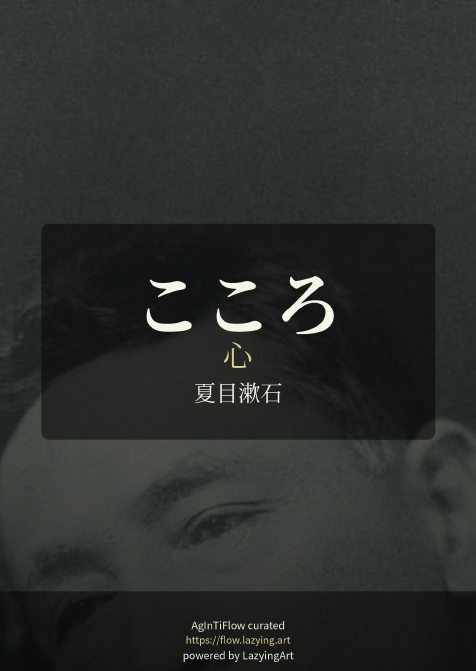
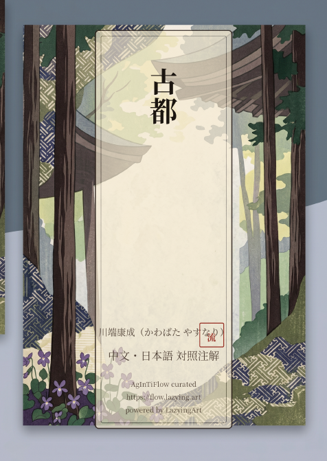
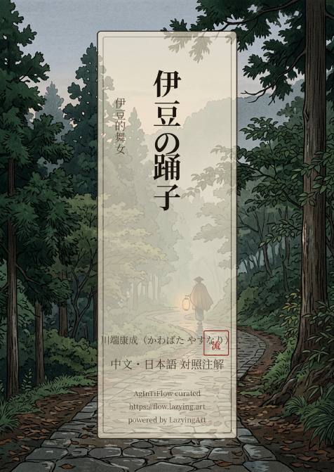
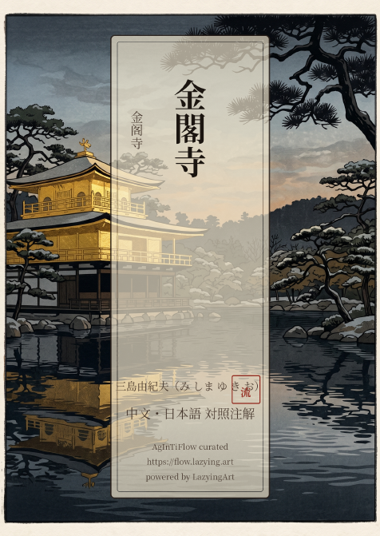
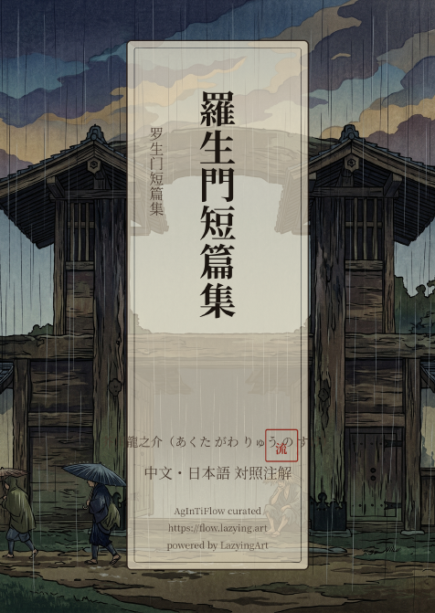
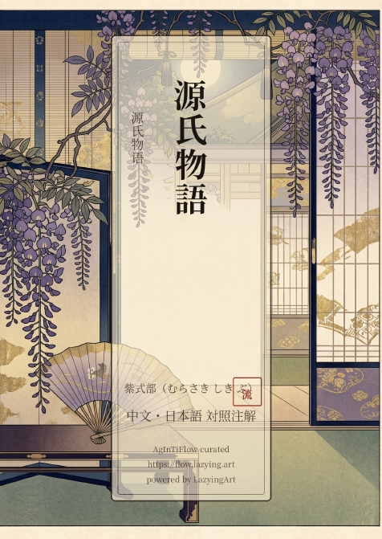
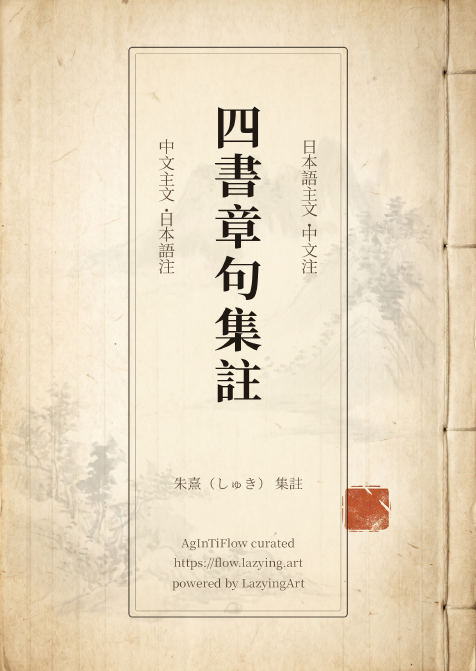
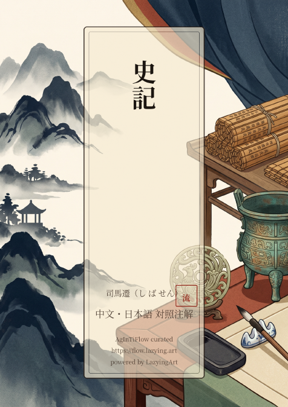

[English](README.md) · [العربية](i18n/README.ar.md) · [Español](i18n/README.es.md) · [Français](i18n/README.fr.md) · [日本語](i18n/README.ja.md) · [한국어](i18n/README.ko.md) · [Tiếng Việt](i18n/README.vi.md) · [中文 (简体)](i18n/README.zh-Hans.md) · [中文（繁體）](i18n/README.zh-Hant.md) · [Deutsch](i18n/README.de.md) · [Русский](i18n/README.ru.md)

[](https://github.com/lachlanchen/lachlanchen/blob/main/figs/banner.png)

# PocketPolyglot

Generate beautiful pocket-size interlinear books for language learning.

[](https://learn.lazying.art)
[](https://www.tug.org/xetex/)
[](scripts/)
[](data/interlinear/sample.json)

PocketPolyglot turns bilingual texts into ruby, pinyin, grammar-colored, line-aligned pocket books. The current production workflow focuses on Chinese/Japanese editions, but the data model is language-pair neutral: EN-JP, ZH-EN, classical-modern, and other paired reading formats can use the same structure.

The repository is a toolkit: TeX templates, Python scripts, JSON schemas, preview assets, and sample data. Bring your own rights-cleared source texts before publishing full generated books.

## One Sentence In Full Width

JP-main sample from Kokoro: Japanese main text with furigana, Chinese comment with pinyin, and grammar color on the aligned words.

<p align="center">
  <a href="assets/edition-comparisons/kokoro-jp-main-sentence-page-20.png">
    
  </a>
</p>

## Four Editions At A Glance

The same Kokoro interior page rendered as all four standard editions:

<p align="center">
  <a href="assets/edition-comparisons/kokoro-four-editions-page-20.png">
    
  </a>
</p>

Click the image to open the full-resolution version for readable ruby, furigana, and pinyin.

Chinese/Japanese is the current showcase pair, but the pipeline is not limited to it. Any language pair with prepared aligned text and readings can use the same book model: EN-JP, ZH-EN, classical-modern, learner gloss editions, or teacher-curated parallel readers.

## What It Builds

Every complete paired book can be exported in four reader choices:

| Direction | Color | Black and White |
| --- | --- | --- |
| Chinese main text with Japanese notes | grammar-colored ruby/pinyin edition | monochrome edition for e-ink |
| Japanese main text with Chinese notes | grammar-colored furigana/pinyin edition | monochrome edition for e-ink |

The page format is pocket-size, with line-based interlinear blocks, full furigana over Japanese kanji, pinyin over Chinese text, optional grammar roles, tables of contents, generated covers, and chapter page breaks.

## Gallery

These previews are first pages rendered from generated PDFs, not standalone cover images.

| Preview | Book | Editions |
| --- | --- | --- |
|  | **Kokoro / 心 / こころ** | ZH-main color, ZH-main black and white, JP-main color, JP-main black and white |
|  | **Snow Country / 雪国** | ZH-main color, ZH-main black and white, JP-main color, JP-main black and white |
|  | **No Longer Human / 人間失格** | ZH-main color, ZH-main black and white, JP-main color, JP-main black and white |
|  | **The Old Capital / 古都** | ZH-main color, ZH-main black and white, JP-main color, JP-main black and white |
|  | **The Dancing Girl of Izu / 伊豆の踊子** | ZH-main color, ZH-main black and white, JP-main color, JP-main black and white |
|  | **The Temple of the Golden Pavilion / 金閣寺** | ZH-main color, ZH-main black and white, JP-main color, JP-main black and white |
|  | **Rashomon Stories / 羅生門短篇集** | ZH-main color, ZH-main black and white, JP-main color, JP-main black and white |
|  | **The Tale of Genji / 源氏物語** | ZH-main color, ZH-main black and white, JP-main color, JP-main black and white |
|  | **Sishu Zhangju Jizhu / 四書章句集註** | ZH-main color, ZH-main black and white, JP-main color, JP-main black and white |
|  | **Shiji / 史記** | ZH-main color, ZH-main black and white, JP-main color, JP-main black and white |
|  | **Sichuan Folk Stories, Volume 1 / 中国民间故事集成四川卷上** | ZH-main color, ZH-main black and white, JP-main color, JP-main black and white |

## Quick Start

Build the simple paired demo:

```sh
make sample
```

Build the Chinese-main interlinear sample:

```sh
make interlinear
```

Build the Japanese-main interlinear sample from the same JSON:

```sh
make interlinear-jp-main
```

Export completed local PDFs into a flat browsing folder and regenerate README previews:

```sh
make export-books
make readme-assets
```

## Data Model

The core format is a paragraph/chapter JSON model. Text is split into aligned reading units, and each token can carry a reading and an optional grammar role.

```json
{
  "zh": [{"t": "天", "r": "tiān", "g": "subject"}, {"t": "地", "r": "dì", "g": "subject"}],
  "ja": [[{"t": "天", "r": "てん", "g": "subject"}, {"t": "地", "r": "ち", "g": "subject"}]]
}
```

Stable token fields:

| Field | Meaning |
| --- | --- |
| `t` | surface text |
| `r` | ruby, furigana, pinyin, or other reading |
| `g` | optional grammar role such as `subject`, `predicate`, `object`, `attributive`, `adverbial`, `complement`, `topic`, or `function` |

## Project Layout

| Path | Purpose |
| --- | --- |
| `tex/` | XeLaTeX templates for paired, block interlinear, run-in, and JP-main layouts |
| `scripts/books/` | EPUB/PDF/Markdown preparation, cover composition, preview export |
| `scripts/interlinear/` | JSON chunking, validation, rendering, compiling, long-run workers |
| `data/interlinear/sample.json` | small public sample of the structured format |
| `assets/readme-previews/` | first-page preview images generated from PDFs |
| `assets/edition-comparisons/` | single-sentence and four-edition comparison images generated from interior PDF pages |
| `references/` | design notes, naming notes, and pipeline references |
| `sources/` | local source books, ignored by Git |
| `build/` | generated PDFs and TeX intermediates, ignored by Git |

## Public Use

PocketPolyglot is designed for language learners, teachers, and book builders who want maintainable bilingual editions rather than manually aligned TeX. Keep source rights clear: publish templates, samples, and previews freely; publish full book PDFs only when the source text and translation can be redistributed.

Project site: [learn.lazying.art](https://learn.lazying.art)
