[English](README.md) · [العربية](i18n/README.ar.md) · [Español](i18n/README.es.md) · [Français](i18n/README.fr.md) · [日本語](i18n/README.ja.md) · [한국어](i18n/README.ko.md) · [Tiếng Việt](i18n/README.vi.md) · [中文 (简体)](i18n/README.zh-Hans.md) · [中文（繁體）](i18n/README.zh-Hant.md) · [Deutsch](i18n/README.de.md) · [Русский](i18n/README.ru.md)

[](https://github.com/lachlanchen/lachlanchen/blob/main/figs/banner.png)

# PocketPolyglot

Generate beautiful pocket-size interlinear books for language learning.

[](https://learn.lazying.art)
[](https://www.tug.org/xetex/)
[](scripts/)
[](data/interlinear/sample.json)
[](https://github.com/sponsors/lachlanchen)

PocketPolyglot turns bilingual texts into ruby, pinyin, grammar-colored, line-aligned pocket books. The current production workflow focuses on Chinese/Japanese editions, but the data model is language-pair neutral: EN-JP, ZH-EN, classical-modern, and other paired reading formats can use the same structure.

The repository is a toolkit: TeX templates, Python scripts, JSON schemas, preview assets, and sample data. Bring your own rights-cleared source texts before publishing full generated books.

PocketPolyglot is also the study-companion stage of the [fixed USD 250 Bilingual Lecture Pack](https://lazying.art/lecture-pack/?utm_source=github&utm_medium=repository&utm_campaign=bilingual_lecture_pack_pilot&utm_content=pocketpolyglot_readme) for one rights-cleared English lecture.

## Support PocketPolyglot

| Donate | PayPal | Stripe |
| --- | --- | --- |
| [](https://chat.lazying.art/donate) | [](https://paypal.me/RongzhouChen) | [](https://buy.stripe.com/aFadR8gIaflgfQV6T4fw400) |

## PocketPolyglot Studio

PocketPolyglot Studio turns the repository's separate LinguaLeaf, OCR,
PDF-to-TeX, PocketPolished, validation, cover, and export commands into one
local work surface. It includes a responsive web app and a Codex-style CLI,
with `gpt-5.6-sol` low reasoning as the responsive chat default and automatic
reasoning escalation for repair and audit work.

[](studio/docs/images/pocketpolyglot-studio-queue.png)

```sh
make studio-install
make studio
# open http://127.0.0.1:8765
```

Jobs run in independent tmux sessions, persist in SQLite, and are only marked
complete after their declared evidence checks pass. The Studio does not replace
the existing book engines; it orchestrates them, so improvements to the scripts
under `scripts/` and `prompt_tools/` are immediately available through the UI
and CLI. See [the Studio guide](studio/README.md) for project creation, source
registration, chat, model routing, pipeline stages, and recovery behavior.

<!-- POCKETPOLYGLOT_MAX_LANGUAGE:START -->
## Maximum-Language Pocket Editions

These are the richest available local editions for each completed book, rebuilt with a larger font profile and compressed for GitHub when the result stays under normal GitHub file limits.

| Preview | Book | Family | Color PDF | Black-white PDF |
| --- | --- | --- | --- | --- |
|  | `a-brief-history-of-time` | `en-jp-zh` | [color](https://github.com/lachlanchen/LinguaLeaf/blob/main/docs/pocketpolyglot/books/en-jp-zh/a-brief-history-of-time/en-main-jp-zh/color/A Brief History of Time（日文・中文注）・最大語種・大字版.pdf) | [black-white](https://github.com/lachlanchen/LinguaLeaf/blob/main/docs/pocketpolyglot/books/en-jp-zh/a-brief-history-of-time/en-main-jp-zh/blackwhite/A Brief History of Time（日文・中文注・黑白）・最大語種・大字版.pdf) |
|  | `a-briefer-history-of-time` | `en-jp-zh` | [color](https://github.com/lachlanchen/LinguaLeaf/blob/main/docs/pocketpolyglot/books/en-jp-zh/a-briefer-history-of-time/en-main-jp-zh/color/A Briefer History of Time（日文・中文注）・最大語種・大字版.pdf) | [black-white](https://github.com/lachlanchen/LinguaLeaf/blob/main/docs/pocketpolyglot/books/en-jp-zh/a-briefer-history-of-time/en-main-jp-zh/blackwhite/A Briefer History of Time（日文・中文注・黑白）・最大語種・大字版.pdf) |
|  | `a-city-on-mars` | `en-jp-zh` | [color](https://github.com/lachlanchen/LinguaLeaf/blob/main/docs/pocketpolyglot/books/en-jp-zh/a-city-on-mars/en-main-jp-zh/color/A City on Mars（日文・中文注）・最大語種・大字版.pdf) | [black-white](https://github.com/lachlanchen/LinguaLeaf/blob/main/docs/pocketpolyglot/books/en-jp-zh/a-city-on-mars/en-main-jp-zh/blackwhite/A City on Mars（日文・中文注・黑白）・最大語種・大字版.pdf) |
| 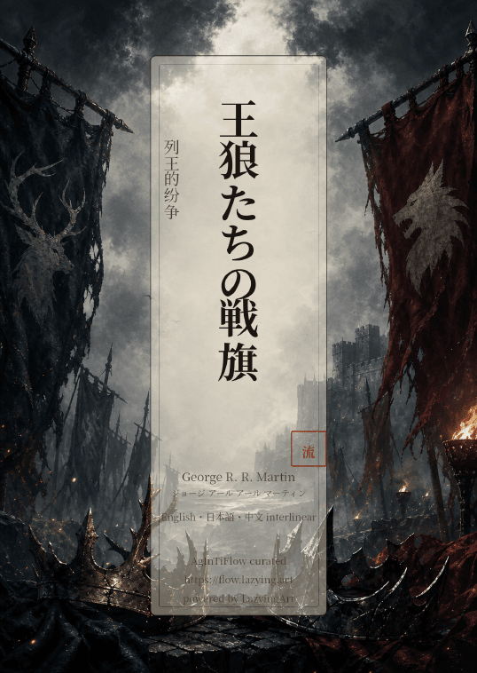 | `a-clash-of-kings` | `en-jp-zh` | [color](https://github.com/lachlanchen/LinguaLeaf/blob/main/docs/pocketpolyglot/books/en-jp-zh/a-clash-of-kings/en-main-jp-zh/color/A Clash of Kings（日文・中文注）・最大語種・大字版.pdf) | [black-white](https://github.com/lachlanchen/LinguaLeaf/blob/main/docs/pocketpolyglot/books/en-jp-zh/a-clash-of-kings/en-main-jp-zh/blackwhite/A Clash of Kings（日文・中文注・黑白）・最大語種・大字版.pdf) |
|  | `a-dance-with-dragons` | `en-jp-zh` | [color](https://github.com/lachlanchen/LinguaLeaf/blob/main/docs/pocketpolyglot/books/en-jp-zh/a-dance-with-dragons/en-main-jp-zh/color/A Dance with Dragons（日文・中文注）・最大語種・大字版.pdf) | [black-white](https://github.com/lachlanchen/LinguaLeaf/blob/main/docs/pocketpolyglot/books/en-jp-zh/a-dance-with-dragons/en-main-jp-zh/blackwhite/A Dance with Dragons（日文・中文注・黑白）・最大語種・大字版.pdf) |
|  | `a-feast-for-crows` | `en-jp-zh` | [color](https://github.com/lachlanchen/LinguaLeaf/blob/main/docs/pocketpolyglot/books/en-jp-zh/a-feast-for-crows/en-main-jp-zh/color/A Feast for Crows（日文・中文注）・最大語種・大字版.pdf) | [black-white](https://github.com/lachlanchen/LinguaLeaf/blob/main/docs/pocketpolyglot/books/en-jp-zh/a-feast-for-crows/en-main-jp-zh/blackwhite/A Feast for Crows（日文・中文注・黑白）・最大語種・大字版.pdf) |
| 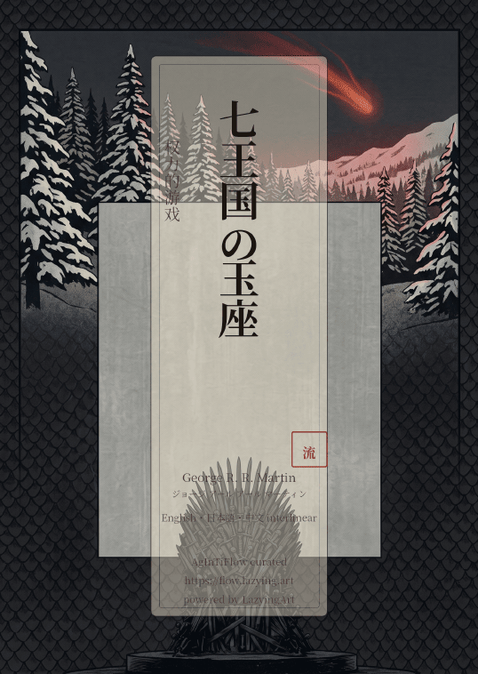 | `a-game-of-thrones` | `en-jp-zh` | [color](https://github.com/lachlanchen/LinguaLeaf/blob/main/docs/pocketpolyglot/books/en-jp-zh/a-game-of-thrones/en-main-jp-zh/color/A Game of Thrones（日文・中文注）・最大語種・大字版.pdf) | [black-white](https://github.com/lachlanchen/LinguaLeaf/blob/main/docs/pocketpolyglot/books/en-jp-zh/a-game-of-thrones/en-main-jp-zh/blackwhite/A Game of Thrones（日文・中文注・黑白）・最大語種・大字版.pdf) |
|  | `a-storm-of-swords` | `en-jp-zh` | [color](https://github.com/lachlanchen/LinguaLeaf/blob/main/docs/pocketpolyglot/books/en-jp-zh/a-storm-of-swords/en-main-jp-zh/color/A Storm of Swords（日文・中文注）・最大語種・大字版.pdf) | [black-white](https://github.com/lachlanchen/LinguaLeaf/blob/main/docs/pocketpolyglot/books/en-jp-zh/a-storm-of-swords/en-main-jp-zh/blackwhite/A Storm of Swords（日文・中文注・黑白）・最大語種・大字版.pdf) |
|  | `ancient-egypt-history` | `en-jp-zh` | [color](https://github.com/lachlanchen/LinguaLeaf/blob/main/docs/pocketpolyglot/books/en-jp-zh/ancient-egypt-history/en-main-jp-zh/color/The Oxford History of Ancient Egypt（日文・中文注）・最大語種・大字版.pdf) | [black-white](https://github.com/lachlanchen/LinguaLeaf/blob/main/docs/pocketpolyglot/books/en-jp-zh/ancient-egypt-history/en-main-jp-zh/blackwhite/The Oxford History of Ancient Egypt（日文・中文注・黑白）・最大語種・大字版.pdf) |
|  | `babylon-mesopotamia` | `en-jp-zh` | [color](https://github.com/lachlanchen/LinguaLeaf/blob/main/docs/pocketpolyglot/books/en-jp-zh/babylon-mesopotamia/en-main-jp-zh/color/Babylon: Mesopotamia and the Birth of Civilization（日文・中文注）・最大語種・大字版.pdf) | [black-white](https://github.com/lachlanchen/LinguaLeaf/blob/main/docs/pocketpolyglot/books/en-jp-zh/babylon-mesopotamia/en-main-jp-zh/blackwhite/Babylon: Mesopotamia and the Birth of Civilization（日文・中文注・黑白）・最大語種・大字版.pdf) |
| 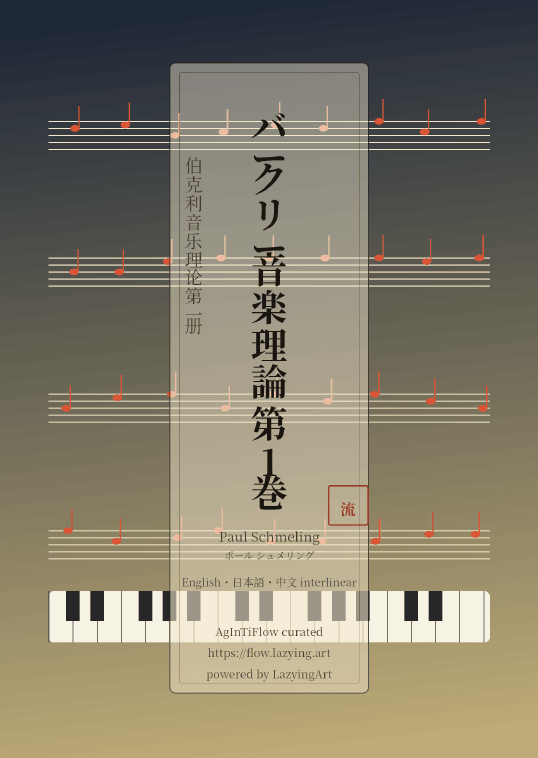 | `berklee-music-theory-book-1` | `en-jp-zh` | [color](https://github.com/lachlanchen/LinguaLeaf/blob/main/docs/pocketpolyglot/books/en-jp-zh/berklee-music-theory-book-1/en-main-jp-zh/color/Berklee Music Theory Book 1（日文・中文注）・最大語種・大字版.pdf) | [black-white](https://github.com/lachlanchen/LinguaLeaf/blob/main/docs/pocketpolyglot/books/en-jp-zh/berklee-music-theory-book-1/en-main-jp-zh/blackwhite/Berklee Music Theory Book 1（日文・中文注・黑白）・最大語種・大字版.pdf) |
|  | `bhagavad-gita` | `en-jp-zh` | [color](https://github.com/lachlanchen/LinguaLeaf/blob/main/docs/pocketpolyglot/books/en-jp-zh/bhagavad-gita/en-main-jp-zh/color/The Bhagavad Gita（日文・中文注）・最大語種・大字版.pdf) | [black-white](https://github.com/lachlanchen/LinguaLeaf/blob/main/docs/pocketpolyglot/books/en-jp-zh/bhagavad-gita/en-main-jp-zh/blackwhite/The Bhagavad Gita（日文・中文注・黑白）・最大語種・大字版.pdf) |
|  | `bible` | `en-jp-zh` | [color](https://github.com/lachlanchen/LinguaLeaf/blob/main/docs/pocketpolyglot/books/en-jp-zh/bible/en-main-jp-zh/color/The Holy Bible（日文・中文注）・最大語種・大字版.pdf) | [black-white](https://github.com/lachlanchen/LinguaLeaf/blob/main/docs/pocketpolyglot/books/en-jp-zh/bible/en-main-jp-zh/blackwhite/The Holy Bible（日文・中文注・黑白）・最大語種・大字版.pdf) |
|  | `black-holes-baby-universes` | `en-jp-zh` | [color](https://github.com/lachlanchen/LinguaLeaf/blob/main/docs/pocketpolyglot/books/en-jp-zh/black-holes-baby-universes/en-main-jp-zh/color/Black Holes and Baby Universes and Other Essays（日文・中文注）・最大語種・大字版.pdf) | [black-white](https://github.com/lachlanchen/LinguaLeaf/blob/main/docs/pocketpolyglot/books/en-jp-zh/black-holes-baby-universes/en-main-jp-zh/blackwhite/Black Holes and Baby Universes and Other Essays（日文・中文注・黑白）・最大語種・大字版.pdf) |
|  | `botchan` | `en-jp-zh` | [color](https://github.com/lachlanchen/LinguaLeaf/blob/main/docs/pocketpolyglot/books/en-jp-zh/botchan/en-main-jp-zh/color/Botchan（日文・中文注）・最大語種・大字版.pdf) | [black-white](https://github.com/lachlanchen/LinguaLeaf/blob/main/docs/pocketpolyglot/books/en-jp-zh/botchan/en-main-jp-zh/blackwhite/Botchan（日文・中文注・黑白）・最大語種・大字版.pdf) |
|  | `brief-answers-big-questions` | `en-jp-zh` | [color](https://github.com/lachlanchen/LinguaLeaf/blob/main/docs/pocketpolyglot/books/en-jp-zh/brief-answers-big-questions/en-main-jp-zh/color/Brief Answers to the Big Questions（日文・中文注）・最大語種・大字版.pdf) | [black-white](https://github.com/lachlanchen/LinguaLeaf/blob/main/docs/pocketpolyglot/books/en-jp-zh/brief-answers-big-questions/en-main-jp-zh/blackwhite/Brief Answers to the Big Questions（日文・中文注・黑白）・最大語種・大字版.pdf) |
|  | `byron-selected-poems` | `en-jp-zh` | [color](https://github.com/lachlanchen/LinguaLeaf/blob/main/docs/pocketpolyglot/books/en-jp-zh/byron-selected-poems/en-main-jp-zh/color/Selected Poems of Lord Byron（日文・中文注）・最大語種・大字版.pdf) | [black-white](https://github.com/lachlanchen/LinguaLeaf/blob/main/docs/pocketpolyglot/books/en-jp-zh/byron-selected-poems/en-main-jp-zh/blackwhite/Selected Poems of Lord Byron（日文・中文注・黑白）・最大語種・大字版.pdf) |
|  | `chuci` | `wenyan-en-jp-zh` | [color](https://github.com/lachlanchen/LinguaLeaf/blob/main/docs/pocketpolyglot/books/wenyan-en-jp-zh/chuci/wenyan-main-quadrilingual/color/楚辭（英文・現代日本語・現代中文注）・最大語種・大字版.pdf) | [black-white](https://github.com/lachlanchen/LinguaLeaf/blob/main/docs/pocketpolyglot/books/wenyan-en-jp-zh/chuci/wenyan-main-quadrilingual/blackwhite/楚辭（英文・現代日本語・現代中文注・黑白）・最大語種・大字版.pdf) |
|  | `chumon-no-ooi-ryoriten` | `jp-zh` | [color](https://github.com/lachlanchen/LinguaLeaf/blob/main/docs/pocketpolyglot/books/jp-zh/chumon-no-ooi-ryoriten/jp-main/color/注文の多い料理店（中文注）・最大語種・大字版.pdf) | [black-white](https://github.com/lachlanchen/LinguaLeaf/blob/main/docs/pocketpolyglot/books/jp-zh/chumon-no-ooi-ryoriten/jp-main/blackwhite/注文の多い料理店（中文注・黑白）・最大語種・大字版.pdf) |
| 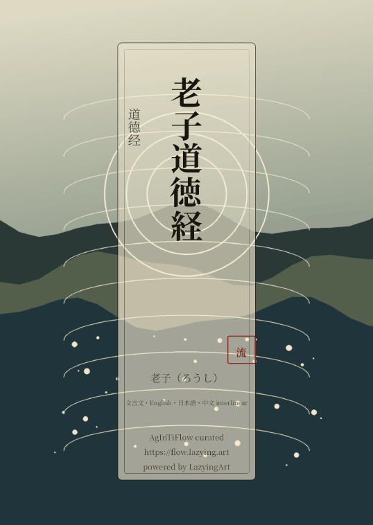 | `daodejing` | `wenyan-en-jp-zh` | [color](https://github.com/lachlanchen/LinguaLeaf/blob/main/docs/pocketpolyglot/books/wenyan-en-jp-zh/daodejing/wenyan-main-quadrilingual/color/道德經（英文・現代日本語・現代中文注）・最大語種・大字版.pdf) | [black-white](https://github.com/lachlanchen/LinguaLeaf/blob/main/docs/pocketpolyglot/books/wenyan-en-jp-zh/daodejing/wenyan-main-quadrilingual/blackwhite/道德經（英文・現代日本語・現代中文注・黑白）・最大語種・大字版.pdf) |
|  | `economics-one-lesson` | `en-jp-zh` | [color](https://github.com/lachlanchen/LinguaLeaf/blob/main/docs/pocketpolyglot/books/en-jp-zh/economics-one-lesson/en-main-jp-zh/color/Economics in One Lesson（日文・中文注）・最大語種・大字版.pdf) | [black-white](https://github.com/lachlanchen/LinguaLeaf/blob/main/docs/pocketpolyglot/books/en-jp-zh/economics-one-lesson/en-main-jp-zh/blackwhite/Economics in One Lesson（日文・中文注・黑白）・最大語種・大字版.pdf) |
|  | `elegant-universe` | `en-jp-zh` | [color](https://github.com/lachlanchen/LinguaLeaf/blob/main/docs/pocketpolyglot/books/en-jp-zh/elegant-universe/en-main-jp-zh/color/The Elegant Universe（日文・中文注）・最大語種・大字版.pdf) | [black-white](https://github.com/lachlanchen/LinguaLeaf/blob/main/docs/pocketpolyglot/books/en-jp-zh/elegant-universe/en-main-jp-zh/blackwhite/The Elegant Universe（日文・中文注・黑白）・最大語種・大字版.pdf) |
|  | `english-poetry-anthology-spark` | `en-jp-zh` | [color](https://github.com/lachlanchen/LinguaLeaf/blob/main/docs/pocketpolyglot/books/en-jp-zh/english-poetry-anthology-spark/en-main-jp-zh/color/Walt Whitman: Selected Poems（日文・中文注）・最大語種・大字版.pdf) | [black-white](https://github.com/lachlanchen/LinguaLeaf/blob/main/docs/pocketpolyglot/books/en-jp-zh/english-poetry-anthology-spark/en-main-jp-zh/blackwhite/Walt Whitman: Selected Poems（日文・中文注・黑白）・最大語種・大字版.pdf) |
|  | `fabric-of-the-cosmos` | `en-jp-zh` | [color](https://github.com/lachlanchen/LinguaLeaf/blob/main/docs/pocketpolyglot/books/en-jp-zh/fabric-of-the-cosmos/en-main-jp-zh/color/The Fabric of the Cosmos（日文・中文注）・最大語種・大字版.pdf) | [black-white](https://github.com/lachlanchen/LinguaLeaf/blob/main/docs/pocketpolyglot/books/en-jp-zh/fabric-of-the-cosmos/en-main-jp-zh/blackwhite/The Fabric of the Cosmos（日文・中文注・黑白）・最大語種・大字版.pdf) |
| 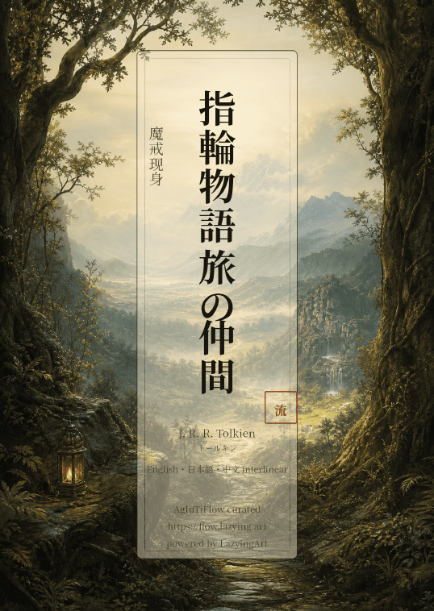 | `fellowship-of-the-ring` | `en-jp-zh` | [color](https://github.com/lachlanchen/LinguaLeaf/blob/main/docs/pocketpolyglot/books/en-jp-zh/fellowship-of-the-ring/en-main-jp-zh/color/The Fellowship of the Ring（日文・中文注）・最大語種・大字版.pdf) | [black-white](https://github.com/lachlanchen/LinguaLeaf/blob/main/docs/pocketpolyglot/books/en-jp-zh/fellowship-of-the-ring/en-main-jp-zh/blackwhite/The Fellowship of the Ring（日文・中文注・黑白）・最大語種・大字版.pdf) |
|  | `foguoji` | `wenyan-en-jp-zh` | [color](https://github.com/lachlanchen/LinguaLeaf/blob/main/docs/pocketpolyglot/books/wenyan-en-jp-zh/foguoji/wenyan-main-quadrilingual/color/佛國記（英文・現代日本語・現代中文注）・最大語種・大字版.pdf) | [black-white](https://github.com/lachlanchen/LinguaLeaf/blob/main/docs/pocketpolyglot/books/wenyan-en-jp-zh/foguoji/wenyan-main-quadrilingual/blackwhite/佛國記（英文・現代日本語・現代中文注・黑白）・最大語種・大字版.pdf) |
|  | `genji-modern` | `en-jp-zh` | [color](https://github.com/lachlanchen/LinguaLeaf/blob/main/docs/pocketpolyglot/books/en-jp-zh/genji-modern/en-main-jp-zh/color/The Tale of Genji（日文・中文注）・最大語種・大字版.pdf) | [black-white](https://github.com/lachlanchen/LinguaLeaf/blob/main/docs/pocketpolyglot/books/en-jp-zh/genji-modern/en-main-jp-zh/blackwhite/The Tale of Genji（日文・中文注・黑白）・最大語種・大字版.pdf) |
| 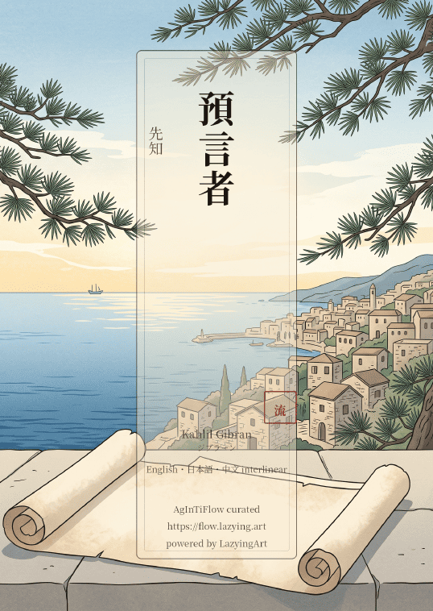 | `gibran-the-prophet` | `en-jp-zh` | [color](https://github.com/lachlanchen/LinguaLeaf/blob/main/docs/pocketpolyglot/books/en-jp-zh/gibran-the-prophet/en-main-jp-zh/color/The Prophet（日文・中文注）・最大語種・大字版.pdf) | [black-white](https://github.com/lachlanchen/LinguaLeaf/blob/main/docs/pocketpolyglot/books/en-jp-zh/gibran-the-prophet/en-main-jp-zh/blackwhite/The Prophet（日文・中文注・黑白）・最大語種・大字版.pdf) |
|  | `ginga-tetsudo` | `jp-zh` | [color](https://github.com/lachlanchen/LinguaLeaf/blob/main/docs/pocketpolyglot/books/jp-zh/ginga-tetsudo/jp-main/color/銀河鉄道の夜（中文注）・最大語種・大字版.pdf) | [black-white](https://github.com/lachlanchen/LinguaLeaf/blob/main/docs/pocketpolyglot/books/jp-zh/ginga-tetsudo/jp-main/blackwhite/銀河鉄道の夜（中文注・黑白）・最大語種・大字版.pdf) |
|  | `gone-with-the-wind` | `en-jp-zh` | [color](https://github.com/lachlanchen/LinguaLeaf/blob/main/docs/pocketpolyglot/books/en-jp-zh/gone-with-the-wind/en-main-jp-zh/color/Gone With the Wind（日文・中文注）・最大語種・大字版.pdf) | [black-white](https://github.com/lachlanchen/LinguaLeaf/blob/main/docs/pocketpolyglot/books/en-jp-zh/gone-with-the-wind/en-main-jp-zh/blackwhite/Gone With the Wind（日文・中文注・黑白）・最大語種・大字版.pdf) |
|  | `good-strategy-bad-strategy` | `en-jp-zh` | [color](https://github.com/lachlanchen/LinguaLeaf/blob/main/docs/pocketpolyglot/books/en-jp-zh/good-strategy-bad-strategy/en-main-jp-zh/color/Good Strategy Bad Strategy（日文・中文注）・最大語種・大字版.pdf) | [black-white](https://github.com/lachlanchen/LinguaLeaf/blob/main/docs/pocketpolyglot/books/en-jp-zh/good-strategy-bad-strategy/en-main-jp-zh/blackwhite/Good Strategy Bad Strategy（日文・中文注・黑白）・最大語種・大字版.pdf) |
|  | `grand-design` | `en-jp-zh` | [color](https://github.com/lachlanchen/LinguaLeaf/blob/main/docs/pocketpolyglot/books/en-jp-zh/grand-design/en-main-jp-zh/color/The Grand Design（日文・中文注）・最大語種・大字版.pdf) | [black-white](https://github.com/lachlanchen/LinguaLeaf/blob/main/docs/pocketpolyglot/books/en-jp-zh/grand-design/en-main-jp-zh/blackwhite/The Grand Design（日文・中文注・黑白）・最大語種・大字版.pdf) |
| 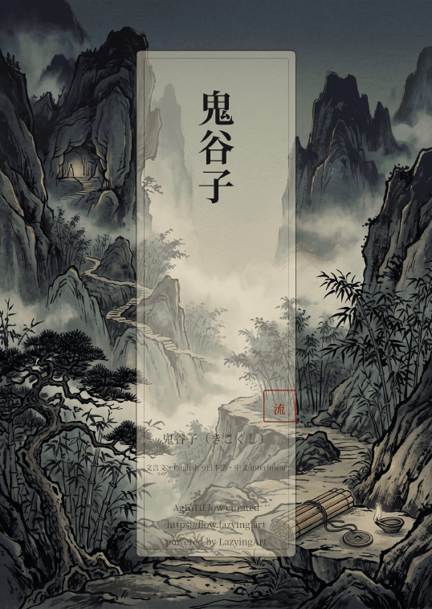 | `guiguzi` | `wenyan-en-jp-zh` | [color](https://github.com/lachlanchen/LinguaLeaf/blob/main/docs/pocketpolyglot/books/wenyan-en-jp-zh/guiguzi/wenyan-main-quadrilingual/color/鬼谷子（英文・現代日本語・現代中文注）・最大語種・大字版.pdf) | [black-white](https://github.com/lachlanchen/LinguaLeaf/blob/main/docs/pocketpolyglot/books/wenyan-en-jp-zh/guiguzi/wenyan-main-quadrilingual/blackwhite/鬼谷子（英文・現代日本語・現代中文注・黑白）・最大語種・大字版.pdf) |
| 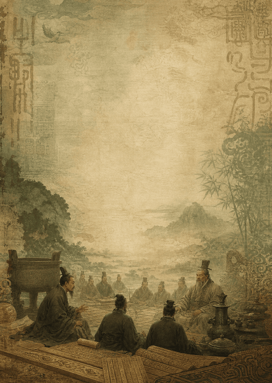 | `guoyu` | `wenyan-en-jp-zh` | [color](https://github.com/lachlanchen/LinguaLeaf/blob/main/docs/pocketpolyglot/books/wenyan-en-jp-zh/guoyu/wenyan-main-quadrilingual/color/國語（英文・現代日本語・現代中文注）・最大語種・大字版.pdf) | [black-white](https://github.com/lachlanchen/LinguaLeaf/blob/main/docs/pocketpolyglot/books/wenyan-en-jp-zh/guoyu/wenyan-main-quadrilingual/blackwhite/國語（英文・現代日本語・現代中文注・黑白）・最大語種・大字版.pdf) |
|  | `han-shu` | `wenyan-en-jp-zh` | local only | local only |
| 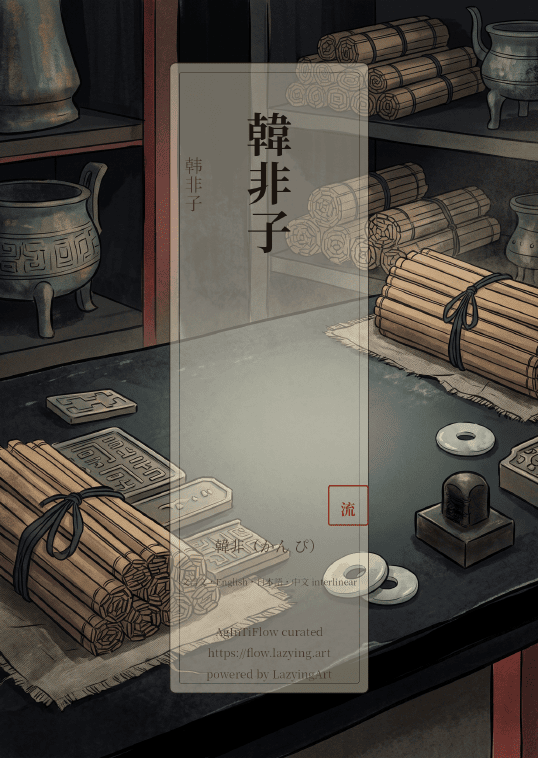 | `hanfeizi` | `wenyan-en-jp-zh` | [color](https://github.com/lachlanchen/LinguaLeaf/blob/main/docs/pocketpolyglot/books/wenyan-en-jp-zh/hanfeizi/wenyan-main-quadrilingual/color/韓非子（英文・現代日本語・現代中文注）・最大語種・大字版.pdf) | [black-white](https://github.com/lachlanchen/LinguaLeaf/blob/main/docs/pocketpolyglot/books/wenyan-en-jp-zh/hanfeizi/wenyan-main-quadrilingual/blackwhite/韓非子（英文・現代日本語・現代中文注・黑白）・最大語種・大字版.pdf) |
| 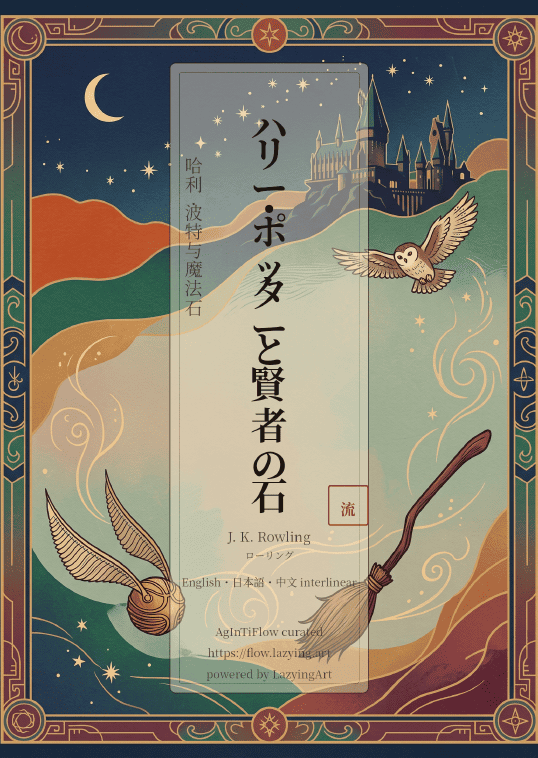 | `harry-potter-1` | `en-jp-zh` | [color](https://github.com/lachlanchen/LinguaLeaf/blob/main/docs/pocketpolyglot/books/en-jp-zh/harry-potter-1/en-main-jp-zh/color/Harry Potter and the Sorcerer's Stone（日文・中文注）・最大語種・大字版.pdf) | [black-white](https://github.com/lachlanchen/LinguaLeaf/blob/main/docs/pocketpolyglot/books/en-jp-zh/harry-potter-1/en-main-jp-zh/blackwhite/Harry Potter and the Sorcerer's Stone（日文・中文注・黑白）・最大語種・大字版.pdf) |
| 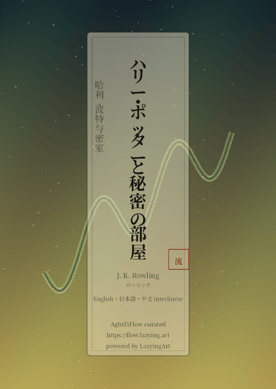 | `harry-potter-2` | `en-jp-zh` | [color](https://github.com/lachlanchen/LinguaLeaf/blob/main/docs/pocketpolyglot/books/en-jp-zh/harry-potter-2/en-main-jp-zh/color/Harry Potter and the Chamber of Secrets（日文・中文注）・最大語種・大字版.pdf) | [black-white](https://github.com/lachlanchen/LinguaLeaf/blob/main/docs/pocketpolyglot/books/en-jp-zh/harry-potter-2/en-main-jp-zh/blackwhite/Harry Potter and the Chamber of Secrets（日文・中文注・黑白）・最大語種・大字版.pdf) |
|  | `harry-potter-3` | `en-jp-zh` | [color](https://github.com/lachlanchen/LinguaLeaf/blob/main/docs/pocketpolyglot/books/en-jp-zh/harry-potter-3/en-main-jp-zh/color/Harry Potter and the Prisoner of Azkaban（日文・中文注）・最大語種・大字版.pdf) | [black-white](https://github.com/lachlanchen/LinguaLeaf/blob/main/docs/pocketpolyglot/books/en-jp-zh/harry-potter-3/en-main-jp-zh/blackwhite/Harry Potter and the Prisoner of Azkaban（日文・中文注・黑白）・最大語種・大字版.pdf) |
| 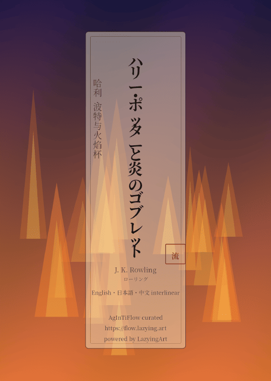 | `harry-potter-4` | `en-jp-zh` | [color](https://github.com/lachlanchen/LinguaLeaf/blob/main/docs/pocketpolyglot/books/en-jp-zh/harry-potter-4/en-main-jp-zh/color/Harry Potter and the Goblet of Fire（日文・中文注）・最大語種・大字版.pdf) | [black-white](https://github.com/lachlanchen/LinguaLeaf/blob/main/docs/pocketpolyglot/books/en-jp-zh/harry-potter-4/en-main-jp-zh/blackwhite/Harry Potter and the Goblet of Fire（日文・中文注・黑白）・最大語種・大字版.pdf) |
| 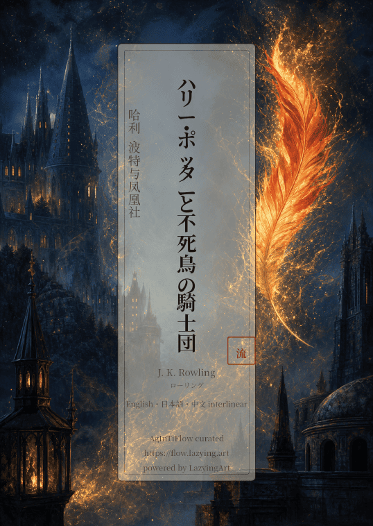 | `harry-potter-5` | `en-jp-zh` | [color](https://github.com/lachlanchen/LinguaLeaf/blob/main/docs/pocketpolyglot/books/en-jp-zh/harry-potter-5/en-main-jp-zh/color/Harry Potter and the Order of the Phoenix（日文・中文注）・最大語種・大字版.pdf) | [black-white](https://github.com/lachlanchen/LinguaLeaf/blob/main/docs/pocketpolyglot/books/en-jp-zh/harry-potter-5/en-main-jp-zh/blackwhite/Harry Potter and the Order of the Phoenix（日文・中文注・黑白）・最大語種・大字版.pdf) |
| 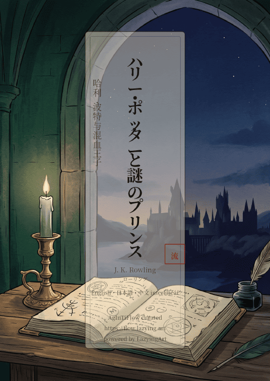 | `harry-potter-6` | `en-jp-zh` | [color](https://github.com/lachlanchen/LinguaLeaf/blob/main/docs/pocketpolyglot/books/en-jp-zh/harry-potter-6/en-main-jp-zh/color/Harry Potter and the Half-Blood Prince（日文・中文注）・最大語種・大字版.pdf) | [black-white](https://github.com/lachlanchen/LinguaLeaf/blob/main/docs/pocketpolyglot/books/en-jp-zh/harry-potter-6/en-main-jp-zh/blackwhite/Harry Potter and the Half-Blood Prince（日文・中文注・黑白）・最大語種・大字版.pdf) |
| 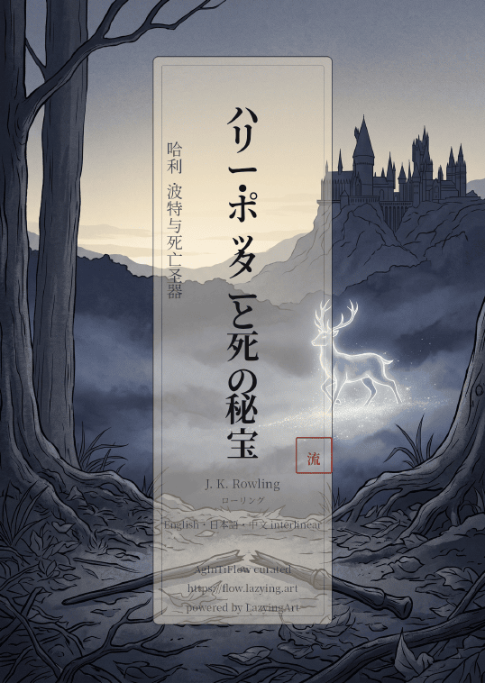 | `harry-potter-7` | `en-jp-zh` | [color](https://github.com/lachlanchen/LinguaLeaf/blob/main/docs/pocketpolyglot/books/en-jp-zh/harry-potter-7/en-main-jp-zh/color/Harry Potter and the Deathly Hallows（日文・中文注）・最大語種・大字版.pdf) | [black-white](https://github.com/lachlanchen/LinguaLeaf/blob/main/docs/pocketpolyglot/books/en-jp-zh/harry-potter-7/en-main-jp-zh/blackwhite/Harry Potter and the Deathly Hallows（日文・中文注・黑白）・最大語種・大字版.pdf) |
|  | `hidden-reality` | `en-jp-zh` | [color](https://github.com/lachlanchen/LinguaLeaf/blob/main/docs/pocketpolyglot/books/en-jp-zh/hidden-reality/en-main-jp-zh/color/The Hidden Reality（日文・中文注）・最大語種・大字版.pdf) | [black-white](https://github.com/lachlanchen/LinguaLeaf/blob/main/docs/pocketpolyglot/books/en-jp-zh/hidden-reality/en-main-jp-zh/blackwhite/The Hidden Reality（日文・中文注・黑白）・最大語種・大字版.pdf) |
|  | `holy-roman-empire-history` | `en-jp-zh` | [color](https://github.com/lachlanchen/LinguaLeaf/blob/main/docs/pocketpolyglot/books/en-jp-zh/holy-roman-empire-history/en-main-jp-zh/color/Heart of Europe: A History of the Holy Roman Empire（日文・中文注）・最大語種・大字版.pdf) | [black-white](https://github.com/lachlanchen/LinguaLeaf/blob/main/docs/pocketpolyglot/books/en-jp-zh/holy-roman-empire-history/en-main-jp-zh/blackwhite/Heart of Europe: A History of the Holy Roman Empire（日文・中文注・黑白）・最大語種・大字版.pdf) |
| 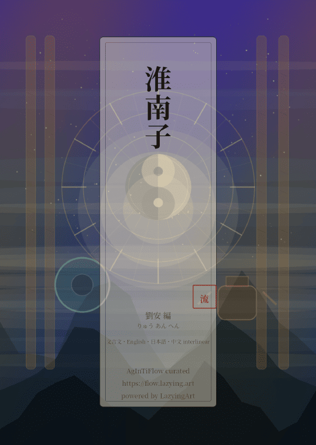 | `huainanzi` | `wenyan-en-jp-zh` | [color](https://github.com/lachlanchen/LinguaLeaf/blob/main/docs/pocketpolyglot/books/wenyan-en-jp-zh/huainanzi/wenyan-main-quadrilingual/color/淮南子（英文・現代日本語・現代中文注）・最大語種・大字版.pdf) | [black-white](https://github.com/lachlanchen/LinguaLeaf/blob/main/docs/pocketpolyglot/books/wenyan-en-jp-zh/huainanzi/wenyan-main-quadrilingual/blackwhite/淮南子（英文・現代日本語・現代中文注・黑白）・最大語種・大字版.pdf) |
|  | `i-am-a-cat` | `en-jp-zh` | [color](https://github.com/lachlanchen/LinguaLeaf/blob/main/docs/pocketpolyglot/books/en-jp-zh/i-am-a-cat/en-main-jp-zh/color/I Am a Cat（日文・中文注）・最大語種・大字版.pdf) | [black-white](https://github.com/lachlanchen/LinguaLeaf/blob/main/docs/pocketpolyglot/books/en-jp-zh/i-am-a-cat/en-main-jp-zh/blackwhite/I Am a Cat（日文・中文注・黑白）・最大語種・大字版.pdf) |
|  | `icarus-edge-of-time` | `en-jp-zh` | [color](https://github.com/lachlanchen/LinguaLeaf/blob/main/docs/pocketpolyglot/books/en-jp-zh/icarus-edge-of-time/en-main-jp-zh/color/Icarus at the Edge of Time（日文・中文注）・最大語種・大字版.pdf) | [black-white](https://github.com/lachlanchen/LinguaLeaf/blob/main/docs/pocketpolyglot/books/en-jp-zh/icarus-edge-of-time/en-main-jp-zh/blackwhite/Icarus at the Edge of Time（日文・中文注・黑白）・最大語種・大字版.pdf) |
|  | `inspired-product` | `en-jp-zh` | [color](https://github.com/lachlanchen/LinguaLeaf/blob/main/docs/pocketpolyglot/books/en-jp-zh/inspired-product/en-main-jp-zh/color/INSPIRED（日文・中文注）・最大語種・大字版.pdf) | [black-white](https://github.com/lachlanchen/LinguaLeaf/blob/main/docs/pocketpolyglot/books/en-jp-zh/inspired-product/en-main-jp-zh/blackwhite/INSPIRED（日文・中文注・黑白）・最大語種・大字版.pdf) |
|  | `intelligent-investor` | `en-jp-zh` | [color](https://github.com/lachlanchen/LinguaLeaf/blob/main/docs/pocketpolyglot/books/en-jp-zh/intelligent-investor/en-main-jp-zh/color/The Intelligent Investor（日文・中文注）・最大語種・大字版.pdf) | [black-white](https://github.com/lachlanchen/LinguaLeaf/blob/main/docs/pocketpolyglot/books/en-jp-zh/intelligent-investor/en-main-jp-zh/blackwhite/The Intelligent Investor（日文・中文注・黑白）・最大語種・大字版.pdf) |
|  | `inugami-curse` | `en-jp-zh` | [color](https://github.com/lachlanchen/LinguaLeaf/blob/main/docs/pocketpolyglot/books/en-jp-zh/inugami-curse/en-main-jp-zh/color/The Inugami Curse（日文・中文注）・最大語種・大字版.pdf) | [black-white](https://github.com/lachlanchen/LinguaLeaf/blob/main/docs/pocketpolyglot/books/en-jp-zh/inugami-curse/en-main-jp-zh/blackwhite/The Inugami Curse（日文・中文注・黑白）・最大語種・大字版.pdf) |
|  | `izu-no-odori` | `en-jp-zh` | [color](https://github.com/lachlanchen/LinguaLeaf/blob/main/docs/pocketpolyglot/books/en-jp-zh/izu-no-odori/en-main-jp-zh/color/The Dancing Girl of Izu（日文・中文注）・最大語種・大字版.pdf) | [black-white](https://github.com/lachlanchen/LinguaLeaf/blob/main/docs/pocketpolyglot/books/en-jp-zh/izu-no-odori/en-main-jp-zh/blackwhite/The Dancing Girl of Izu（日文・中文注・黑白）・最大語種・大字版.pdf) |
|  | `jane-eyre` | `en-jp-zh` | [color](https://github.com/lachlanchen/LinguaLeaf/blob/main/docs/pocketpolyglot/books/en-jp-zh/jane-eyre/en-main-jp-zh/color/Jane Eyre（日文・中文注）・最大語種・大字版.pdf) | [black-white](https://github.com/lachlanchen/LinguaLeaf/blob/main/docs/pocketpolyglot/books/en-jp-zh/jane-eyre/en-main-jp-zh/blackwhite/Jane Eyre（日文・中文注・黑白）・最大語種・大字版.pdf) |
|  | `japanese-history` | `en-jp-zh` | [color](https://github.com/lachlanchen/LinguaLeaf/blob/main/docs/pocketpolyglot/books/en-jp-zh/japanese-history/en-main-jp-zh/color/A Concise History of Japan（日文・中文注）・最大語種・大字版.pdf) | [black-white](https://github.com/lachlanchen/LinguaLeaf/blob/main/docs/pocketpolyglot/books/en-jp-zh/japanese-history/en-main-jp-zh/blackwhite/A Concise History of Japan（日文・中文注・黑白）・最大語種・大字版.pdf) |
|  | `keats-poems-spark` | `en-jp-zh` | [color](https://github.com/lachlanchen/LinguaLeaf/blob/main/docs/pocketpolyglot/books/en-jp-zh/keats-poems-spark/en-main-jp-zh/color/John Keats: Poems（日文・中文注）・最大語種・大字版.pdf) | [black-white](https://github.com/lachlanchen/LinguaLeaf/blob/main/docs/pocketpolyglot/books/en-jp-zh/keats-poems-spark/en-main-jp-zh/blackwhite/John Keats: Poems（日文・中文注・黑白）・最大語種・大字版.pdf) |
|  | `kinkakuji` | `en-jp-zh` | [color](https://github.com/lachlanchen/LinguaLeaf/blob/main/docs/pocketpolyglot/books/en-jp-zh/kinkakuji/en-main-jp-zh/color/The Temple of the Golden Pavilion（日文・中文注）・最大語種・大字版.pdf) | [black-white](https://github.com/lachlanchen/LinguaLeaf/blob/main/docs/pocketpolyglot/books/en-jp-zh/kinkakuji/en-main-jp-zh/blackwhite/The Temple of the Golden Pavilion（日文・中文注・黑白）・最大語種・大字版.pdf) |
|  | `kojiki` | `jp-zh` | [color](https://github.com/lachlanchen/LinguaLeaf/blob/main/docs/pocketpolyglot/books/jp-zh/kojiki/jp-main/color/古事記（中文注）・最大語種・大字版.pdf) | [black-white](https://github.com/lachlanchen/LinguaLeaf/blob/main/docs/pocketpolyglot/books/jp-zh/kojiki/jp-main/blackwhite/古事記（中文注・黑白）・最大語種・大字版.pdf) |
|  | `kojiki-wenyan` | `wenyan-en-jp-zh` | [color](https://github.com/lachlanchen/LinguaLeaf/blob/main/docs/pocketpolyglot/books/wenyan-en-jp-zh/kojiki-wenyan/wenyan-main-quadrilingual/color/古事記（現代日本語・現代中文・英文注）・最大語種・大字版.pdf) | [black-white](https://github.com/lachlanchen/LinguaLeaf/blob/main/docs/pocketpolyglot/books/wenyan-en-jp-zh/kojiki-wenyan/wenyan-main-quadrilingual/blackwhite/古事記（現代日本語・現代中文・英文注・黑白）・最大語種・大字版.pdf) |
|  | `kokin-wakashu` | `wayakana-en-jp-zh` | [color](https://github.com/lachlanchen/LinguaLeaf/blob/main/docs/pocketpolyglot/books/wayakana-en-jp-zh/kokin-wakashu/wayakana-main-en-zh/color/古今和歌集（英文・中文注）・最大語種・大字版.pdf) | [black-white](https://github.com/lachlanchen/LinguaLeaf/blob/main/docs/pocketpolyglot/books/wayakana-en-jp-zh/kokin-wakashu/wayakana-main-en-zh/blackwhite/古今和歌集（英文・中文注・黑白）・最大語種・大字版.pdf) |
|  | `kokoro` | `en-jp-zh` | [color](https://github.com/lachlanchen/LinguaLeaf/blob/main/docs/pocketpolyglot/books/en-jp-zh/kokoro/en-main-jp-zh/color/Kokoro（日文・中文注）・最大語種・大字版.pdf) | [black-white](https://github.com/lachlanchen/LinguaLeaf/blob/main/docs/pocketpolyglot/books/en-jp-zh/kokoro/en-main-jp-zh/blackwhite/Kokoro（日文・中文注・黑白）・最大語種・大字版.pdf) |
|  | `lean-startup` | `en-jp-zh` | [color](https://github.com/lachlanchen/LinguaLeaf/blob/main/docs/pocketpolyglot/books/en-jp-zh/lean-startup/en-main-jp-zh/color/The Lean Startup（日文・中文注）・最大語種・大字版.pdf) | [black-white](https://github.com/lachlanchen/LinguaLeaf/blob/main/docs/pocketpolyglot/books/en-jp-zh/lean-startup/en-main-jp-zh/blackwhite/The Lean Startup（日文・中文注・黑白）・最大語種・大字版.pdf) |
|  | `les-miserables` | `en-jp-zh` | [color](https://github.com/lachlanchen/LinguaLeaf/blob/main/docs/pocketpolyglot/books/en-jp-zh/les-miserables/en-main-jp-zh/color/Les Misérables（日文・中文注）・最大語種・大字版.pdf) | [black-white](https://github.com/lachlanchen/LinguaLeaf/blob/main/docs/pocketpolyglot/books/en-jp-zh/les-miserables/en-main-jp-zh/blackwhite/Les Misérables（日文・中文注・黑白）・最大語種・大字版.pdf) |
|  | `little-book-common-sense-investing` | `en-jp-zh` | [color](https://github.com/lachlanchen/LinguaLeaf/blob/main/docs/pocketpolyglot/books/en-jp-zh/little-book-common-sense-investing/en-main-jp-zh/color/The Little Book of Common Sense Investing（日文・中文注）・最大語種・大字版.pdf) | [black-white](https://github.com/lachlanchen/LinguaLeaf/blob/main/docs/pocketpolyglot/books/en-jp-zh/little-book-common-sense-investing/en-main-jp-zh/blackwhite/The Little Book of Common Sense Investing（日文・中文注・黑白）・最大語種・大字版.pdf) |
| 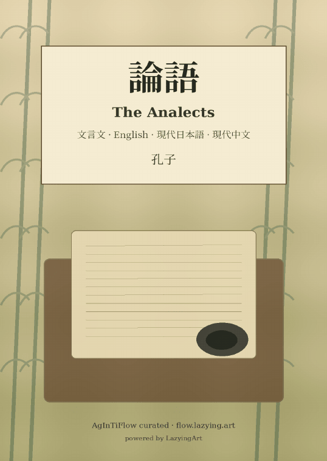 | `lunyu` | `wenyan-en-jp-zh` | [color](https://github.com/lachlanchen/LinguaLeaf/blob/main/docs/pocketpolyglot/books/wenyan-en-jp-zh/lunyu/wenyan-main-quadrilingual/color/論語（英文・現代日本語・現代中文注）・最大語種・大字版.pdf) | [black-white](https://github.com/lachlanchen/LinguaLeaf/blob/main/docs/pocketpolyglot/books/wenyan-en-jp-zh/lunyu/wenyan-main-quadrilingual/blackwhite/論語（英文・現代日本語・現代中文注・黑白）・最大語種・大字版.pdf) |
| 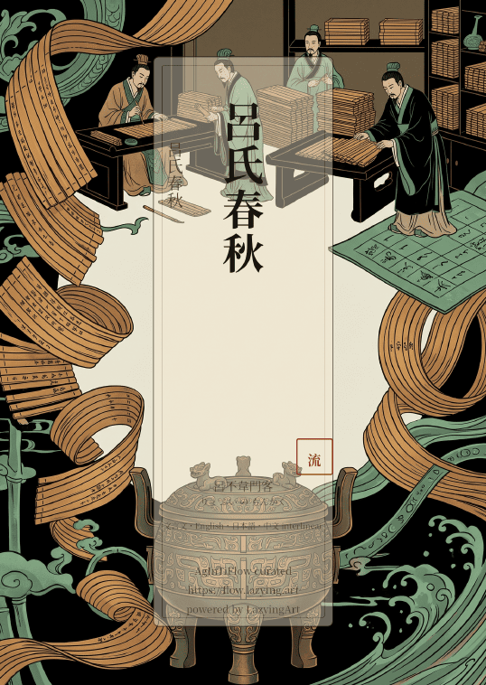 | `lushi-chunqiu` | `wenyan-en-jp-zh` | [color](https://github.com/lachlanchen/LinguaLeaf/blob/main/docs/pocketpolyglot/books/wenyan-en-jp-zh/lushi-chunqiu/wenyan-main-quadrilingual/color/呂氏春秋（英文・現代日本語・現代中文注）・最大語種・大字版.pdf) | [black-white](https://github.com/lachlanchen/LinguaLeaf/blob/main/docs/pocketpolyglot/books/wenyan-en-jp-zh/lushi-chunqiu/wenyan-main-quadrilingual/blackwhite/呂氏春秋（英文・現代日本語・現代中文注・黑白）・最大語種・大字版.pdf) |
|  | `manyoshu` | `wayakana-en-jp-zh` | [color](https://github.com/lachlanchen/LinguaLeaf/blob/main/docs/pocketpolyglot/books/wayakana-en-jp-zh/manyoshu/wayakana-main-en-zh/color/万葉集（英文・中文注）・最大語種・大字版.pdf) | [black-white](https://github.com/lachlanchen/LinguaLeaf/blob/main/docs/pocketpolyglot/books/wayakana-en-jp-zh/manyoshu/wayakana-main-en-zh/blackwhite/万葉集（英文・中文注・黑白）・最大語種・大字版.pdf) |
|  | `martian-chronicles` | `en-jp-zh` | [color](https://github.com/lachlanchen/LinguaLeaf/blob/main/docs/pocketpolyglot/books/en-jp-zh/martian-chronicles/en-main-jp-zh/color/The Martian Chronicles（日文・中文注）・最大語種・大字版.pdf) | [black-white](https://github.com/lachlanchen/LinguaLeaf/blob/main/docs/pocketpolyglot/books/en-jp-zh/martian-chronicles/en-main-jp-zh/blackwhite/The Martian Chronicles（日文・中文注・黑白）・最大語種・大字版.pdf) |
| 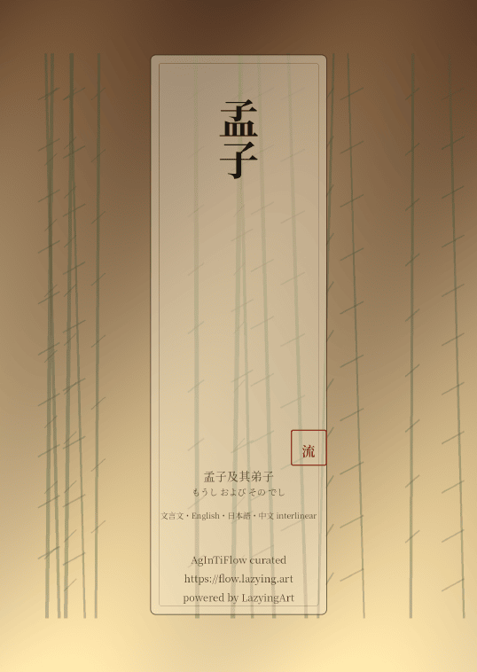 | `mengzi` | `wenyan-en-jp-zh` | [color](https://github.com/lachlanchen/LinguaLeaf/blob/main/docs/pocketpolyglot/books/wenyan-en-jp-zh/mengzi/wenyan-main-quadrilingual/color/孟子（英文・現代日本語・現代中文注）・最大語種・大字版.pdf) | [black-white](https://github.com/lachlanchen/LinguaLeaf/blob/main/docs/pocketpolyglot/books/wenyan-en-jp-zh/mengzi/wenyan-main-quadrilingual/blackwhite/孟子（英文・現代日本語・現代中文注・黑白）・最大語種・大字版.pdf) |
|  | `mom-test` | `en-jp-zh` | [color](https://github.com/lachlanchen/LinguaLeaf/blob/main/docs/pocketpolyglot/books/en-jp-zh/mom-test/en-main-jp-zh/color/The Mom Test（日文・中文注）・最大語種・大字版.pdf) | [black-white](https://github.com/lachlanchen/LinguaLeaf/blob/main/docs/pocketpolyglot/books/en-jp-zh/mom-test/en-main-jp-zh/blackwhite/The Mom Test（日文・中文注・黑白）・最大語種・大字版.pdf) |
| 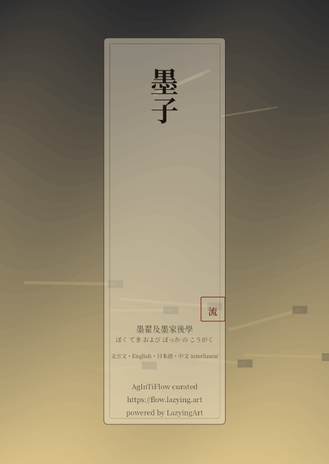 | `mozi` | `wenyan-en-jp-zh` | [color](https://github.com/lachlanchen/LinguaLeaf/blob/main/docs/pocketpolyglot/books/wenyan-en-jp-zh/mozi/wenyan-main-quadrilingual/color/墨子（英文・現代日本語・現代中文注）・最大語種・大字版.pdf) | [black-white](https://github.com/lachlanchen/LinguaLeaf/blob/main/docs/pocketpolyglot/books/wenyan-en-jp-zh/mozi/wenyan-main-quadrilingual/blackwhite/墨子（英文・現代日本語・現代中文注・黑白）・最大語種・大字版.pdf) |
|  | `mudanting` | `wenyan-en-jp-zh` | [color](https://github.com/lachlanchen/LinguaLeaf/blob/main/docs/pocketpolyglot/books/wenyan-en-jp-zh/mudanting/wenyan-main-quadrilingual/color/牡丹亭（英文・現代日本語・現代中文注）・最大語種・大字版.pdf) | [black-white](https://github.com/lachlanchen/LinguaLeaf/blob/main/docs/pocketpolyglot/books/wenyan-en-jp-zh/mudanting/wenyan-main-quadrilingual/blackwhite/牡丹亭（英文・現代日本語・現代中文注・黑白）・最大語種・大字版.pdf) |
|  | `my-brief-history` | `en-jp-zh` | [color](https://github.com/lachlanchen/LinguaLeaf/blob/main/docs/pocketpolyglot/books/en-jp-zh/my-brief-history/en-main-jp-zh/color/My Brief History（日文・中文注）・最大語種・大字版.pdf) | [black-white](https://github.com/lachlanchen/LinguaLeaf/blob/main/docs/pocketpolyglot/books/en-jp-zh/my-brief-history/en-main-jp-zh/blackwhite/My Brief History（日文・中文注・黑白）・最大語種・大字版.pdf) |
|  | `nature-of-space-time` | `en-jp-zh` | [color](https://github.com/lachlanchen/LinguaLeaf/blob/main/docs/pocketpolyglot/books/en-jp-zh/nature-of-space-time/en-main-jp-zh/color/The Nature of Space and Time（日文・中文注）・最大語種・大字版.pdf) | [black-white](https://github.com/lachlanchen/LinguaLeaf/blob/main/docs/pocketpolyglot/books/en-jp-zh/nature-of-space-time/en-main-jp-zh/blackwhite/The Nature of Space and Time（日文・中文注・黑白）・最大語種・大字版.pdf) |
|  | `new-roman-empire-gpt55-low` | `en-jp-zh` | [color](https://github.com/lachlanchen/LinguaLeaf/blob/main/docs/pocketpolyglot/books/en-jp-zh/new-roman-empire-gpt55-low/en-main-jp-zh/color/The New Roman Empire: A History of Byzantium（日文・中文注）・最大語種・大字版.pdf) | [black-white](https://github.com/lachlanchen/LinguaLeaf/blob/main/docs/pocketpolyglot/books/en-jp-zh/new-roman-empire-gpt55-low/en-main-jp-zh/blackwhite/The New Roman Empire: A History of Byzantium（日文・中文注・黑白）・最大語種・大字版.pdf) |
|  | `nihon-shoki` | `wenyan-en-jp-zh` | [color](https://github.com/lachlanchen/LinguaLeaf/blob/main/docs/pocketpolyglot/books/wenyan-en-jp-zh/nihon-shoki/wenyan-main-quadrilingual/color/日本書紀（現代日本語・現代中文・英文注）・最大語種・大字版.pdf) | [black-white](https://github.com/lachlanchen/LinguaLeaf/blob/main/docs/pocketpolyglot/books/wenyan-en-jp-zh/nihon-shoki/wenyan-main-quadrilingual/blackwhite/日本書紀（現代日本語・現代中文・英文注・黑白）・最大語種・大字版.pdf) |
|  | `no-longer-human` | `en-jp-zh` | [color](https://github.com/lachlanchen/LinguaLeaf/blob/main/docs/pocketpolyglot/books/en-jp-zh/no-longer-human/en-main-jp-zh/color/No Longer Human（日文・中文注）・最大語種・大字版.pdf) | [black-white](https://github.com/lachlanchen/LinguaLeaf/blob/main/docs/pocketpolyglot/books/en-jp-zh/no-longer-human/en-main-jp-zh/blackwhite/No Longer Human（日文・中文注・黑白）・最大語種・大字版.pdf) |
|  | `notre-dame-de-paris` | `en-jp-zh` | [color](https://github.com/lachlanchen/LinguaLeaf/blob/main/docs/pocketpolyglot/books/en-jp-zh/notre-dame-de-paris/en-main-jp-zh/color/Notre-Dame de Paris（日文・中文注）・最大語種・大字版.pdf) | [black-white](https://github.com/lachlanchen/LinguaLeaf/blob/main/docs/pocketpolyglot/books/en-jp-zh/notre-dame-de-paris/en-main-jp-zh/blackwhite/Notre-Dame de Paris（日文・中文注・黑白）・最大語種・大字版.pdf) |
|  | `one-hundred-years-of-solitude` | `en-jp-zh` | [color](https://github.com/lachlanchen/LinguaLeaf/blob/main/docs/pocketpolyglot/books/en-jp-zh/one-hundred-years-of-solitude/en-main-jp-zh/color/One Hundred Years of Solitude（日文・中文注）・最大語種・大字版.pdf) | [black-white](https://github.com/lachlanchen/LinguaLeaf/blob/main/docs/pocketpolyglot/books/en-jp-zh/one-hundred-years-of-solitude/en-main-jp-zh/blackwhite/One Hundred Years of Solitude（日文・中文注・黑白）・最大語種・大字版.pdf) |
| 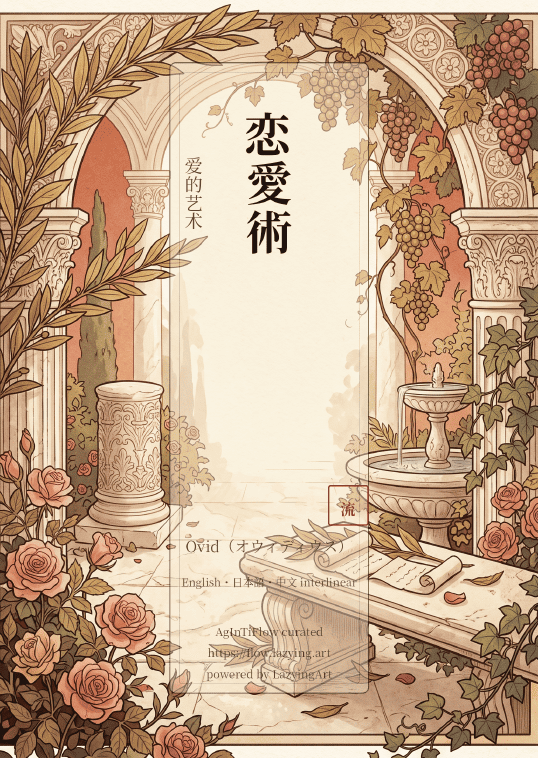 | `ovid-art-of-love-spark` | `en-jp-zh` | [color](https://github.com/lachlanchen/LinguaLeaf/blob/main/docs/pocketpolyglot/books/en-jp-zh/ovid-art-of-love-spark/en-main-jp-zh/color/Ars Amatoria: The Art of Love（日文・中文注）・最大語種・大字版.pdf) | [black-white](https://github.com/lachlanchen/LinguaLeaf/blob/main/docs/pocketpolyglot/books/en-jp-zh/ovid-art-of-love-spark/en-main-jp-zh/blackwhite/Ars Amatoria: The Art of Love（日文・中文注・黑白）・最大語種・大字版.pdf) |
|  | `platform-sutra` | `wenyan-en-jp-zh` | [color](https://github.com/lachlanchen/LinguaLeaf/blob/main/docs/pocketpolyglot/books/wenyan-en-jp-zh/platform-sutra/wenyan-main-quadrilingual/color/六祖大師法寶壇經（英文・現代日本語・現代中文注）・最大語種・大字版.pdf) | [black-white](https://github.com/lachlanchen/LinguaLeaf/blob/main/docs/pocketpolyglot/books/wenyan-en-jp-zh/platform-sutra/wenyan-main-quadrilingual/blackwhite/六祖大師法寶壇經（英文・現代日本語・現代中文注・黑白）・最大語種・大字版.pdf) |
|  | `positioning-battle-for-your-mind` | `en-jp-zh` | [color](https://github.com/lachlanchen/LinguaLeaf/blob/main/docs/pocketpolyglot/books/en-jp-zh/positioning-battle-for-your-mind/en-main-jp-zh/color/Positioning: The Battle for Your Mind（日文・中文注）・最大語種・大字版.pdf) | [black-white](https://github.com/lachlanchen/LinguaLeaf/blob/main/docs/pocketpolyglot/books/en-jp-zh/positioning-battle-for-your-mind/en-main-jp-zh/blackwhite/Positioning: The Battle for Your Mind（日文・中文注・黑白）・最大語種・大字版.pdf) |
|  | `psychology-of-money` | `en-jp-zh` | [color](https://github.com/lachlanchen/LinguaLeaf/blob/main/docs/pocketpolyglot/books/en-jp-zh/psychology-of-money/en-main-jp-zh/color/The Psychology of Money（日文・中文注）・最大語種・大字版.pdf) | [black-white](https://github.com/lachlanchen/LinguaLeaf/blob/main/docs/pocketpolyglot/books/en-jp-zh/psychology-of-money/en-main-jp-zh/blackwhite/The Psychology of Money（日文・中文注・黑白）・最大語種・大字版.pdf) |
|  | `questions-that-sell` | `en-jp-zh` | [color](https://github.com/lachlanchen/LinguaLeaf/blob/main/docs/pocketpolyglot/books/en-jp-zh/questions-that-sell/en-main-jp-zh/color/Questions That Sell（日文・中文注）・最大語種・大字版.pdf) | [black-white](https://github.com/lachlanchen/LinguaLeaf/blob/main/docs/pocketpolyglot/books/en-jp-zh/questions-that-sell/en-main-jp-zh/blackwhite/Questions That Sell（日文・中文注・黑白）・最大語種・大字版.pdf) |
|  | `rashomon-stories` | `en-jp-zh` | [color](https://github.com/lachlanchen/LinguaLeaf/blob/main/docs/pocketpolyglot/books/en-jp-zh/rashomon-stories/en-main-jp-zh/color/Rashomon Stories（日文・中文注）・最大語種・大字版.pdf) | [black-white](https://github.com/lachlanchen/LinguaLeaf/blob/main/docs/pocketpolyglot/books/en-jp-zh/rashomon-stories/en-main-jp-zh/blackwhite/Rashomon Stories（日文・中文注・黑白）・最大語種・大字版.pdf) |
|  | `red-mars` | `en-jp-zh` | [color](https://github.com/lachlanchen/LinguaLeaf/blob/main/docs/pocketpolyglot/books/en-jp-zh/red-mars/en-main-jp-zh/color/Red Mars（日文・中文注）・最大語種・大字版.pdf) | [black-white](https://github.com/lachlanchen/LinguaLeaf/blob/main/docs/pocketpolyglot/books/en-jp-zh/red-mars/en-main-jp-zh/blackwhite/Red Mars（日文・中文注・黑白）・最大語種・大字版.pdf) |
|  | `red-rising-1` | `en-jp-zh` | [color](https://github.com/lachlanchen/LinguaLeaf/blob/main/docs/pocketpolyglot/books/en-jp-zh/red-rising-1/en-main-jp-zh/color/Red Rising（日文・中文注）・最大語種・大字版.pdf) | [black-white](https://github.com/lachlanchen/LinguaLeaf/blob/main/docs/pocketpolyglot/books/en-jp-zh/red-rising-1/en-main-jp-zh/blackwhite/Red Rising（日文・中文注・黑白）・最大語種・大字版.pdf) |
|  | `red-rising-2` | `en-jp-zh` | [color](https://github.com/lachlanchen/LinguaLeaf/blob/main/docs/pocketpolyglot/books/en-jp-zh/red-rising-2/en-main-jp-zh/color/Golden Son（日文・中文注）・最大語種・大字版.pdf) | [black-white](https://github.com/lachlanchen/LinguaLeaf/blob/main/docs/pocketpolyglot/books/en-jp-zh/red-rising-2/en-main-jp-zh/blackwhite/Golden Son（日文・中文注・黑白）・最大語種・大字版.pdf) |
|  | `red-rising-3` | `en-jp-zh` | [color](https://github.com/lachlanchen/LinguaLeaf/blob/main/docs/pocketpolyglot/books/en-jp-zh/red-rising-3/en-main-jp-zh/color/Morning Star（日文・中文注）・最大語種・大字版.pdf) | [black-white](https://github.com/lachlanchen/LinguaLeaf/blob/main/docs/pocketpolyglot/books/en-jp-zh/red-rising-3/en-main-jp-zh/blackwhite/Morning Star（日文・中文注・黑白）・最大語種・大字版.pdf) |
| 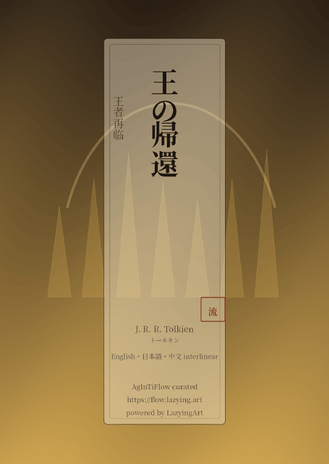 | `return-of-the-king` | `en-jp-zh` | [color](https://github.com/lachlanchen/LinguaLeaf/blob/main/docs/pocketpolyglot/books/en-jp-zh/return-of-the-king/en-main-jp-zh/color/The Return of the King（日文・中文注）・最大語種・大字版.pdf) | [black-white](https://github.com/lachlanchen/LinguaLeaf/blob/main/docs/pocketpolyglot/books/en-jp-zh/return-of-the-king/en-main-jp-zh/blackwhite/The Return of the King（日文・中文注・黑白）・最大語種・大字版.pdf) |
|  | `sanguozhi` | `wenyan-en-jp-zh` | [color](https://github.com/lachlanchen/LinguaLeaf/blob/main/docs/pocketpolyglot/books/wenyan-en-jp-zh/sanguozhi/wenyan-main-quadrilingual/color/三國志（英文・現代日本語・現代中文注）・最大語種・大字版.pdf) | [black-white](https://github.com/lachlanchen/LinguaLeaf/blob/main/docs/pocketpolyglot/books/wenyan-en-jp-zh/sanguozhi/wenyan-main-quadrilingual/blackwhite/三國志（英文・現代日本語・現代中文注・黑白）・最大語種・大字版.pdf) |
|  | `sanguozhi-pei-zhu` | `wenyan-en-jp-zh` | [color](https://github.com/lachlanchen/LinguaLeaf/blob/main/docs/pocketpolyglot/books/wenyan-en-jp-zh/sanguozhi-pei-zhu/wenyan-main-quadrilingual/color/三國志裴松之注（英文・現代日本語・現代中文注）・最大語種・大字版.pdf) | [black-white](https://github.com/lachlanchen/LinguaLeaf/blob/main/docs/pocketpolyglot/books/wenyan-en-jp-zh/sanguozhi-pei-zhu/wenyan-main-quadrilingual/blackwhite/三國志裴松之注（英文・現代日本語・現代中文注・黑白）・最大語種・大字版.pdf) |
|  | `secrets-question-based-selling` | `en-jp-zh` | [color](https://github.com/lachlanchen/LinguaLeaf/blob/main/docs/pocketpolyglot/books/en-jp-zh/secrets-question-based-selling/en-main-jp-zh/color/Secrets of Question-Based Selling（日文・中文注）・最大語種・大字版.pdf) | [black-white](https://github.com/lachlanchen/LinguaLeaf/blob/main/docs/pocketpolyglot/books/en-jp-zh/secrets-question-based-selling/en-main-jp-zh/blackwhite/Secrets of Question-Based Selling（日文・中文注・黑白）・最大語種・大字版.pdf) |
|  | `shanhaijing` | `wenyan-en-jp-zh` | [color](https://github.com/lachlanchen/LinguaLeaf/blob/main/docs/pocketpolyglot/books/wenyan-en-jp-zh/shanhaijing/wenyan-main-quadrilingual/color/山海經（英文・現代日本語・現代中文注）・最大語種・大字版.pdf) | [black-white](https://github.com/lachlanchen/LinguaLeaf/blob/main/docs/pocketpolyglot/books/wenyan-en-jp-zh/shanhaijing/wenyan-main-quadrilingual/blackwhite/山海經（英文・現代日本語・現代中文注・黑白）・最大語種・大字版.pdf) |
| 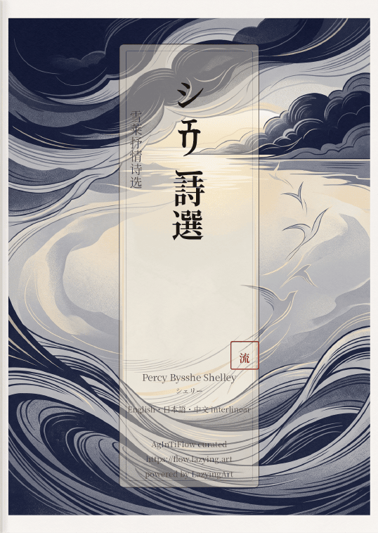 | `shelley-selected-poems-gpt55-low` | `en-jp-zh` | [color](https://github.com/lachlanchen/LinguaLeaf/blob/main/docs/pocketpolyglot/books/en-jp-zh/shelley-selected-poems-gpt55-low/en-main-jp-zh/color/Shelley: Selected Poems（日文・中文注）・最大語種・大字版.pdf) | [black-white](https://github.com/lachlanchen/LinguaLeaf/blob/main/docs/pocketpolyglot/books/en-jp-zh/shelley-selected-poems-gpt55-low/en-main-jp-zh/blackwhite/Shelley: Selected Poems（日文・中文注・黑白）・最大語種・大字版.pdf) |
|  | `shiji-aginti` | `wenyan-jp-zh` | [color](https://github.com/lachlanchen/LinguaLeaf/blob/main/docs/pocketpolyglot/books/wenyan-jp-zh/shiji-aginti/wenyan-main-jp-zh/color/史記（現代日本語・現代中文注）・最大語種・大字版.pdf) | [black-white](https://github.com/lachlanchen/LinguaLeaf/blob/main/docs/pocketpolyglot/books/wenyan-jp-zh/shiji-aginti/wenyan-main-jp-zh/blackwhite/史記（現代日本語・現代中文注・黑白）・最大語種・大字版.pdf) |
|  | `shijing` | `wenyan-en-jp-zh` | [color](https://github.com/lachlanchen/LinguaLeaf/blob/main/docs/pocketpolyglot/books/wenyan-en-jp-zh/shijing/wenyan-main-quadrilingual/color/詩經（英文・現代日本語・現代中文注）・最大語種・大字版.pdf) | [black-white](https://github.com/lachlanchen/LinguaLeaf/blob/main/docs/pocketpolyglot/books/wenyan-en-jp-zh/shijing/wenyan-main-quadrilingual/blackwhite/詩經（英文・現代日本語・現代中文注・黑白）・最大語種・大字版.pdf) |
|  | `shishuo-xinyu` | `wenyan-en-jp-zh` | [color](https://github.com/lachlanchen/LinguaLeaf/blob/main/docs/pocketpolyglot/books/wenyan-en-jp-zh/shishuo-xinyu/wenyan-main-quadrilingual/color/世說新語（英文・現代日本語・現代中文注）・最大語種・大字版.pdf) | [black-white](https://github.com/lachlanchen/LinguaLeaf/blob/main/docs/pocketpolyglot/books/wenyan-en-jp-zh/shishuo-xinyu/wenyan-main-quadrilingual/blackwhite/世說新語（英文・現代日本語・現代中文注・黑白）・最大語種・大字版.pdf) |
|  | `shui-jing-zhu` | `wenyan-en-jp-zh` | [color](https://github.com/lachlanchen/LinguaLeaf/blob/main/docs/pocketpolyglot/books/wenyan-en-jp-zh/shui-jing-zhu/wenyan-main-quadrilingual/color/水經注（英文・現代日本語・現代中文注）・最大語種・大字版.pdf) | [black-white](https://github.com/lachlanchen/LinguaLeaf/blob/main/docs/pocketpolyglot/books/wenyan-en-jp-zh/shui-jing-zhu/wenyan-main-quadrilingual/blackwhite/水經注（英文・現代日本語・現代中文注・黑白）・最大語種・大字版.pdf) |
|  | `sichuan-folk-stories-vol1` | `jp-zh` | [color](https://github.com/lachlanchen/LinguaLeaf/blob/main/docs/pocketpolyglot/books/jp-zh/sichuan-folk-stories-vol1/jp-main/color/中国民間故事集成四川巻上（中文注）・最大語種・大字版.pdf) | [black-white](https://github.com/lachlanchen/LinguaLeaf/blob/main/docs/pocketpolyglot/books/jp-zh/sichuan-folk-stories-vol1/jp-main/blackwhite/中国民間故事集成四川巻上（中文注・黑白）・最大語種・大字版.pdf) |
|  | `silk-roads-gpt55-low` | `en-jp-zh` | [color](https://github.com/lachlanchen/LinguaLeaf/blob/main/docs/pocketpolyglot/books/en-jp-zh/silk-roads-gpt55-low/en-main-jp-zh/color/The Silk Roads: A New History of the World（日文・中文注）・最大語種・大字版.pdf) | [black-white](https://github.com/lachlanchen/LinguaLeaf/blob/main/docs/pocketpolyglot/books/en-jp-zh/silk-roads-gpt55-low/en-main-jp-zh/blackwhite/The Silk Roads: A New History of the World（日文・中文注・黑白）・最大語種・大字版.pdf) |
| 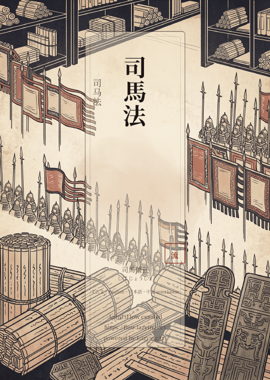 | `simafa` | `wenyan-en-jp-zh` | [color](https://github.com/lachlanchen/LinguaLeaf/blob/main/docs/pocketpolyglot/books/wenyan-en-jp-zh/simafa/wenyan-main-quadrilingual/color/司馬法（英文・現代日本語・現代中文注）・最大語種・大字版.pdf) | [black-white](https://github.com/lachlanchen/LinguaLeaf/blob/main/docs/pocketpolyglot/books/wenyan-en-jp-zh/simafa/wenyan-main-quadrilingual/blackwhite/司馬法（英文・現代日本語・現代中文注・黑白）・最大語種・大字版.pdf) |
|  | `simple-path-to-wealth` | `en-jp-zh` | [color](https://github.com/lachlanchen/LinguaLeaf/blob/main/docs/pocketpolyglot/books/en-jp-zh/simple-path-to-wealth/en-main-jp-zh/color/The Simple Path to Wealth（日文・中文注）・最大語種・大字版.pdf) | [black-white](https://github.com/lachlanchen/LinguaLeaf/blob/main/docs/pocketpolyglot/books/en-jp-zh/simple-path-to-wealth/en-main-jp-zh/blackwhite/The Simple Path to Wealth（日文・中文注・黑白）・最大語種・大字版.pdf) |
|  | `sishu-jizhu` | `jp-zh` | [color](https://github.com/lachlanchen/LinguaLeaf/blob/main/docs/pocketpolyglot/books/jp-zh/sishu-jizhu/jp-main/color/四書章句集注（中文注）・最大語種・大字版.pdf) | [black-white](https://github.com/lachlanchen/LinguaLeaf/blob/main/docs/pocketpolyglot/books/jp-zh/sishu-jizhu/jp-main/blackwhite/四書章句集注（中文注・黑白）・最大語種・大字版.pdf) |
|  | `sishu-jizhu-aginti` | `jp-zh` | [color](https://github.com/lachlanchen/LinguaLeaf/blob/main/docs/pocketpolyglot/books/jp-zh/sishu-jizhu-aginti/jp-main/color/四書章句集注（中文注）・最大語種・大字版.pdf) | [black-white](https://github.com/lachlanchen/LinguaLeaf/blob/main/docs/pocketpolyglot/books/jp-zh/sishu-jizhu-aginti/jp-main/blackwhite/四書章句集注（中文注・黑白）・最大語種・大字版.pdf) |
|  | `snow-country` | `en-jp-zh` | [color](https://github.com/lachlanchen/LinguaLeaf/blob/main/docs/pocketpolyglot/books/en-jp-zh/snow-country/en-main-jp-zh/color/Snow Country（日文・中文注）・最大語種・大字版.pdf) | [black-white](https://github.com/lachlanchen/LinguaLeaf/blob/main/docs/pocketpolyglot/books/en-jp-zh/snow-country/en-main-jp-zh/blackwhite/Snow Country（日文・中文注・黑白）・最大語種・大字版.pdf) |
|  | `spin-selling` | `en-jp-zh` | [color](https://github.com/lachlanchen/LinguaLeaf/blob/main/docs/pocketpolyglot/books/en-jp-zh/spin-selling/en-main-jp-zh/color/SPIN Selling（日文・中文注）・最大語種・大字版.pdf) | [black-white](https://github.com/lachlanchen/LinguaLeaf/blob/main/docs/pocketpolyglot/books/en-jp-zh/spin-selling/en-main-jp-zh/blackwhite/SPIN Selling（日文・中文注・黑白）・最大語種・大字版.pdf) |
|  | `spring-snow` | `en-jp-zh` | [color](https://github.com/lachlanchen/LinguaLeaf/blob/main/docs/pocketpolyglot/books/en-jp-zh/spring-snow/en-main-jp-zh/color/Spring Snow（日文・中文注）・最大語種・大字版.pdf) | [black-white](https://github.com/lachlanchen/LinguaLeaf/blob/main/docs/pocketpolyglot/books/en-jp-zh/spring-snow/en-main-jp-zh/blackwhite/Spring Snow（日文・中文注・黑白）・最大語種・大字版.pdf) |
| 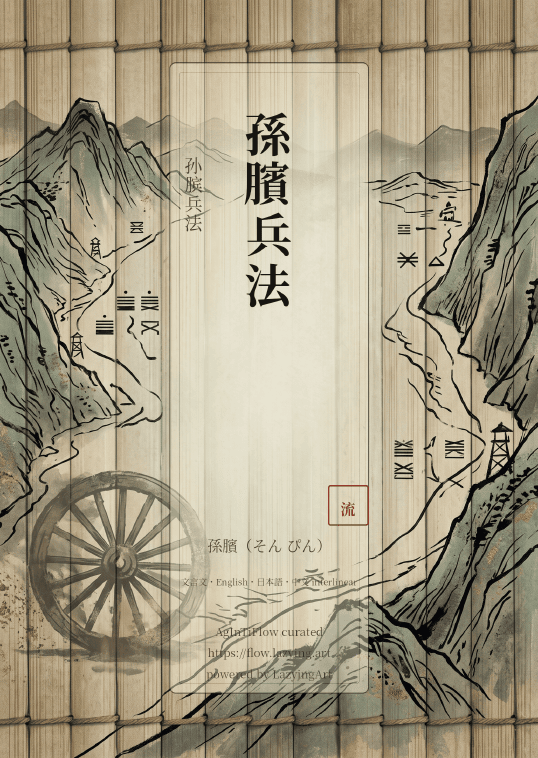 | `sunbin-bingfa` | `wenyan-en-jp-zh` | [color](https://github.com/lachlanchen/LinguaLeaf/blob/main/docs/pocketpolyglot/books/wenyan-en-jp-zh/sunbin-bingfa/wenyan-main-quadrilingual/color/孫臏兵法（英文・現代日本語・現代中文注）・最大語種・大字版.pdf) | [black-white](https://github.com/lachlanchen/LinguaLeaf/blob/main/docs/pocketpolyglot/books/wenyan-en-jp-zh/sunbin-bingfa/wenyan-main-quadrilingual/blackwhite/孫臏兵法（英文・現代日本語・現代中文注・黑白）・最大語種・大字版.pdf) |
| 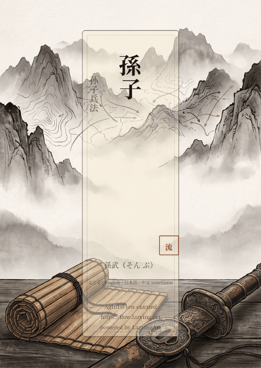 | `sunzi-bingfa` | `wenyan-en-jp-zh` | [color](https://github.com/lachlanchen/LinguaLeaf/blob/main/docs/pocketpolyglot/books/wenyan-en-jp-zh/sunzi-bingfa/wenyan-main-quadrilingual/color/孫子兵法（英文・現代日本語・現代中文注）・最大語種・大字版.pdf) | [black-white](https://github.com/lachlanchen/LinguaLeaf/blob/main/docs/pocketpolyglot/books/wenyan-en-jp-zh/sunzi-bingfa/wenyan-main-quadrilingual/blackwhite/孫子兵法（英文・現代日本語・現代中文注・黑白）・最大語種・大字版.pdf) |
| 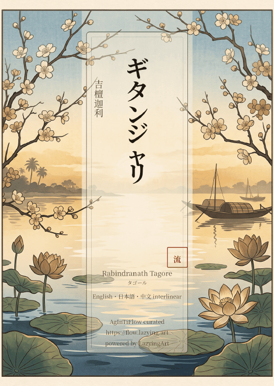 | `tagore-gitanjali` | `en-jp-zh` | [color](https://github.com/lachlanchen/LinguaLeaf/blob/main/docs/pocketpolyglot/books/en-jp-zh/tagore-gitanjali/en-main-jp-zh/color/Gitanjali（日文・中文注）・最大語種・大字版.pdf) | [black-white](https://github.com/lachlanchen/LinguaLeaf/blob/main/docs/pocketpolyglot/books/en-jp-zh/tagore-gitanjali/en-main-jp-zh/blackwhite/Gitanjali（日文・中文注・黑白）・最大語種・大字版.pdf) |
| 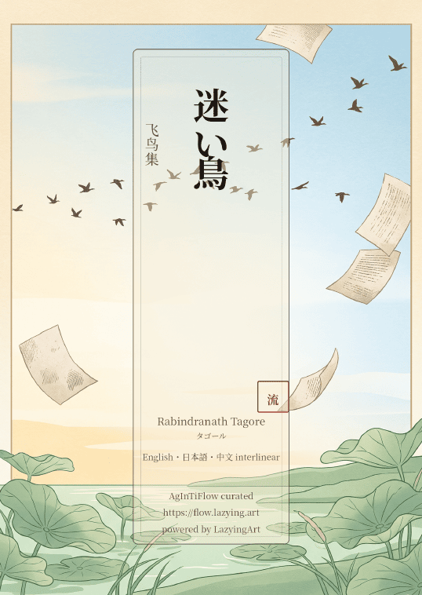 | `tagore-stray-birds` | `en-jp-zh` | [color](https://github.com/lachlanchen/LinguaLeaf/blob/main/docs/pocketpolyglot/books/en-jp-zh/tagore-stray-birds/en-main-jp-zh/color/Stray Birds（日文・中文注）・最大語種・大字版.pdf) | [black-white](https://github.com/lachlanchen/LinguaLeaf/blob/main/docs/pocketpolyglot/books/en-jp-zh/tagore-stray-birds/en-main-jp-zh/blackwhite/Stray Birds（日文・中文注・黑白）・最大語種・大字版.pdf) |
|  | `tangshi-sanbai` | `wenyan-en-jp-zh` | [color](https://github.com/lachlanchen/LinguaLeaf/blob/main/docs/pocketpolyglot/books/wenyan-en-jp-zh/tangshi-sanbai/wenyan-main-quadrilingual/color/唐詩三百首（英文・現代日本語・現代中文注）・最大語種・大字版.pdf) | [black-white](https://github.com/lachlanchen/LinguaLeaf/blob/main/docs/pocketpolyglot/books/wenyan-en-jp-zh/tangshi-sanbai/wenyan-main-quadrilingual/blackwhite/唐詩三百首（英文・現代日本語・現代中文注・黑白）・最大語種・大字版.pdf) |
|  | `the-count-of-monte-cristo` | `en-jp-zh` | [color](https://github.com/lachlanchen/LinguaLeaf/blob/main/docs/pocketpolyglot/books/en-jp-zh/the-count-of-monte-cristo/en-main-jp-zh/color/The Count of Monte Cristo（日文・中文注）・最大語種・大字版.pdf) | [black-white](https://github.com/lachlanchen/LinguaLeaf/blob/main/docs/pocketpolyglot/books/en-jp-zh/the-count-of-monte-cristo/en-main-jp-zh/blackwhite/The Count of Monte Cristo（日文・中文注・黑白）・最大語種・大字版.pdf) |
|  | `the-martian` | `en-jp-zh` | [color](https://github.com/lachlanchen/LinguaLeaf/blob/main/docs/pocketpolyglot/books/en-jp-zh/the-martian/en-main-jp-zh/color/The Martian（日文・中文注）・最大語種・大字版.pdf) | [black-white](https://github.com/lachlanchen/LinguaLeaf/blob/main/docs/pocketpolyglot/books/en-jp-zh/the-martian/en-main-jp-zh/blackwhite/The Martian（日文・中文注・黑白）・最大語種・大字版.pdf) |
|  | `the-old-capital` | `en-jp-zh` | [color](https://github.com/lachlanchen/LinguaLeaf/blob/main/docs/pocketpolyglot/books/en-jp-zh/the-old-capital/en-main-jp-zh/color/The Old Capital（日文・中文注）・最大語種・大字版.pdf) | [black-white](https://github.com/lachlanchen/LinguaLeaf/blob/main/docs/pocketpolyglot/books/en-jp-zh/the-old-capital/en-main-jp-zh/blackwhite/The Old Capital（日文・中文注・黑白）・最大語種・大字版.pdf) |
|  | `the-sirens-of-mars` | `en-jp-zh` | [color](https://github.com/lachlanchen/LinguaLeaf/blob/main/docs/pocketpolyglot/books/en-jp-zh/the-sirens-of-mars/en-main-jp-zh/color/The Sirens of Mars（日文・中文注）・最大語種・大字版.pdf) | [black-white](https://github.com/lachlanchen/LinguaLeaf/blob/main/docs/pocketpolyglot/books/en-jp-zh/the-sirens-of-mars/en-main-jp-zh/blackwhite/The Sirens of Mars（日文・中文注・黑白）・最大語種・大字版.pdf) |
| 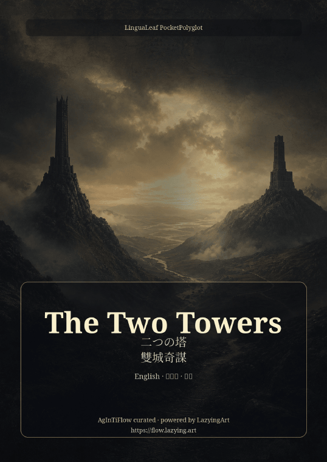 | `the-two-towers` | `en-jp-zh` | [color](https://github.com/lachlanchen/LinguaLeaf/blob/main/docs/pocketpolyglot/books/en-jp-zh/the-two-towers/en-main-jp-zh/color/The Two Towers（日文・中文注）・最大語種・大字版.pdf) | [black-white](https://github.com/lachlanchen/LinguaLeaf/blob/main/docs/pocketpolyglot/books/en-jp-zh/the-two-towers/en-main-jp-zh/blackwhite/The Two Towers（日文・中文注・黑白）・最大語種・大字版.pdf) |
| 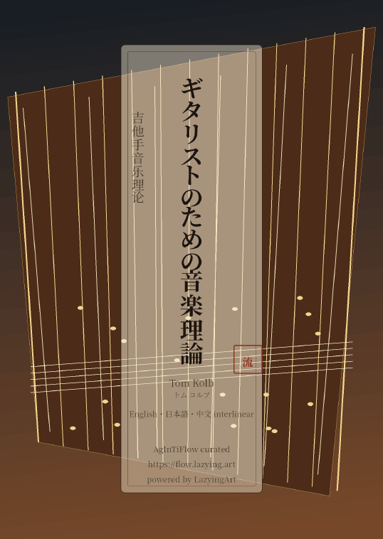 | `tom-kolb-music-theory-guitarists` | `en-jp-zh` | [color](https://github.com/lachlanchen/LinguaLeaf/blob/main/docs/pocketpolyglot/books/en-jp-zh/tom-kolb-music-theory-guitarists/en-main-jp-zh/color/Music Theory for Guitarists（日文・中文注）・最大語種・大字版.pdf) | [black-white](https://github.com/lachlanchen/LinguaLeaf/blob/main/docs/pocketpolyglot/books/en-jp-zh/tom-kolb-music-theory-guitarists/en-main-jp-zh/blackwhite/Music Theory for Guitarists（日文・中文注・黑白）・最大語種・大字版.pdf) |
|  | `trading-in-the-zone` | `en-jp-zh` | [color](https://github.com/lachlanchen/LinguaLeaf/blob/main/docs/pocketpolyglot/books/en-jp-zh/trading-in-the-zone/en-main-jp-zh/color/Trading in the Zone（日文・中文注）・最大語種・大字版.pdf) | [black-white](https://github.com/lachlanchen/LinguaLeaf/blob/main/docs/pocketpolyglot/books/en-jp-zh/trading-in-the-zone/en-main-jp-zh/blackwhite/Trading in the Zone（日文・中文注・黑白）・最大語種・大字版.pdf) |
|  | `tsangyang-gyatso-poems-spark` | `en-jp-zh` | [color](https://github.com/lachlanchen/LinguaLeaf/blob/main/docs/pocketpolyglot/books/en-jp-zh/tsangyang-gyatso-poems-spark/en-main-jp-zh/color/Songs of Tsangyang Gyatso（日文・中文注）・最大語種・大字版.pdf) | [black-white](https://github.com/lachlanchen/LinguaLeaf/blob/main/docs/pocketpolyglot/books/en-jp-zh/tsangyang-gyatso-poems-spark/en-main-jp-zh/blackwhite/Songs of Tsangyang Gyatso（日文・中文注・黑白）・最大語種・大字版.pdf) |
|  | `universe-in-a-nutshell` | `en-jp-zh` | [color](https://github.com/lachlanchen/LinguaLeaf/blob/main/docs/pocketpolyglot/books/en-jp-zh/universe-in-a-nutshell/en-main-jp-zh/color/The Universe in a Nutshell（日文・中文注）・最大語種・大字版.pdf) | [black-white](https://github.com/lachlanchen/LinguaLeaf/blob/main/docs/pocketpolyglot/books/en-jp-zh/universe-in-a-nutshell/en-main-jp-zh/blackwhite/The Universe in a Nutshell（日文・中文注・黑白）・最大語種・大字版.pdf) |
|  | `until-end-of-time` | `en-jp-zh` | [color](https://github.com/lachlanchen/LinguaLeaf/blob/main/docs/pocketpolyglot/books/en-jp-zh/until-end-of-time/en-main-jp-zh/color/Until the End of Time（日文・中文注）・最大語種・大字版.pdf) | [black-white](https://github.com/lachlanchen/LinguaLeaf/blob/main/docs/pocketpolyglot/books/en-jp-zh/until-end-of-time/en-main-jp-zh/blackwhite/Until the End of Time（日文・中文注・黑白）・最大語種・大字版.pdf) |
|  | `vimalakirti-sutra` | `wenyan-en-jp-zh` | [color](https://github.com/lachlanchen/LinguaLeaf/blob/main/docs/pocketpolyglot/books/wenyan-en-jp-zh/vimalakirti-sutra/wenyan-main-quadrilingual/color/維摩詰所說經（英文・現代日本語・現代中文注）・最大語種・大字版.pdf) | [black-white](https://github.com/lachlanchen/LinguaLeaf/blob/main/docs/pocketpolyglot/books/wenyan-en-jp-zh/vimalakirti-sutra/wenyan-main-quadrilingual/blackwhite/維摩詰所說經（英文・現代日本語・現代中文注・黑白）・最大語種・大字版.pdf) |
| 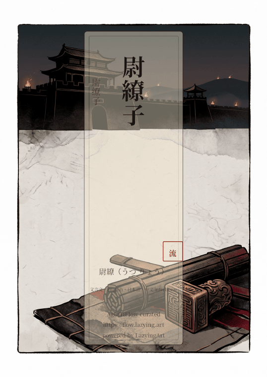 | `weiliaozi` | `wenyan-en-jp-zh` | [color](https://github.com/lachlanchen/LinguaLeaf/blob/main/docs/pocketpolyglot/books/wenyan-en-jp-zh/weiliaozi/wenyan-main-quadrilingual/color/尉繚子（英文・現代日本語・現代中文注）・最大語種・大字版.pdf) | [black-white](https://github.com/lachlanchen/LinguaLeaf/blob/main/docs/pocketpolyglot/books/wenyan-en-jp-zh/weiliaozi/wenyan-main-quadrilingual/blackwhite/尉繚子（英文・現代日本語・現代中文注・黑白）・最大語種・大字版.pdf) |
| 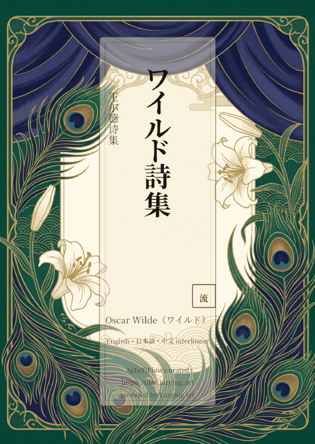 | `wilde-poetry-spark` | `en-jp-zh` | [color](https://github.com/lachlanchen/LinguaLeaf/blob/main/docs/pocketpolyglot/books/en-jp-zh/wilde-poetry-spark/en-main-jp-zh/color/Poetry（日文・中文注）・最大語種・大字版.pdf) | [black-white](https://github.com/lachlanchen/LinguaLeaf/blob/main/docs/pocketpolyglot/books/en-jp-zh/wilde-poetry-spark/en-main-jp-zh/blackwhite/Poetry（日文・中文注・黑白）・最大語種・大字版.pdf) |
|  | `woman-in-the-dunes` | `en-jp-zh` | [color](https://github.com/lachlanchen/LinguaLeaf/blob/main/docs/pocketpolyglot/books/en-jp-zh/woman-in-the-dunes/en-main-jp-zh/color/The Woman in the Dunes（日文・中文注）・最大語種・大字版.pdf) | [black-white](https://github.com/lachlanchen/LinguaLeaf/blob/main/docs/pocketpolyglot/books/en-jp-zh/woman-in-the-dunes/en-main-jp-zh/blackwhite/The Woman in the Dunes（日文・中文注・黑白）・最大語種・大字版.pdf) |
|  | `wuthering-heights` | `en-jp-zh` | [color](https://github.com/lachlanchen/LinguaLeaf/blob/main/docs/pocketpolyglot/books/en-jp-zh/wuthering-heights/en-main-jp-zh/color/Wuthering Heights（日文・中文注）・最大語種・大字版.pdf) | [black-white](https://github.com/lachlanchen/LinguaLeaf/blob/main/docs/pocketpolyglot/books/en-jp-zh/wuthering-heights/en-main-jp-zh/blackwhite/Wuthering Heights（日文・中文注・黑白）・最大語種・大字版.pdf) |
| 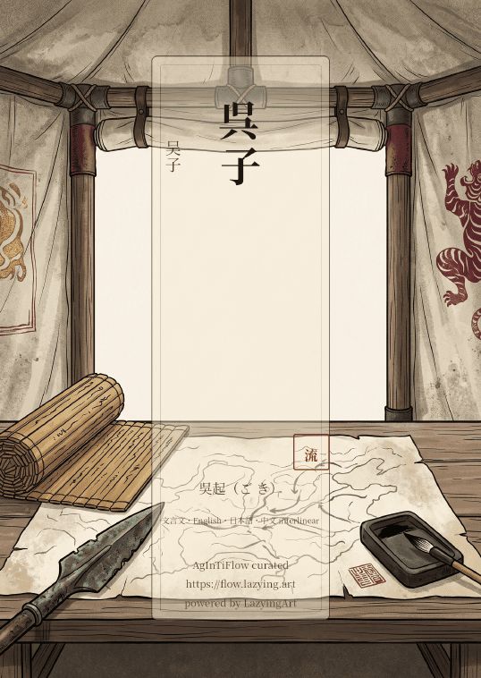 | `wuzi` | `wenyan-en-jp-zh` | [color](https://github.com/lachlanchen/LinguaLeaf/blob/main/docs/pocketpolyglot/books/wenyan-en-jp-zh/wuzi/wenyan-main-quadrilingual/color/吳子（英文・現代日本語・現代中文注）・最大語種・大字版.pdf) | [black-white](https://github.com/lachlanchen/LinguaLeaf/blob/main/docs/pocketpolyglot/books/wenyan-en-jp-zh/wuzi/wenyan-main-quadrilingual/blackwhite/吳子（英文・現代日本語・現代中文注・黑白）・最大語種・大字版.pdf) |
|  | `xixiangji` | `wenyan-en-jp-zh` | [color](https://github.com/lachlanchen/LinguaLeaf/blob/main/docs/pocketpolyglot/books/wenyan-en-jp-zh/xixiangji/wenyan-main-quadrilingual/color/西廂記（英文・現代日本語・現代中文注）・最大語種・大字版.pdf) | [black-white](https://github.com/lachlanchen/LinguaLeaf/blob/main/docs/pocketpolyglot/books/wenyan-en-jp-zh/xixiangji/wenyan-main-quadrilingual/blackwhite/西廂記（英文・現代日本語・現代中文注・黑白）・最大語種・大字版.pdf) |
|  | `xu-xiake-youji` | `wenyan-en-jp-zh` | [color](https://github.com/lachlanchen/LinguaLeaf/blob/main/docs/pocketpolyglot/books/wenyan-en-jp-zh/xu-xiake-youji/wenyan-main-quadrilingual/color/徐霞客遊記（英文・現代日本語・現代中文注）・最大語種・大字版.pdf) | [black-white](https://github.com/lachlanchen/LinguaLeaf/blob/main/docs/pocketpolyglot/books/wenyan-en-jp-zh/xu-xiake-youji/wenyan-main-quadrilingual/blackwhite/徐霞客遊記（英文・現代日本語・現代中文注・黑白）・最大語種・大字版.pdf) |
|  | `xu-zhimo-poems-spark` | `en-jp-zh` | [color](https://github.com/lachlanchen/LinguaLeaf/blob/main/docs/pocketpolyglot/books/en-jp-zh/xu-zhimo-poems-spark/en-main-jp-zh/color/Xu Zhimo: Selected Poems（日文・中文注）・最大語種・大字版.pdf) | [black-white](https://github.com/lachlanchen/LinguaLeaf/blob/main/docs/pocketpolyglot/books/en-jp-zh/xu-zhimo-poems-spark/en-main-jp-zh/blackwhite/Xu Zhimo: Selected Poems（日文・中文注・黑白）・最大語種・大字版.pdf) |
| 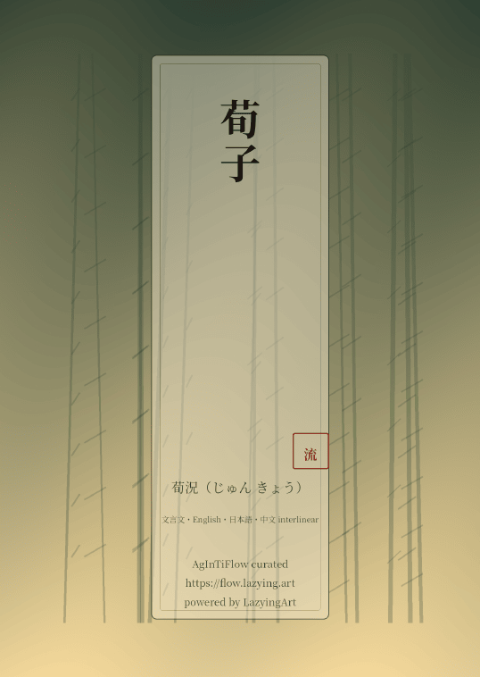 | `xunzi` | `wenyan-en-jp-zh` | [color](https://github.com/lachlanchen/LinguaLeaf/blob/main/docs/pocketpolyglot/books/wenyan-en-jp-zh/xunzi/wenyan-main-quadrilingual/color/荀子（英文・現代日本語・現代中文注）・最大語種・大字版.pdf) | [black-white](https://github.com/lachlanchen/LinguaLeaf/blob/main/docs/pocketpolyglot/books/wenyan-en-jp-zh/xunzi/wenyan-main-quadrilingual/blackwhite/荀子（英文・現代日本語・現代中文注・黑白）・最大語種・大字版.pdf) |
| 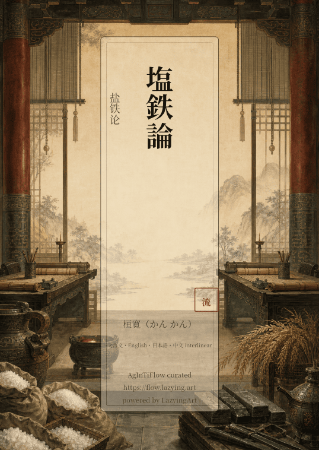 | `yantielun` | `wenyan-en-jp-zh` | [color](https://github.com/lachlanchen/LinguaLeaf/blob/main/docs/pocketpolyglot/books/wenyan-en-jp-zh/yantielun/wenyan-main-quadrilingual/color/鹽鐵論（英文・現代日本語・現代中文注）・最大語種・大字版.pdf) | [black-white](https://github.com/lachlanchen/LinguaLeaf/blob/main/docs/pocketpolyglot/books/wenyan-en-jp-zh/yantielun/wenyan-main-quadrilingual/blackwhite/鹽鐵論（英文・現代日本語・現代中文注・黑白）・最大語種・大字版.pdf) |
| 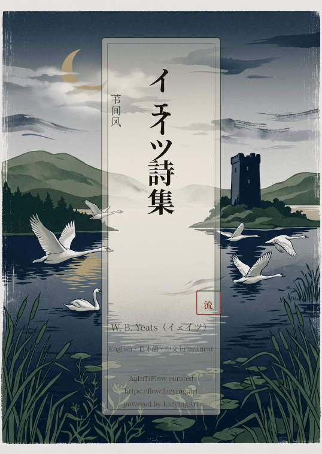 | `yeats-collected-poems-spark` | `en-jp-zh` | [color](https://github.com/lachlanchen/LinguaLeaf/blob/main/docs/pocketpolyglot/books/en-jp-zh/yeats-collected-poems-spark/en-main-jp-zh/color/The Collected Poems of W. B. Yeats（日文・中文注）・最大語種・大字版.pdf) | [black-white](https://github.com/lachlanchen/LinguaLeaf/blob/main/docs/pocketpolyglot/books/en-jp-zh/yeats-collected-poems-spark/en-main-jp-zh/blackwhite/The Collected Poems of W. B. Yeats（日文・中文注・黑白）・最大語種・大字版.pdf) |
|  | `yijing` | `wenyan-en-jp-zh` | [color](https://github.com/lachlanchen/LinguaLeaf/blob/main/docs/pocketpolyglot/books/wenyan-en-jp-zh/yijing/wenyan-main-quadrilingual/color/周易（英文・現代日本語・現代中文注）・最大語種・大字版.pdf) | [black-white](https://github.com/lachlanchen/LinguaLeaf/blob/main/docs/pocketpolyglot/books/wenyan-en-jp-zh/yijing/wenyan-main-quadrilingual/blackwhite/周易（英文・現代日本語・現代中文注・黑白）・最大語種・大字版.pdf) |
|  | `your-money-or-your-life` | `en-jp-zh` | [color](https://github.com/lachlanchen/LinguaLeaf/blob/main/docs/pocketpolyglot/books/en-jp-zh/your-money-or-your-life/en-main-jp-zh/color/Your Money or Your Life（日文・中文注）・最大語種・大字版.pdf) | [black-white](https://github.com/lachlanchen/LinguaLeaf/blob/main/docs/pocketpolyglot/books/en-jp-zh/your-money-or-your-life/en-main-jp-zh/blackwhite/Your Money or Your Life（日文・中文注・黑白）・最大語種・大字版.pdf) |
|  | `zhanguoce` | `wenyan-en-jp-zh` | [color](https://github.com/lachlanchen/LinguaLeaf/blob/main/docs/pocketpolyglot/books/wenyan-en-jp-zh/zhanguoce/wenyan-main-quadrilingual/color/戰國策（英文・現代日本語・現代中文注）・最大語種・大字版.pdf) | [black-white](https://github.com/lachlanchen/LinguaLeaf/blob/main/docs/pocketpolyglot/books/wenyan-en-jp-zh/zhanguoce/wenyan-main-quadrilingual/blackwhite/戰國策（英文・現代日本語・現代中文注・黑白）・最大語種・大字版.pdf) |
|  | `zhuangzi` | `wenyan-en-jp-zh` | [color](https://github.com/lachlanchen/LinguaLeaf/blob/main/docs/pocketpolyglot/books/wenyan-en-jp-zh/zhuangzi/wenyan-main-quadrilingual/color/莊子（英文・現代日本語・現代中文注）・最大語種・大字版.pdf) | [black-white](https://github.com/lachlanchen/LinguaLeaf/blob/main/docs/pocketpolyglot/books/wenyan-en-jp-zh/zhuangzi/wenyan-main-quadrilingual/blackwhite/莊子（英文・現代日本語・現代中文注・黑白）・最大語種・大字版.pdf) |
|  | `zuozhuan` | `wenyan-en-jp-zh` | [color](https://github.com/lachlanchen/LinguaLeaf/blob/main/docs/pocketpolyglot/books/wenyan-en-jp-zh/zuozhuan/wenyan-main-quadrilingual/color/春秋左氏傳（英文・現代日本語・現代中文注）・最大語種・大字版.pdf) | [black-white](https://github.com/lachlanchen/LinguaLeaf/blob/main/docs/pocketpolyglot/books/wenyan-en-jp-zh/zuozhuan/wenyan-main-quadrilingual/blackwhite/春秋左氏傳（英文・現代日本語・現代中文注・黑白）・最大語種・大字版.pdf) |
|  | `hou-han-shu-part-01` | `wenyan-en-jp-zh` | [color](https://github.com/lachlanchen/LinguaLeaf/blob/main/docs/pocketpolyglot/books/wenyan-en-jp-zh/hou-han-shu-part-01/wenyan-main-quadrilingual/color/後漢書第一部（英文・現代日本語・現代中文注）・最大語種・大字版.pdf) | [black-white](https://github.com/lachlanchen/LinguaLeaf/blob/main/docs/pocketpolyglot/books/wenyan-en-jp-zh/hou-han-shu-part-01/wenyan-main-quadrilingual/blackwhite/後漢書第一部（英文・現代日本語・現代中文注・黑白）・最大語種・大字版.pdf) |
|  | `hou-han-shu-part-02` | `wenyan-en-jp-zh` | [color](https://github.com/lachlanchen/LinguaLeaf/blob/main/docs/pocketpolyglot/books/wenyan-en-jp-zh/hou-han-shu-part-02/wenyan-main-quadrilingual/color/後漢書第二部（英文・現代日本語・現代中文注）・最大語種・大字版.pdf) | [black-white](https://github.com/lachlanchen/LinguaLeaf/blob/main/docs/pocketpolyglot/books/wenyan-en-jp-zh/hou-han-shu-part-02/wenyan-main-quadrilingual/blackwhite/後漢書第二部（英文・現代日本語・現代中文注・黑白）・最大語種・大字版.pdf) |
|  | `hou-han-shu-part-03` | `wenyan-en-jp-zh` | [color](https://github.com/lachlanchen/LinguaLeaf/blob/main/docs/pocketpolyglot/books/wenyan-en-jp-zh/hou-han-shu-part-03/wenyan-main-quadrilingual/color/後漢書第三部（英文・現代日本語・現代中文注）・最大語種・大字版.pdf) | [black-white](https://github.com/lachlanchen/LinguaLeaf/blob/main/docs/pocketpolyglot/books/wenyan-en-jp-zh/hou-han-shu-part-03/wenyan-main-quadrilingual/blackwhite/後漢書第三部（英文・現代日本語・現代中文注・黑白）・最大語種・大字版.pdf) |
|  | `zizhi-tongjian-part-01` | `wenyan-en-jp-zh` | local only | local only |
|  | `zizhi-tongjian-part-02` | `wenyan-en-jp-zh` | local only | local only |
|  | `zizhi-tongjian-part-03` | `wenyan-en-jp-zh` | local only | local only |
|  | `zizhi-tongjian-part-04` | `wenyan-en-jp-zh` | local only | local only |
|  | `zizhi-tongjian-part-05` | `wenyan-en-jp-zh` | local only | local only |
|  | `zizhi-tongjian-part-06` | `wenyan-en-jp-zh` | local only | local only |

Full local manifest: [references/MAX_LANGUAGE_LARGE_FONT_EXPORTS.md](references/MAX_LANGUAGE_LARGE_FONT_EXPORTS.md).
<!-- POCKETPOLYGLOT_MAX_LANGUAGE:END -->

## One Sentence In Full Width

JP-main sample from Kokoro: Japanese main text with furigana, Chinese comment with pinyin, and grammar color on the aligned words.

<p align="center">
  <a href="assets/edition-comparisons/kokoro-jp-main-sentence-page-20.png">
    
  </a>
</p>

## Four Editions At A Glance

The same Kokoro interior page rendered as all four standard editions:

<p align="center">
  <a href="assets/edition-comparisons/kokoro-four-editions-page-20.png">
    
  </a>
</p>

Click the image to open the full-resolution version for readable ruby, furigana, and pinyin.

Chinese/Japanese is the current showcase pair, but the pipeline is not limited to it. Any language pair with prepared aligned text and readings can use the same book model: EN-JP, ZH-EN, classical-modern, learner gloss editions, or teacher-curated parallel readers.

## What It Builds

Every complete paired book can be exported in four reader choices:

| Direction | Color | Black and White |
| --- | --- | --- |
| Chinese main text with Japanese notes | grammar-colored ruby/pinyin edition | monochrome edition for e-ink |
| Japanese main text with Chinese notes | grammar-colored furigana/pinyin edition | monochrome edition for e-ink |

The page format is pocket-size, with line-based interlinear blocks, full furigana over Japanese kanji, pinyin over Chinese text, optional grammar roles, tables of contents, generated covers, and chapter page breaks.

## Gallery

These previews are first pages rendered from generated PDFs, not standalone cover images. The full local export currently contains 224 PDFs across color/black-white variants and reading directions.

| Preview | Book | Edition |
| --- | --- | --- |
|  | **A City on Mars** | EN-JP · en-main · color |
|  | **火星城市** | ZH-EN · zh-main · color |
|  | **火星城市** | ZH-JP · zh-main · color |
|  | **Botchan** | EN-JP · en-main · color |
|  | **少爷** | ZH-EN · zh-main · color |
|  | **少爷** | ZH-JP · zh-main · color |
|  | **源氏物语** | ZH-JP · zh-main · color |
|  | **Gone With the Wind** | EN-JP · en-main · color |
|  | **飘** | ZH-EN · zh-main · color |
|  | **飘** | ZH-JP · zh-main · color |
|  | **I Am a Cat** | EN-JP · en-main · color |
|  | **我是猫** | ZH-EN · zh-main · color |
|  | **我是猫** | ZH-JP · zh-main · color |
|  | **The Inugami Curse** | EN-JP · en-main · color |
|  | **犬神家族** | ZH-EN · zh-main · color |
|  | **犬神家族** | ZH-JP · zh-main · color |
|  | **伊豆的舞女** | ZH-JP · zh-main · color |
|  | **A Concise History of Japan** | EN-JP · en-main · color |
|  | **日本史** | ZH-EN · zh-main · color |
|  | **日本史** | ZH-JP · zh-main · color |
|  | **金阁寺** | ZH-JP · zh-main · color |
|  | **古事記** | ZH-JP · zh-main · color |
|  | **心** | ZH-JP · zh-main · color |
|  | **The Martian Chronicles** | EN-JP · en-main · color |
|  | **火星编年史** | ZH-EN · zh-main · color |
|  | **火星编年史** | ZH-JP · zh-main · color |
|  | **人間失格** | ZH-JP · zh-main · color |
|  | **罗生门短篇集** | ZH-JP · zh-main · color |
|  | **Red Mars** | EN-JP · en-main · color |
|  | **红火星** | ZH-EN · zh-main · color |
|  | **红火星** | ZH-JP · zh-main · color |
|  | **Red Rising** | EN-JP · en-main · color |
|  | **火星崛起** | ZH-EN · zh-main · color |
|  | **火星崛起** | ZH-JP · zh-main · color |
|  | **Golden Son** | EN-JP · en-main · color |
|  | **火星崛起2：黄金之子** | ZH-EN · zh-main · color |
|  | **火星崛起2：黄金之子** | ZH-JP · zh-main · color |
|  | **Morning Star** | EN-JP · en-main · color |
|  | **火星崛起3：晨色之星** | ZH-EN · zh-main · color |
|  | **火星崛起3：晨色之星** | ZH-JP · zh-main · color |
|  | **史記** | ZH-JP · zh-main · color |
|  | **中国民间故事集成四川卷上** | ZH-JP · zh-main · color |
|  | **四書章句集註** | ZH-JP · zh-main · color |
|  | **四書章句集註** | ZH-JP · zh-main · color |
|  | **雪国** | ZH-JP · zh-main · color |
|  | **Spring Snow** | EN-JP · en-main · color |
|  | **春雪** | ZH-EN · zh-main · color |
|  | **春雪** | ZH-JP · zh-main · color |
|  | **The Martian** | EN-JP · en-main · color |
|  | **火星救援** | ZH-EN · zh-main · color |
|  | **火星救援** | ZH-JP · zh-main · color |
|  | **古都** | ZH-JP · zh-main · color |
|  | **The Sirens of Mars** | EN-JP · en-main · color |
|  | **火星的塞壬** | ZH-EN · zh-main · color |
|  | **火星的塞壬** | ZH-JP · zh-main · color |
|  | **砂女** | ZH-JP · zh-main · color |

## Quick Start

Build the simple paired demo:

```sh
make sample
```

Build the Chinese-main interlinear sample:

```sh
make interlinear
```

Build the Japanese-main interlinear sample from the same JSON:

```sh
make interlinear-jp-main
```

Export completed local PDFs into a flat browsing folder and regenerate README previews:

```sh
make export-books
make readme-assets
```

## Data Model

The core format is a paragraph/chapter JSON model. Text is split into aligned reading units, and each token can carry a reading and an optional grammar role.

```json
{
  "zh": [{"t": "天", "r": "tiān", "g": "subject"}, {"t": "地", "r": "dì", "g": "subject"}],
  "ja": [[{"t": "天", "r": "てん", "g": "subject"}, {"t": "地", "r": "ち", "g": "subject"}]]
}
```

Stable token fields:

| Field | Meaning |
| --- | --- |
| `t` | surface text |
| `r` | ruby, furigana, pinyin, or other reading |
| `g` | optional grammar role such as `subject`, `predicate`, `object`, `attributive`, `adverbial`, `complement`, `topic`, or `function` |

## Project Layout

| Path | Purpose |
| --- | --- |
| `tex/` | XeLaTeX templates for paired, block interlinear, run-in, and JP-main layouts |
| `scripts/books/` | EPUB/PDF/Markdown preparation, cover composition, preview export |
| `scripts/interlinear/` | JSON chunking, validation, rendering, compiling, long-run workers |
| `data/interlinear/sample.json` | small public sample of the structured format |
| `assets/readme-previews/` | first-page preview images generated from PDFs |
| `assets/edition-comparisons/` | single-sentence and four-edition comparison images generated from interior PDF pages |
| `references/` | design notes, naming notes, and pipeline references |
| `sources/` | local source books, ignored by Git |
| `build/` | generated PDFs and TeX intermediates, ignored by Git |

## Public Use

PocketPolyglot is designed for language learners, teachers, and book builders who want maintainable bilingual editions rather than manually aligned TeX. Keep source rights clear: publish templates, samples, and previews freely; publish full book PDFs only when the source text and translation can be redistributed.

Project site: [learn.lazying.art](https://learn.lazying.art)

## Citation

If you use PocketPolyglot in research or teaching, cite the repository. GitHub
reads [CITATION.cff](CITATION.cff) and provides a **Cite this repository**
panel on the project page.

```bibtex
@software{chen_pocketpolyglot_2026,
  author = {Chen, Lachlan},
  title = {PocketPolyglot: Multilingual Interlinear Pocket-Book Studio},
  year = {2026},
  url = {https://github.com/lachlanchen/PocketPolyglot}
}
```
