[English](README.md) · [العربية](i18n/README.ar.md) · [Español](i18n/README.es.md) · [Français](i18n/README.fr.md) · [日本語](i18n/README.ja.md) · [한국어](i18n/README.ko.md) · [Tiếng Việt](i18n/README.vi.md) · [中文 (简体)](i18n/README.zh-Hans.md) · [中文（繁體）](i18n/README.zh-Hant.md) · [Deutsch](i18n/README.de.md) · [Русский](i18n/README.ru.md)

[](https://github.com/lachlanchen/lachlanchen/blob/main/figs/banner.png)

# PocketPolyglot

Generate beautiful pocket-size interlinear books for language learning.

[](https://learn.lazying.art)
[](https://www.tug.org/xetex/)
[](scripts/)
[](data/interlinear/sample.json)

PocketPolyglot turns bilingual texts into ruby, pinyin, grammar-colored, line-aligned pocket books. The current production workflow focuses on Chinese/Japanese editions, but the data model is language-pair neutral: EN-JP, ZH-EN, classical-modern, and other paired reading formats can use the same structure.

The repository is a toolkit: TeX templates, Python scripts, JSON schemas, preview assets, and sample data. Bring your own rights-cleared source texts before publishing full generated books.

<!-- POCKETPOLYGLOT_MAX_LANGUAGE:START -->
## Maximum-Language Pocket Editions

The final compressed PDFs live in [lachlanchen/LinguaLeaf](https://github.com/lachlanchen/LinguaLeaf). The links below point to the uploaded PDF artifacts while this repository keeps the source text, JSON, TeX, scripts, and generation workflow.

| Preview | Book | Edition | Color | Black-white |
| --- | --- | --- | --- | --- |
|  | `a-city-on-mars` | English main · 日本語 · 中文 | [PDF](https://github.com/lachlanchen/LinguaLeaf/blob/main/docs/pocketpolyglot/books/en-jp-zh/a-city-on-mars/en-main-jp-zh/color/A%20City%20on%20Mars%EF%BC%88%E6%97%A5%E6%96%87%E3%83%BB%E4%B8%AD%E6%96%87%E6%B3%A8%EF%BC%89%E3%83%BB%E6%9C%80%E5%A4%A7%E8%AA%9E%E7%A8%AE%E3%83%BB%E5%A4%A7%E5%AD%97%E7%89%88.pdf) | [PDF](https://github.com/lachlanchen/LinguaLeaf/blob/main/docs/pocketpolyglot/books/en-jp-zh/a-city-on-mars/en-main-jp-zh/blackwhite/A%20City%20on%20Mars%EF%BC%88%E6%97%A5%E6%96%87%E3%83%BB%E4%B8%AD%E6%96%87%E6%B3%A8%E3%83%BB%E9%BB%91%E7%99%BD%EF%BC%89%E3%83%BB%E6%9C%80%E5%A4%A7%E8%AA%9E%E7%A8%AE%E3%83%BB%E5%A4%A7%E5%AD%97%E7%89%88.pdf) |
| 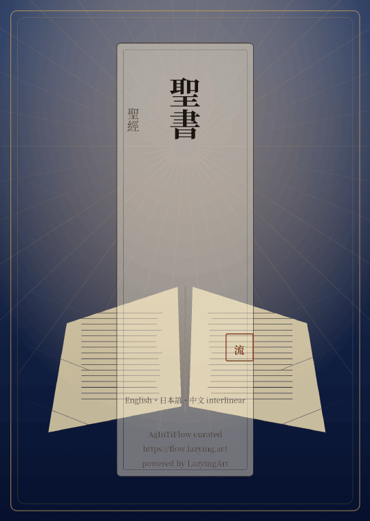 | `bible` | English main · 日本語 · 中文 | [PDF](https://github.com/lachlanchen/LinguaLeaf/blob/main/docs/pocketpolyglot/books/en-jp-zh/bible/en-main-jp-zh/color/The%20Holy%20Bible%EF%BC%88%E6%97%A5%E6%96%87%E3%83%BB%E4%B8%AD%E6%96%87%E6%B3%A8%EF%BC%89%E3%83%BB%E6%9C%80%E5%A4%A7%E8%AA%9E%E7%A8%AE%E3%83%BB%E5%A4%A7%E5%AD%97%E7%89%88.pdf) | [PDF](https://github.com/lachlanchen/LinguaLeaf/blob/main/docs/pocketpolyglot/books/en-jp-zh/bible/en-main-jp-zh/blackwhite/The%20Holy%20Bible%EF%BC%88%E6%97%A5%E6%96%87%E3%83%BB%E4%B8%AD%E6%96%87%E6%B3%A8%E3%83%BB%E9%BB%91%E7%99%BD%EF%BC%89%E3%83%BB%E6%9C%80%E5%A4%A7%E8%AA%9E%E7%A8%AE%E3%83%BB%E5%A4%A7%E5%AD%97%E7%89%88.pdf) |
| 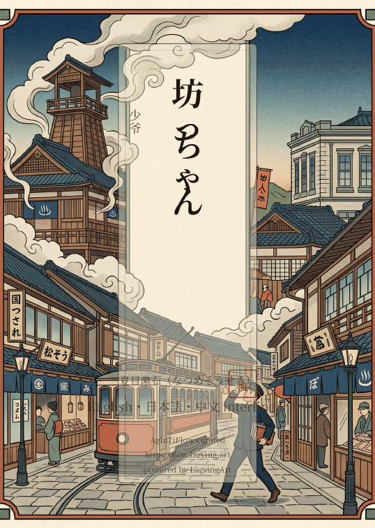 | `botchan` | English main · 日本語 · 中文 | [PDF](https://github.com/lachlanchen/LinguaLeaf/blob/main/docs/pocketpolyglot/books/en-jp-zh/botchan/en-main-jp-zh/color/Botchan%EF%BC%88%E6%97%A5%E6%96%87%E3%83%BB%E4%B8%AD%E6%96%87%E6%B3%A8%EF%BC%89%E3%83%BB%E6%9C%80%E5%A4%A7%E8%AA%9E%E7%A8%AE%E3%83%BB%E5%A4%A7%E5%AD%97%E7%89%88.pdf) | [PDF](https://github.com/lachlanchen/LinguaLeaf/blob/main/docs/pocketpolyglot/books/en-jp-zh/botchan/en-main-jp-zh/blackwhite/Botchan%EF%BC%88%E6%97%A5%E6%96%87%E3%83%BB%E4%B8%AD%E6%96%87%E6%B3%A8%E3%83%BB%E9%BB%91%E7%99%BD%EF%BC%89%E3%83%BB%E6%9C%80%E5%A4%A7%E8%AA%9E%E7%A8%AE%E3%83%BB%E5%A4%A7%E5%AD%97%E7%89%88.pdf) |
| 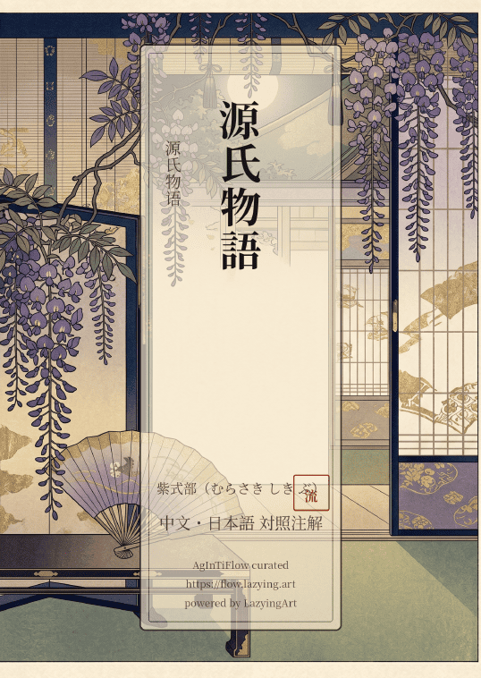 | `genji-modern` | English main · 日本語 · 中文 | [PDF](https://github.com/lachlanchen/LinguaLeaf/blob/main/docs/pocketpolyglot/books/en-jp-zh/genji-modern/en-main-jp-zh/color/The%20Tale%20of%20Genji%EF%BC%88%E6%97%A5%E6%96%87%E3%83%BB%E4%B8%AD%E6%96%87%E6%B3%A8%EF%BC%89%E3%83%BB%E6%9C%80%E5%A4%A7%E8%AA%9E%E7%A8%AE%E3%83%BB%E5%A4%A7%E5%AD%97%E7%89%88.pdf) | [PDF](https://github.com/lachlanchen/LinguaLeaf/blob/main/docs/pocketpolyglot/books/en-jp-zh/genji-modern/en-main-jp-zh/blackwhite/The%20Tale%20of%20Genji%EF%BC%88%E6%97%A5%E6%96%87%E3%83%BB%E4%B8%AD%E6%96%87%E6%B3%A8%E3%83%BB%E9%BB%91%E7%99%BD%EF%BC%89%E3%83%BB%E6%9C%80%E5%A4%A7%E8%AA%9E%E7%A8%AE%E3%83%BB%E5%A4%A7%E5%AD%97%E7%89%88.pdf) |
| 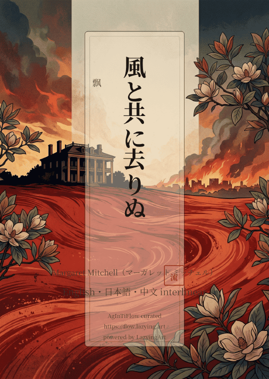 | `gone-with-the-wind` | English main · 日本語 · 中文 | [PDF](https://github.com/lachlanchen/LinguaLeaf/blob/main/docs/pocketpolyglot/books/en-jp-zh/gone-with-the-wind/en-main-jp-zh/color/Gone%20With%20the%20Wind%EF%BC%88%E6%97%A5%E6%96%87%E3%83%BB%E4%B8%AD%E6%96%87%E6%B3%A8%EF%BC%89%E3%83%BB%E6%9C%80%E5%A4%A7%E8%AA%9E%E7%A8%AE%E3%83%BB%E5%A4%A7%E5%AD%97%E7%89%88.pdf) | [PDF](https://github.com/lachlanchen/LinguaLeaf/blob/main/docs/pocketpolyglot/books/en-jp-zh/gone-with-the-wind/en-main-jp-zh/blackwhite/Gone%20With%20the%20Wind%EF%BC%88%E6%97%A5%E6%96%87%E3%83%BB%E4%B8%AD%E6%96%87%E6%B3%A8%E3%83%BB%E9%BB%91%E7%99%BD%EF%BC%89%E3%83%BB%E6%9C%80%E5%A4%A7%E8%AA%9E%E7%A8%AE%E3%83%BB%E5%A4%A7%E5%AD%97%E7%89%88.pdf) |
|  | `i-am-a-cat` | English main · 日本語 · 中文 | [PDF](https://github.com/lachlanchen/LinguaLeaf/blob/main/docs/pocketpolyglot/books/en-jp-zh/i-am-a-cat/en-main-jp-zh/color/I%20Am%20a%20Cat%EF%BC%88%E6%97%A5%E6%96%87%E3%83%BB%E4%B8%AD%E6%96%87%E6%B3%A8%EF%BC%89%E3%83%BB%E6%9C%80%E5%A4%A7%E8%AA%9E%E7%A8%AE%E3%83%BB%E5%A4%A7%E5%AD%97%E7%89%88.pdf) | [PDF](https://github.com/lachlanchen/LinguaLeaf/blob/main/docs/pocketpolyglot/books/en-jp-zh/i-am-a-cat/en-main-jp-zh/blackwhite/I%20Am%20a%20Cat%EF%BC%88%E6%97%A5%E6%96%87%E3%83%BB%E4%B8%AD%E6%96%87%E6%B3%A8%E3%83%BB%E9%BB%91%E7%99%BD%EF%BC%89%E3%83%BB%E6%9C%80%E5%A4%A7%E8%AA%9E%E7%A8%AE%E3%83%BB%E5%A4%A7%E5%AD%97%E7%89%88.pdf) |
|  | `inugami-curse` | English main · 日本語 · 中文 | [PDF](https://github.com/lachlanchen/LinguaLeaf/blob/main/docs/pocketpolyglot/books/en-jp-zh/inugami-curse/en-main-jp-zh/color/The%20Inugami%20Curse%EF%BC%88%E6%97%A5%E6%96%87%E3%83%BB%E4%B8%AD%E6%96%87%E6%B3%A8%EF%BC%89%E3%83%BB%E6%9C%80%E5%A4%A7%E8%AA%9E%E7%A8%AE%E3%83%BB%E5%A4%A7%E5%AD%97%E7%89%88.pdf) | [PDF](https://github.com/lachlanchen/LinguaLeaf/blob/main/docs/pocketpolyglot/books/en-jp-zh/inugami-curse/en-main-jp-zh/blackwhite/The%20Inugami%20Curse%EF%BC%88%E6%97%A5%E6%96%87%E3%83%BB%E4%B8%AD%E6%96%87%E6%B3%A8%E3%83%BB%E9%BB%91%E7%99%BD%EF%BC%89%E3%83%BB%E6%9C%80%E5%A4%A7%E8%AA%9E%E7%A8%AE%E3%83%BB%E5%A4%A7%E5%AD%97%E7%89%88.pdf) |
|  | `izu-no-odori` | English main · 日本語 · 中文 | [PDF](https://github.com/lachlanchen/LinguaLeaf/blob/main/docs/pocketpolyglot/books/en-jp-zh/izu-no-odori/en-main-jp-zh/color/The%20Dancing%20Girl%20of%20Izu%EF%BC%88%E6%97%A5%E6%96%87%E3%83%BB%E4%B8%AD%E6%96%87%E6%B3%A8%EF%BC%89%E3%83%BB%E6%9C%80%E5%A4%A7%E8%AA%9E%E7%A8%AE%E3%83%BB%E5%A4%A7%E5%AD%97%E7%89%88.pdf) | [PDF](https://github.com/lachlanchen/LinguaLeaf/blob/main/docs/pocketpolyglot/books/en-jp-zh/izu-no-odori/en-main-jp-zh/blackwhite/The%20Dancing%20Girl%20of%20Izu%EF%BC%88%E6%97%A5%E6%96%87%E3%83%BB%E4%B8%AD%E6%96%87%E6%B3%A8%E3%83%BB%E9%BB%91%E7%99%BD%EF%BC%89%E3%83%BB%E6%9C%80%E5%A4%A7%E8%AA%9E%E7%A8%AE%E3%83%BB%E5%A4%A7%E5%AD%97%E7%89%88.pdf) |
|  | `jane-eyre` | English main · 日本語 · 中文 | [PDF](https://github.com/lachlanchen/LinguaLeaf/blob/main/docs/pocketpolyglot/books/en-jp-zh/jane-eyre/en-main-jp-zh/color/Jane%20Eyre%EF%BC%88%E6%97%A5%E6%96%87%E3%83%BB%E4%B8%AD%E6%96%87%E6%B3%A8%EF%BC%89%E3%83%BB%E6%9C%80%E5%A4%A7%E8%AA%9E%E7%A8%AE%E3%83%BB%E5%A4%A7%E5%AD%97%E7%89%88.pdf) | [PDF](https://github.com/lachlanchen/LinguaLeaf/blob/main/docs/pocketpolyglot/books/en-jp-zh/jane-eyre/en-main-jp-zh/blackwhite/Jane%20Eyre%EF%BC%88%E6%97%A5%E6%96%87%E3%83%BB%E4%B8%AD%E6%96%87%E6%B3%A8%E3%83%BB%E9%BB%91%E7%99%BD%EF%BC%89%E3%83%BB%E6%9C%80%E5%A4%A7%E8%AA%9E%E7%A8%AE%E3%83%BB%E5%A4%A7%E5%AD%97%E7%89%88.pdf) |
| 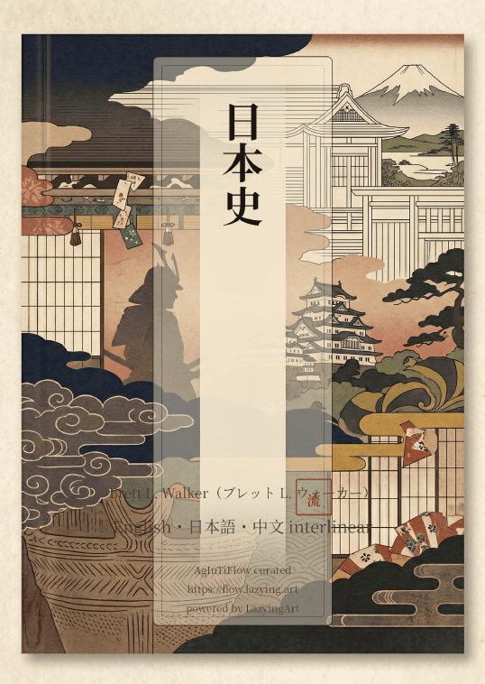 | `japanese-history` | English main · 日本語 · 中文 | [PDF](https://github.com/lachlanchen/LinguaLeaf/blob/main/docs/pocketpolyglot/books/en-jp-zh/japanese-history/en-main-jp-zh/color/A%20Concise%20History%20of%20Japan%EF%BC%88%E6%97%A5%E6%96%87%E3%83%BB%E4%B8%AD%E6%96%87%E6%B3%A8%EF%BC%89%E3%83%BB%E6%9C%80%E5%A4%A7%E8%AA%9E%E7%A8%AE%E3%83%BB%E5%A4%A7%E5%AD%97%E7%89%88.pdf) | [PDF](https://github.com/lachlanchen/LinguaLeaf/blob/main/docs/pocketpolyglot/books/en-jp-zh/japanese-history/en-main-jp-zh/blackwhite/A%20Concise%20History%20of%20Japan%EF%BC%88%E6%97%A5%E6%96%87%E3%83%BB%E4%B8%AD%E6%96%87%E6%B3%A8%E3%83%BB%E9%BB%91%E7%99%BD%EF%BC%89%E3%83%BB%E6%9C%80%E5%A4%A7%E8%AA%9E%E7%A8%AE%E3%83%BB%E5%A4%A7%E5%AD%97%E7%89%88.pdf) |
|  | `kinkakuji` | English main · 日本語 · 中文 | [PDF](https://github.com/lachlanchen/LinguaLeaf/blob/main/docs/pocketpolyglot/books/en-jp-zh/kinkakuji/en-main-jp-zh/color/The%20Temple%20of%20the%20Golden%20Pavilion%EF%BC%88%E6%97%A5%E6%96%87%E3%83%BB%E4%B8%AD%E6%96%87%E6%B3%A8%EF%BC%89%E3%83%BB%E6%9C%80%E5%A4%A7%E8%AA%9E%E7%A8%AE%E3%83%BB%E5%A4%A7%E5%AD%97%E7%89%88.pdf) | [PDF](https://github.com/lachlanchen/LinguaLeaf/blob/main/docs/pocketpolyglot/books/en-jp-zh/kinkakuji/en-main-jp-zh/blackwhite/The%20Temple%20of%20the%20Golden%20Pavilion%EF%BC%88%E6%97%A5%E6%96%87%E3%83%BB%E4%B8%AD%E6%96%87%E6%B3%A8%E3%83%BB%E9%BB%91%E7%99%BD%EF%BC%89%E3%83%BB%E6%9C%80%E5%A4%A7%E8%AA%9E%E7%A8%AE%E3%83%BB%E5%A4%A7%E5%AD%97%E7%89%88.pdf) |
|  | `kokin-wakashu` | English main · 日本語 · 中文 | [PDF](https://github.com/lachlanchen/LinguaLeaf/blob/main/docs/pocketpolyglot/books/en-jp-zh/kokin-wakashu/en-main-jp-zh/color/Kokin%20Wakashu%EF%BC%88%E6%97%A5%E6%96%87%E3%83%BB%E4%B8%AD%E6%96%87%E6%B3%A8%EF%BC%89%E3%83%BB%E6%9C%80%E5%A4%A7%E8%AA%9E%E7%A8%AE%E3%83%BB%E5%A4%A7%E5%AD%97%E7%89%88.pdf) | [PDF](https://github.com/lachlanchen/LinguaLeaf/blob/main/docs/pocketpolyglot/books/en-jp-zh/kokin-wakashu/en-main-jp-zh/blackwhite/Kokin%20Wakashu%EF%BC%88%E6%97%A5%E6%96%87%E3%83%BB%E4%B8%AD%E6%96%87%E6%B3%A8%E3%83%BB%E9%BB%91%E7%99%BD%EF%BC%89%E3%83%BB%E6%9C%80%E5%A4%A7%E8%AA%9E%E7%A8%AE%E3%83%BB%E5%A4%A7%E5%AD%97%E7%89%88.pdf) |
| 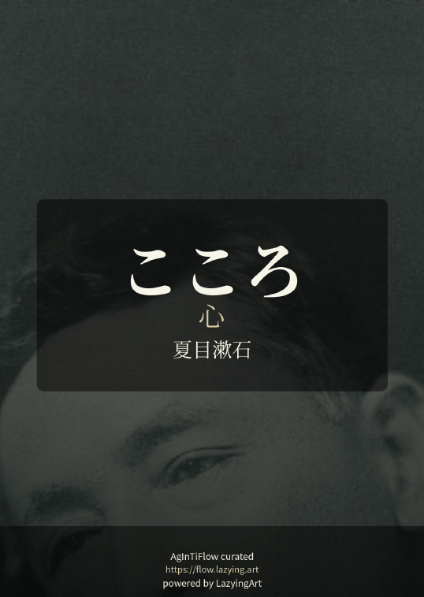 | `kokoro` | English main · 日本語 · 中文 | [PDF](https://github.com/lachlanchen/LinguaLeaf/blob/main/docs/pocketpolyglot/books/en-jp-zh/kokoro/en-main-jp-zh/color/Kokoro%EF%BC%88%E6%97%A5%E6%96%87%E3%83%BB%E4%B8%AD%E6%96%87%E6%B3%A8%EF%BC%89%E3%83%BB%E6%9C%80%E5%A4%A7%E8%AA%9E%E7%A8%AE%E3%83%BB%E5%A4%A7%E5%AD%97%E7%89%88.pdf) | [PDF](https://github.com/lachlanchen/LinguaLeaf/blob/main/docs/pocketpolyglot/books/en-jp-zh/kokoro/en-main-jp-zh/blackwhite/Kokoro%EF%BC%88%E6%97%A5%E6%96%87%E3%83%BB%E4%B8%AD%E6%96%87%E6%B3%A8%E3%83%BB%E9%BB%91%E7%99%BD%EF%BC%89%E3%83%BB%E6%9C%80%E5%A4%A7%E8%AA%9E%E7%A8%AE%E3%83%BB%E5%A4%A7%E5%AD%97%E7%89%88.pdf) |
| 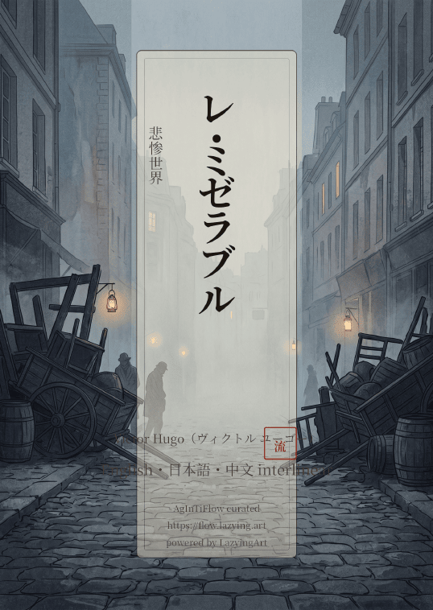 | `les-miserables` | English main · 日本語 · 中文 | [PDF](https://github.com/lachlanchen/LinguaLeaf/blob/main/docs/pocketpolyglot/books/en-jp-zh/les-miserables/en-main-jp-zh/color/Les%20Mis%C3%A9rables%EF%BC%88%E6%97%A5%E6%96%87%E3%83%BB%E4%B8%AD%E6%96%87%E6%B3%A8%EF%BC%89%E3%83%BB%E6%9C%80%E5%A4%A7%E8%AA%9E%E7%A8%AE%E3%83%BB%E5%A4%A7%E5%AD%97%E7%89%88.pdf) | [PDF](https://github.com/lachlanchen/LinguaLeaf/blob/main/docs/pocketpolyglot/books/en-jp-zh/les-miserables/en-main-jp-zh/blackwhite/Les%20Mis%C3%A9rables%EF%BC%88%E6%97%A5%E6%96%87%E3%83%BB%E4%B8%AD%E6%96%87%E6%B3%A8%E3%83%BB%E9%BB%91%E7%99%BD%EF%BC%89%E3%83%BB%E6%9C%80%E5%A4%A7%E8%AA%9E%E7%A8%AE%E3%83%BB%E5%A4%A7%E5%AD%97%E7%89%88.pdf) |
|  | `martian-chronicles` | English main · 日本語 · 中文 | [PDF](https://github.com/lachlanchen/LinguaLeaf/blob/main/docs/pocketpolyglot/books/en-jp-zh/martian-chronicles/en-main-jp-zh/color/The%20Martian%20Chronicles%EF%BC%88%E6%97%A5%E6%96%87%E3%83%BB%E4%B8%AD%E6%96%87%E6%B3%A8%EF%BC%89%E3%83%BB%E6%9C%80%E5%A4%A7%E8%AA%9E%E7%A8%AE%E3%83%BB%E5%A4%A7%E5%AD%97%E7%89%88.pdf) | [PDF](https://github.com/lachlanchen/LinguaLeaf/blob/main/docs/pocketpolyglot/books/en-jp-zh/martian-chronicles/en-main-jp-zh/blackwhite/The%20Martian%20Chronicles%EF%BC%88%E6%97%A5%E6%96%87%E3%83%BB%E4%B8%AD%E6%96%87%E6%B3%A8%E3%83%BB%E9%BB%91%E7%99%BD%EF%BC%89%E3%83%BB%E6%9C%80%E5%A4%A7%E8%AA%9E%E7%A8%AE%E3%83%BB%E5%A4%A7%E5%AD%97%E7%89%88.pdf) |
|  | `no-longer-human` | English main · 日本語 · 中文 | [PDF](https://github.com/lachlanchen/LinguaLeaf/blob/main/docs/pocketpolyglot/books/en-jp-zh/no-longer-human/en-main-jp-zh/color/No%20Longer%20Human%EF%BC%88%E6%97%A5%E6%96%87%E3%83%BB%E4%B8%AD%E6%96%87%E6%B3%A8%EF%BC%89%E3%83%BB%E6%9C%80%E5%A4%A7%E8%AA%9E%E7%A8%AE%E3%83%BB%E5%A4%A7%E5%AD%97%E7%89%88.pdf) | [PDF](https://github.com/lachlanchen/LinguaLeaf/blob/main/docs/pocketpolyglot/books/en-jp-zh/no-longer-human/en-main-jp-zh/blackwhite/No%20Longer%20Human%EF%BC%88%E6%97%A5%E6%96%87%E3%83%BB%E4%B8%AD%E6%96%87%E6%B3%A8%E3%83%BB%E9%BB%91%E7%99%BD%EF%BC%89%E3%83%BB%E6%9C%80%E5%A4%A7%E8%AA%9E%E7%A8%AE%E3%83%BB%E5%A4%A7%E5%AD%97%E7%89%88.pdf) |
| 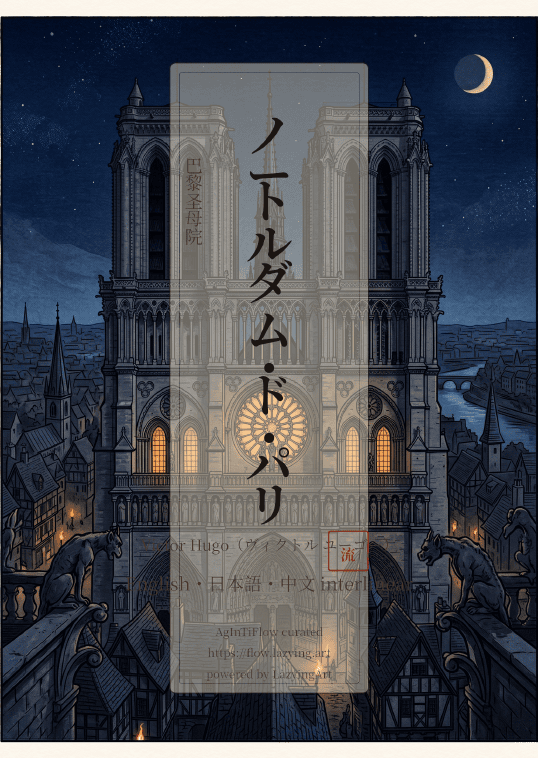 | `notre-dame-de-paris` | English main · 日本語 · 中文 | [PDF](https://github.com/lachlanchen/LinguaLeaf/blob/main/docs/pocketpolyglot/books/en-jp-zh/notre-dame-de-paris/en-main-jp-zh/color/Notre-Dame%20de%20Paris%EF%BC%88%E6%97%A5%E6%96%87%E3%83%BB%E4%B8%AD%E6%96%87%E6%B3%A8%EF%BC%89%E3%83%BB%E6%9C%80%E5%A4%A7%E8%AA%9E%E7%A8%AE%E3%83%BB%E5%A4%A7%E5%AD%97%E7%89%88.pdf) | [PDF](https://github.com/lachlanchen/LinguaLeaf/blob/main/docs/pocketpolyglot/books/en-jp-zh/notre-dame-de-paris/en-main-jp-zh/blackwhite/Notre-Dame%20de%20Paris%EF%BC%88%E6%97%A5%E6%96%87%E3%83%BB%E4%B8%AD%E6%96%87%E6%B3%A8%E3%83%BB%E9%BB%91%E7%99%BD%EF%BC%89%E3%83%BB%E6%9C%80%E5%A4%A7%E8%AA%9E%E7%A8%AE%E3%83%BB%E5%A4%A7%E5%AD%97%E7%89%88.pdf) |
|  | `one-hundred-years-of-solitude` | English main · 日本語 · 中文 | [PDF](https://github.com/lachlanchen/LinguaLeaf/blob/main/docs/pocketpolyglot/books/en-jp-zh/one-hundred-years-of-solitude/en-main-jp-zh/color/One%20Hundred%20Years%20of%20Solitude%EF%BC%88%E6%97%A5%E6%96%87%E3%83%BB%E4%B8%AD%E6%96%87%E6%B3%A8%EF%BC%89%E3%83%BB%E6%9C%80%E5%A4%A7%E8%AA%9E%E7%A8%AE%E3%83%BB%E5%A4%A7%E5%AD%97%E7%89%88.pdf) | [PDF](https://github.com/lachlanchen/LinguaLeaf/blob/main/docs/pocketpolyglot/books/en-jp-zh/one-hundred-years-of-solitude/en-main-jp-zh/blackwhite/One%20Hundred%20Years%20of%20Solitude%EF%BC%88%E6%97%A5%E6%96%87%E3%83%BB%E4%B8%AD%E6%96%87%E6%B3%A8%E3%83%BB%E9%BB%91%E7%99%BD%EF%BC%89%E3%83%BB%E6%9C%80%E5%A4%A7%E8%AA%9E%E7%A8%AE%E3%83%BB%E5%A4%A7%E5%AD%97%E7%89%88.pdf) |
|  | `rashomon-stories` | English main · 日本語 · 中文 | [PDF](https://github.com/lachlanchen/LinguaLeaf/blob/main/docs/pocketpolyglot/books/en-jp-zh/rashomon-stories/en-main-jp-zh/color/Rashomon%20Stories%EF%BC%88%E6%97%A5%E6%96%87%E3%83%BB%E4%B8%AD%E6%96%87%E6%B3%A8%EF%BC%89%E3%83%BB%E6%9C%80%E5%A4%A7%E8%AA%9E%E7%A8%AE%E3%83%BB%E5%A4%A7%E5%AD%97%E7%89%88.pdf) | [PDF](https://github.com/lachlanchen/LinguaLeaf/blob/main/docs/pocketpolyglot/books/en-jp-zh/rashomon-stories/en-main-jp-zh/blackwhite/Rashomon%20Stories%EF%BC%88%E6%97%A5%E6%96%87%E3%83%BB%E4%B8%AD%E6%96%87%E6%B3%A8%E3%83%BB%E9%BB%91%E7%99%BD%EF%BC%89%E3%83%BB%E6%9C%80%E5%A4%A7%E8%AA%9E%E7%A8%AE%E3%83%BB%E5%A4%A7%E5%AD%97%E7%89%88.pdf) |
|  | `red-mars` | English main · 日本語 · 中文 | [PDF](https://github.com/lachlanchen/LinguaLeaf/blob/main/docs/pocketpolyglot/books/en-jp-zh/red-mars/en-main-jp-zh/color/Red%20Mars%EF%BC%88%E6%97%A5%E6%96%87%E3%83%BB%E4%B8%AD%E6%96%87%E6%B3%A8%EF%BC%89%E3%83%BB%E6%9C%80%E5%A4%A7%E8%AA%9E%E7%A8%AE%E3%83%BB%E5%A4%A7%E5%AD%97%E7%89%88.pdf) | [PDF](https://github.com/lachlanchen/LinguaLeaf/blob/main/docs/pocketpolyglot/books/en-jp-zh/red-mars/en-main-jp-zh/blackwhite/Red%20Mars%EF%BC%88%E6%97%A5%E6%96%87%E3%83%BB%E4%B8%AD%E6%96%87%E6%B3%A8%E3%83%BB%E9%BB%91%E7%99%BD%EF%BC%89%E3%83%BB%E6%9C%80%E5%A4%A7%E8%AA%9E%E7%A8%AE%E3%83%BB%E5%A4%A7%E5%AD%97%E7%89%88.pdf) |
|  | `red-rising-1` | English main · 日本語 · 中文 | [PDF](https://github.com/lachlanchen/LinguaLeaf/blob/main/docs/pocketpolyglot/books/en-jp-zh/red-rising-1/en-main-jp-zh/color/Red%20Rising%EF%BC%88%E6%97%A5%E6%96%87%E3%83%BB%E4%B8%AD%E6%96%87%E6%B3%A8%EF%BC%89%E3%83%BB%E6%9C%80%E5%A4%A7%E8%AA%9E%E7%A8%AE%E3%83%BB%E5%A4%A7%E5%AD%97%E7%89%88.pdf) | [PDF](https://github.com/lachlanchen/LinguaLeaf/blob/main/docs/pocketpolyglot/books/en-jp-zh/red-rising-1/en-main-jp-zh/blackwhite/Red%20Rising%EF%BC%88%E6%97%A5%E6%96%87%E3%83%BB%E4%B8%AD%E6%96%87%E6%B3%A8%E3%83%BB%E9%BB%91%E7%99%BD%EF%BC%89%E3%83%BB%E6%9C%80%E5%A4%A7%E8%AA%9E%E7%A8%AE%E3%83%BB%E5%A4%A7%E5%AD%97%E7%89%88.pdf) |
|  | `red-rising-2` | English main · 日本語 · 中文 | [PDF](https://github.com/lachlanchen/LinguaLeaf/blob/main/docs/pocketpolyglot/books/en-jp-zh/red-rising-2/en-main-jp-zh/color/Golden%20Son%EF%BC%88%E6%97%A5%E6%96%87%E3%83%BB%E4%B8%AD%E6%96%87%E6%B3%A8%EF%BC%89%E3%83%BB%E6%9C%80%E5%A4%A7%E8%AA%9E%E7%A8%AE%E3%83%BB%E5%A4%A7%E5%AD%97%E7%89%88.pdf) | [PDF](https://github.com/lachlanchen/LinguaLeaf/blob/main/docs/pocketpolyglot/books/en-jp-zh/red-rising-2/en-main-jp-zh/blackwhite/Golden%20Son%EF%BC%88%E6%97%A5%E6%96%87%E3%83%BB%E4%B8%AD%E6%96%87%E6%B3%A8%E3%83%BB%E9%BB%91%E7%99%BD%EF%BC%89%E3%83%BB%E6%9C%80%E5%A4%A7%E8%AA%9E%E7%A8%AE%E3%83%BB%E5%A4%A7%E5%AD%97%E7%89%88.pdf) |
| 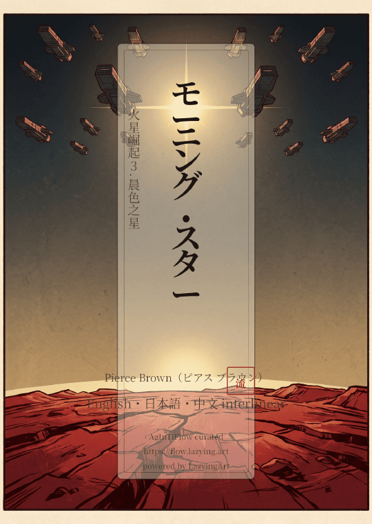 | `red-rising-3` | English main · 日本語 · 中文 | [PDF](https://github.com/lachlanchen/LinguaLeaf/blob/main/docs/pocketpolyglot/books/en-jp-zh/red-rising-3/en-main-jp-zh/color/Morning%20Star%EF%BC%88%E6%97%A5%E6%96%87%E3%83%BB%E4%B8%AD%E6%96%87%E6%B3%A8%EF%BC%89%E3%83%BB%E6%9C%80%E5%A4%A7%E8%AA%9E%E7%A8%AE%E3%83%BB%E5%A4%A7%E5%AD%97%E7%89%88.pdf) | [PDF](https://github.com/lachlanchen/LinguaLeaf/blob/main/docs/pocketpolyglot/books/en-jp-zh/red-rising-3/en-main-jp-zh/blackwhite/Morning%20Star%EF%BC%88%E6%97%A5%E6%96%87%E3%83%BB%E4%B8%AD%E6%96%87%E6%B3%A8%E3%83%BB%E9%BB%91%E7%99%BD%EF%BC%89%E3%83%BB%E6%9C%80%E5%A4%A7%E8%AA%9E%E7%A8%AE%E3%83%BB%E5%A4%A7%E5%AD%97%E7%89%88.pdf) |
|  | `snow-country` | English main · 日本語 · 中文 | [PDF](https://github.com/lachlanchen/LinguaLeaf/blob/main/docs/pocketpolyglot/books/en-jp-zh/snow-country/en-main-jp-zh/color/Snow%20Country%EF%BC%88%E6%97%A5%E6%96%87%E3%83%BB%E4%B8%AD%E6%96%87%E6%B3%A8%EF%BC%89%E3%83%BB%E6%9C%80%E5%A4%A7%E8%AA%9E%E7%A8%AE%E3%83%BB%E5%A4%A7%E5%AD%97%E7%89%88.pdf) | [PDF](https://github.com/lachlanchen/LinguaLeaf/blob/main/docs/pocketpolyglot/books/en-jp-zh/snow-country/en-main-jp-zh/blackwhite/Snow%20Country%EF%BC%88%E6%97%A5%E6%96%87%E3%83%BB%E4%B8%AD%E6%96%87%E6%B3%A8%E3%83%BB%E9%BB%91%E7%99%BD%EF%BC%89%E3%83%BB%E6%9C%80%E5%A4%A7%E8%AA%9E%E7%A8%AE%E3%83%BB%E5%A4%A7%E5%AD%97%E7%89%88.pdf) |
| 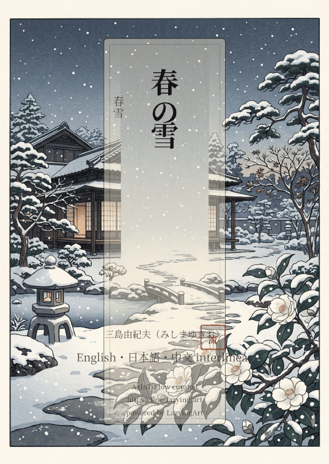 | `spring-snow` | English main · 日本語 · 中文 | [PDF](https://github.com/lachlanchen/LinguaLeaf/blob/main/docs/pocketpolyglot/books/en-jp-zh/spring-snow/en-main-jp-zh/color/Spring%20Snow%EF%BC%88%E6%97%A5%E6%96%87%E3%83%BB%E4%B8%AD%E6%96%87%E6%B3%A8%EF%BC%89%E3%83%BB%E6%9C%80%E5%A4%A7%E8%AA%9E%E7%A8%AE%E3%83%BB%E5%A4%A7%E5%AD%97%E7%89%88.pdf) | [PDF](https://github.com/lachlanchen/LinguaLeaf/blob/main/docs/pocketpolyglot/books/en-jp-zh/spring-snow/en-main-jp-zh/blackwhite/Spring%20Snow%EF%BC%88%E6%97%A5%E6%96%87%E3%83%BB%E4%B8%AD%E6%96%87%E6%B3%A8%E3%83%BB%E9%BB%91%E7%99%BD%EF%BC%89%E3%83%BB%E6%9C%80%E5%A4%A7%E8%AA%9E%E7%A8%AE%E3%83%BB%E5%A4%A7%E5%AD%97%E7%89%88.pdf) |
| 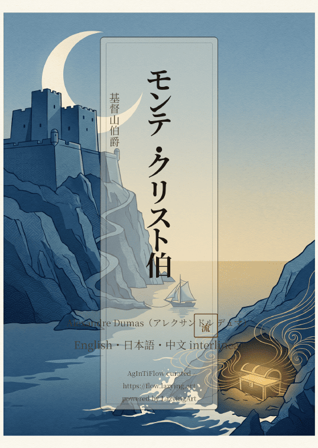 | `the-count-of-monte-cristo` | English main · 日本語 · 中文 | [PDF](https://github.com/lachlanchen/LinguaLeaf/blob/main/docs/pocketpolyglot/books/en-jp-zh/the-count-of-monte-cristo/en-main-jp-zh/color/The%20Count%20of%20Monte%20Cristo%EF%BC%88%E6%97%A5%E6%96%87%E3%83%BB%E4%B8%AD%E6%96%87%E6%B3%A8%EF%BC%89%E3%83%BB%E6%9C%80%E5%A4%A7%E8%AA%9E%E7%A8%AE%E3%83%BB%E5%A4%A7%E5%AD%97%E7%89%88.pdf) | [PDF](https://github.com/lachlanchen/LinguaLeaf/blob/main/docs/pocketpolyglot/books/en-jp-zh/the-count-of-monte-cristo/en-main-jp-zh/blackwhite/The%20Count%20of%20Monte%20Cristo%EF%BC%88%E6%97%A5%E6%96%87%E3%83%BB%E4%B8%AD%E6%96%87%E6%B3%A8%E3%83%BB%E9%BB%91%E7%99%BD%EF%BC%89%E3%83%BB%E6%9C%80%E5%A4%A7%E8%AA%9E%E7%A8%AE%E3%83%BB%E5%A4%A7%E5%AD%97%E7%89%88.pdf) |
| 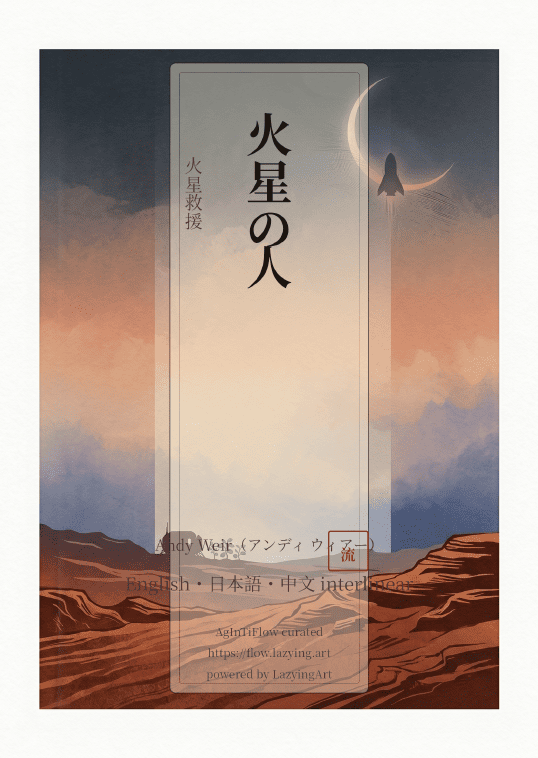 | `the-martian` | English main · 日本語 · 中文 | [PDF](https://github.com/lachlanchen/LinguaLeaf/blob/main/docs/pocketpolyglot/books/en-jp-zh/the-martian/en-main-jp-zh/color/The%20Martian%EF%BC%88%E6%97%A5%E6%96%87%E3%83%BB%E4%B8%AD%E6%96%87%E6%B3%A8%EF%BC%89%E3%83%BB%E6%9C%80%E5%A4%A7%E8%AA%9E%E7%A8%AE%E3%83%BB%E5%A4%A7%E5%AD%97%E7%89%88.pdf) | [PDF](https://github.com/lachlanchen/LinguaLeaf/blob/main/docs/pocketpolyglot/books/en-jp-zh/the-martian/en-main-jp-zh/blackwhite/The%20Martian%EF%BC%88%E6%97%A5%E6%96%87%E3%83%BB%E4%B8%AD%E6%96%87%E6%B3%A8%E3%83%BB%E9%BB%91%E7%99%BD%EF%BC%89%E3%83%BB%E6%9C%80%E5%A4%A7%E8%AA%9E%E7%A8%AE%E3%83%BB%E5%A4%A7%E5%AD%97%E7%89%88.pdf) |
|  | `the-old-capital` | English main · 日本語 · 中文 | [PDF](https://github.com/lachlanchen/LinguaLeaf/blob/main/docs/pocketpolyglot/books/en-jp-zh/the-old-capital/en-main-jp-zh/color/The%20Old%20Capital%EF%BC%88%E6%97%A5%E6%96%87%E3%83%BB%E4%B8%AD%E6%96%87%E6%B3%A8%EF%BC%89%E3%83%BB%E6%9C%80%E5%A4%A7%E8%AA%9E%E7%A8%AE%E3%83%BB%E5%A4%A7%E5%AD%97%E7%89%88.pdf) | [PDF](https://github.com/lachlanchen/LinguaLeaf/blob/main/docs/pocketpolyglot/books/en-jp-zh/the-old-capital/en-main-jp-zh/blackwhite/The%20Old%20Capital%EF%BC%88%E6%97%A5%E6%96%87%E3%83%BB%E4%B8%AD%E6%96%87%E6%B3%A8%E3%83%BB%E9%BB%91%E7%99%BD%EF%BC%89%E3%83%BB%E6%9C%80%E5%A4%A7%E8%AA%9E%E7%A8%AE%E3%83%BB%E5%A4%A7%E5%AD%97%E7%89%88.pdf) |
| 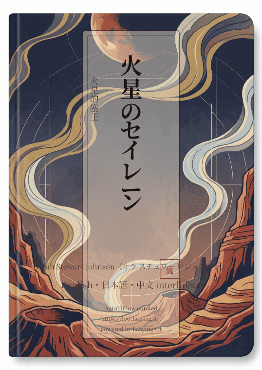 | `the-sirens-of-mars` | English main · 日本語 · 中文 | [PDF](https://github.com/lachlanchen/LinguaLeaf/blob/main/docs/pocketpolyglot/books/en-jp-zh/the-sirens-of-mars/en-main-jp-zh/color/The%20Sirens%20of%20Mars%EF%BC%88%E6%97%A5%E6%96%87%E3%83%BB%E4%B8%AD%E6%96%87%E6%B3%A8%EF%BC%89%E3%83%BB%E6%9C%80%E5%A4%A7%E8%AA%9E%E7%A8%AE%E3%83%BB%E5%A4%A7%E5%AD%97%E7%89%88.pdf) | [PDF](https://github.com/lachlanchen/LinguaLeaf/blob/main/docs/pocketpolyglot/books/en-jp-zh/the-sirens-of-mars/en-main-jp-zh/blackwhite/The%20Sirens%20of%20Mars%EF%BC%88%E6%97%A5%E6%96%87%E3%83%BB%E4%B8%AD%E6%96%87%E6%B3%A8%E3%83%BB%E9%BB%91%E7%99%BD%EF%BC%89%E3%83%BB%E6%9C%80%E5%A4%A7%E8%AA%9E%E7%A8%AE%E3%83%BB%E5%A4%A7%E5%AD%97%E7%89%88.pdf) |
| 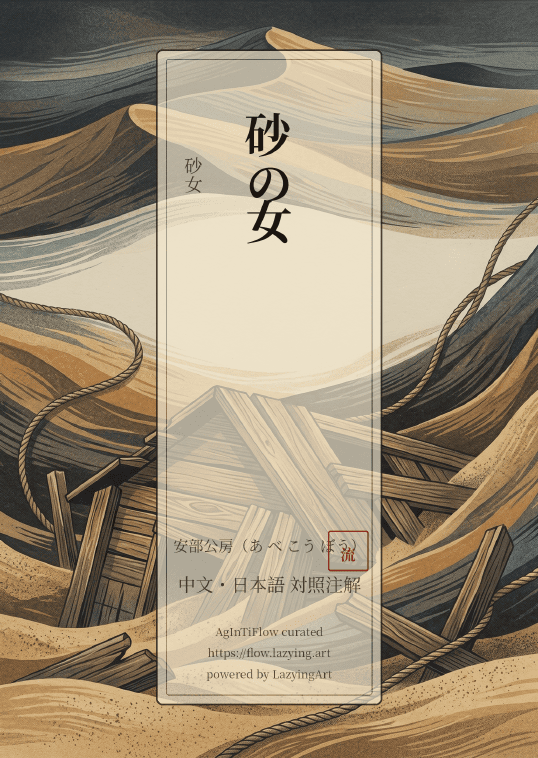 | `woman-in-the-dunes` | English main · 日本語 · 中文 | [PDF](https://github.com/lachlanchen/LinguaLeaf/blob/main/docs/pocketpolyglot/books/en-jp-zh/woman-in-the-dunes/en-main-jp-zh/color/The%20Woman%20in%20the%20Dunes%EF%BC%88%E6%97%A5%E6%96%87%E3%83%BB%E4%B8%AD%E6%96%87%E6%B3%A8%EF%BC%89%E3%83%BB%E6%9C%80%E5%A4%A7%E8%AA%9E%E7%A8%AE%E3%83%BB%E5%A4%A7%E5%AD%97%E7%89%88.pdf) | [PDF](https://github.com/lachlanchen/LinguaLeaf/blob/main/docs/pocketpolyglot/books/en-jp-zh/woman-in-the-dunes/en-main-jp-zh/blackwhite/The%20Woman%20in%20the%20Dunes%EF%BC%88%E6%97%A5%E6%96%87%E3%83%BB%E4%B8%AD%E6%96%87%E6%B3%A8%E3%83%BB%E9%BB%91%E7%99%BD%EF%BC%89%E3%83%BB%E6%9C%80%E5%A4%A7%E8%AA%9E%E7%A8%AE%E3%83%BB%E5%A4%A7%E5%AD%97%E7%89%88.pdf) |
| 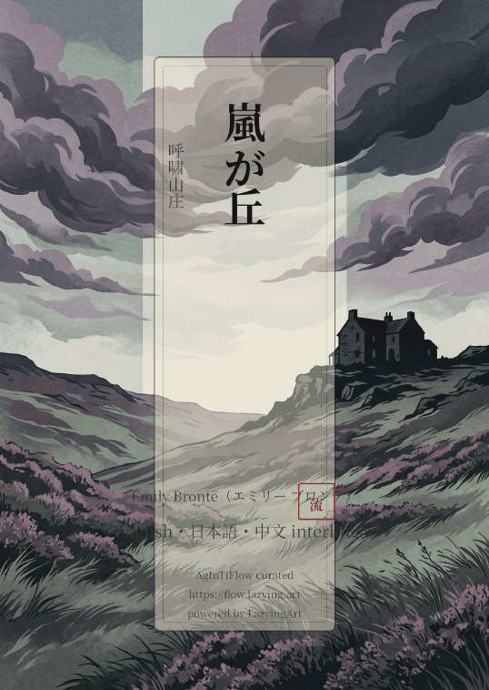 | `wuthering-heights` | English main · 日本語 · 中文 | [PDF](https://github.com/lachlanchen/LinguaLeaf/blob/main/docs/pocketpolyglot/books/en-jp-zh/wuthering-heights/en-main-jp-zh/color/Wuthering%20Heights%EF%BC%88%E6%97%A5%E6%96%87%E3%83%BB%E4%B8%AD%E6%96%87%E6%B3%A8%EF%BC%89%E3%83%BB%E6%9C%80%E5%A4%A7%E8%AA%9E%E7%A8%AE%E3%83%BB%E5%A4%A7%E5%AD%97%E7%89%88.pdf) | [PDF](https://github.com/lachlanchen/LinguaLeaf/blob/main/docs/pocketpolyglot/books/en-jp-zh/wuthering-heights/en-main-jp-zh/blackwhite/Wuthering%20Heights%EF%BC%88%E6%97%A5%E6%96%87%E3%83%BB%E4%B8%AD%E6%96%87%E6%B3%A8%E3%83%BB%E9%BB%91%E7%99%BD%EF%BC%89%E3%83%BB%E6%9C%80%E5%A4%A7%E8%AA%9E%E7%A8%AE%E3%83%BB%E5%A4%A7%E5%AD%97%E7%89%88.pdf) |
| 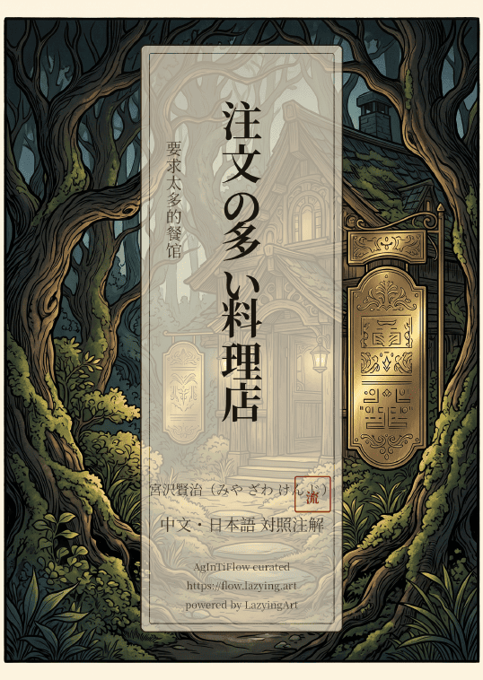 | `chumon-no-ooi-ryoriten` | 日本語 main · 中文 | [PDF](https://github.com/lachlanchen/LinguaLeaf/blob/main/docs/pocketpolyglot/books/jp-zh/chumon-no-ooi-ryoriten/jp-main/color/%E6%B3%A8%E6%96%87%E3%81%AE%E5%A4%9A%E3%81%84%E6%96%99%E7%90%86%E5%BA%97%EF%BC%88%E4%B8%AD%E6%96%87%E6%B3%A8%EF%BC%89%E3%83%BB%E6%9C%80%E5%A4%A7%E8%AA%9E%E7%A8%AE%E3%83%BB%E5%A4%A7%E5%AD%97%E7%89%88.pdf) | [PDF](https://github.com/lachlanchen/LinguaLeaf/blob/main/docs/pocketpolyglot/books/jp-zh/chumon-no-ooi-ryoriten/jp-main/blackwhite/%E6%B3%A8%E6%96%87%E3%81%AE%E5%A4%9A%E3%81%84%E6%96%99%E7%90%86%E5%BA%97%EF%BC%88%E4%B8%AD%E6%96%87%E6%B3%A8%E3%83%BB%E9%BB%91%E7%99%BD%EF%BC%89%E3%83%BB%E6%9C%80%E5%A4%A7%E8%AA%9E%E7%A8%AE%E3%83%BB%E5%A4%A7%E5%AD%97%E7%89%88.pdf) |
|  | `chumon-no-ooi-ryoriten` | 中文 main · 日本語 | [PDF](https://github.com/lachlanchen/LinguaLeaf/blob/main/docs/pocketpolyglot/books/jp-zh/chumon-no-ooi-ryoriten/zh-main/color/%E8%A6%81%E6%B1%82%E5%A4%AA%E5%A4%9A%E7%9A%84%E9%A4%90%E9%A6%86%EF%BC%88%E6%97%A5%E6%96%87%E6%B3%A8%EF%BC%89%E3%83%BB%E6%9C%80%E5%A4%A7%E8%AA%9E%E7%A8%AE%E3%83%BB%E5%A4%A7%E5%AD%97%E7%89%88.pdf) | [PDF](https://github.com/lachlanchen/LinguaLeaf/blob/main/docs/pocketpolyglot/books/jp-zh/chumon-no-ooi-ryoriten/zh-main/blackwhite/%E8%A6%81%E6%B1%82%E5%A4%AA%E5%A4%9A%E7%9A%84%E9%A4%90%E9%A6%86%EF%BC%88%E6%97%A5%E6%96%87%E6%B3%A8%E3%83%BB%E9%BB%91%E7%99%BD%EF%BC%89%E3%83%BB%E6%9C%80%E5%A4%A7%E8%AA%9E%E7%A8%AE%E3%83%BB%E5%A4%A7%E5%AD%97%E7%89%88.pdf) |
| 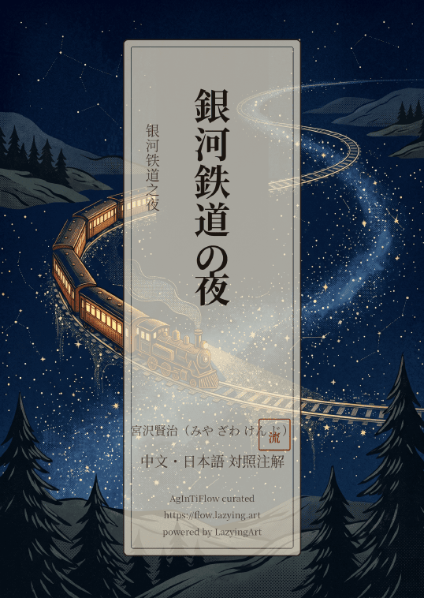 | `ginga-tetsudo` | 日本語 main · 中文 | [PDF](https://github.com/lachlanchen/LinguaLeaf/blob/main/docs/pocketpolyglot/books/jp-zh/ginga-tetsudo/jp-main/color/%E9%8A%80%E6%B2%B3%E9%89%84%E9%81%93%E3%81%AE%E5%A4%9C%EF%BC%88%E4%B8%AD%E6%96%87%E6%B3%A8%EF%BC%89%E3%83%BB%E6%9C%80%E5%A4%A7%E8%AA%9E%E7%A8%AE%E3%83%BB%E5%A4%A7%E5%AD%97%E7%89%88.pdf) | [PDF](https://github.com/lachlanchen/LinguaLeaf/blob/main/docs/pocketpolyglot/books/jp-zh/ginga-tetsudo/jp-main/blackwhite/%E9%8A%80%E6%B2%B3%E9%89%84%E9%81%93%E3%81%AE%E5%A4%9C%EF%BC%88%E4%B8%AD%E6%96%87%E6%B3%A8%E3%83%BB%E9%BB%91%E7%99%BD%EF%BC%89%E3%83%BB%E6%9C%80%E5%A4%A7%E8%AA%9E%E7%A8%AE%E3%83%BB%E5%A4%A7%E5%AD%97%E7%89%88.pdf) |
|  | `ginga-tetsudo` | 中文 main · 日本語 | [PDF](https://github.com/lachlanchen/LinguaLeaf/blob/main/docs/pocketpolyglot/books/jp-zh/ginga-tetsudo/zh-main/color/%E9%93%B6%E6%B2%B3%E9%93%81%E9%81%93%E4%B9%8B%E5%A4%9C%EF%BC%88%E6%97%A5%E6%96%87%E6%B3%A8%EF%BC%89%E3%83%BB%E6%9C%80%E5%A4%A7%E8%AA%9E%E7%A8%AE%E3%83%BB%E5%A4%A7%E5%AD%97%E7%89%88.pdf) | [PDF](https://github.com/lachlanchen/LinguaLeaf/blob/main/docs/pocketpolyglot/books/jp-zh/ginga-tetsudo/zh-main/blackwhite/%E9%93%B6%E6%B2%B3%E9%93%81%E9%81%93%E4%B9%8B%E5%A4%9C%EF%BC%88%E6%97%A5%E6%96%87%E6%B3%A8%E3%83%BB%E9%BB%91%E7%99%BD%EF%BC%89%E3%83%BB%E6%9C%80%E5%A4%A7%E8%AA%9E%E7%A8%AE%E3%83%BB%E5%A4%A7%E5%AD%97%E7%89%88.pdf) |
|  | `kojiki` | 日本語 main · 中文 | [PDF](https://github.com/lachlanchen/LinguaLeaf/blob/main/docs/pocketpolyglot/books/jp-zh/kojiki/jp-main/color/%E5%8F%A4%E4%BA%8B%E8%A8%98%EF%BC%88%E4%B8%AD%E6%96%87%E6%B3%A8%EF%BC%89%E3%83%BB%E6%9C%80%E5%A4%A7%E8%AA%9E%E7%A8%AE%E3%83%BB%E5%A4%A7%E5%AD%97%E7%89%88.pdf) | [PDF](https://github.com/lachlanchen/LinguaLeaf/blob/main/docs/pocketpolyglot/books/jp-zh/kojiki/jp-main/blackwhite/%E5%8F%A4%E4%BA%8B%E8%A8%98%EF%BC%88%E4%B8%AD%E6%96%87%E6%B3%A8%E3%83%BB%E9%BB%91%E7%99%BD%EF%BC%89%E3%83%BB%E6%9C%80%E5%A4%A7%E8%AA%9E%E7%A8%AE%E3%83%BB%E5%A4%A7%E5%AD%97%E7%89%88.pdf) |
|  | `kojiki` | 中文 main · 日本語 | [PDF](https://github.com/lachlanchen/LinguaLeaf/blob/main/docs/pocketpolyglot/books/jp-zh/kojiki/zh-main/color/%E5%8F%A4%E4%BA%8B%E8%A8%98%EF%BC%88%E6%97%A5%E6%96%87%E6%B3%A8%EF%BC%89%E3%83%BB%E6%9C%80%E5%A4%A7%E8%AA%9E%E7%A8%AE%E3%83%BB%E5%A4%A7%E5%AD%97%E7%89%88.pdf) | [PDF](https://github.com/lachlanchen/LinguaLeaf/blob/main/docs/pocketpolyglot/books/jp-zh/kojiki/zh-main/blackwhite/%E5%8F%A4%E4%BA%8B%E8%A8%98%EF%BC%88%E6%97%A5%E6%96%87%E6%B3%A8%E3%83%BB%E9%BB%91%E7%99%BD%EF%BC%89%E3%83%BB%E6%9C%80%E5%A4%A7%E8%AA%9E%E7%A8%AE%E3%83%BB%E5%A4%A7%E5%AD%97%E7%89%88.pdf) |
|  | `sichuan-folk-stories-vol1` | 日本語 main · 中文 | [PDF](https://github.com/lachlanchen/LinguaLeaf/blob/main/docs/pocketpolyglot/books/jp-zh/sichuan-folk-stories-vol1/jp-main/color/%E4%B8%AD%E5%9B%BD%E6%B0%91%E9%96%93%E6%95%85%E4%BA%8B%E9%9B%86%E6%88%90%E5%9B%9B%E5%B7%9D%E5%B7%BB%E4%B8%8A%EF%BC%88%E4%B8%AD%E6%96%87%E6%B3%A8%EF%BC%89%E3%83%BB%E6%9C%80%E5%A4%A7%E8%AA%9E%E7%A8%AE%E3%83%BB%E5%A4%A7%E5%AD%97%E7%89%88.pdf) | [PDF](https://github.com/lachlanchen/LinguaLeaf/blob/main/docs/pocketpolyglot/books/jp-zh/sichuan-folk-stories-vol1/jp-main/blackwhite/%E4%B8%AD%E5%9B%BD%E6%B0%91%E9%96%93%E6%95%85%E4%BA%8B%E9%9B%86%E6%88%90%E5%9B%9B%E5%B7%9D%E5%B7%BB%E4%B8%8A%EF%BC%88%E4%B8%AD%E6%96%87%E6%B3%A8%E3%83%BB%E9%BB%91%E7%99%BD%EF%BC%89%E3%83%BB%E6%9C%80%E5%A4%A7%E8%AA%9E%E7%A8%AE%E3%83%BB%E5%A4%A7%E5%AD%97%E7%89%88.pdf) |
|  | `sichuan-folk-stories-vol1` | 中文 main · 日本語 | [PDF](https://github.com/lachlanchen/LinguaLeaf/blob/main/docs/pocketpolyglot/books/jp-zh/sichuan-folk-stories-vol1/zh-main/color/%E4%B8%AD%E5%9B%BD%E6%B0%91%E9%97%B4%E6%95%85%E4%BA%8B%E9%9B%86%E6%88%90%E5%9B%9B%E5%B7%9D%E5%8D%B7%E4%B8%8A%EF%BC%88%E6%97%A5%E6%96%87%E6%B3%A8%EF%BC%89%E3%83%BB%E6%9C%80%E5%A4%A7%E8%AA%9E%E7%A8%AE%E3%83%BB%E5%A4%A7%E5%AD%97%E7%89%88.pdf) | [PDF](https://github.com/lachlanchen/LinguaLeaf/blob/main/docs/pocketpolyglot/books/jp-zh/sichuan-folk-stories-vol1/zh-main/blackwhite/%E4%B8%AD%E5%9B%BD%E6%B0%91%E9%97%B4%E6%95%85%E4%BA%8B%E9%9B%86%E6%88%90%E5%9B%9B%E5%B7%9D%E5%8D%B7%E4%B8%8A%EF%BC%88%E6%97%A5%E6%96%87%E6%B3%A8%E3%83%BB%E9%BB%91%E7%99%BD%EF%BC%89%E3%83%BB%E6%9C%80%E5%A4%A7%E8%AA%9E%E7%A8%AE%E3%83%BB%E5%A4%A7%E5%AD%97%E7%89%88.pdf) |
|  | `sishu-jizhu` | 日本語 main · 中文 | [PDF](https://github.com/lachlanchen/LinguaLeaf/blob/main/docs/pocketpolyglot/books/jp-zh/sishu-jizhu/jp-main/color/%E5%9B%9B%E6%9B%B8%E7%AB%A0%E5%8F%A5%E9%9B%86%E6%B3%A8%EF%BC%88%E4%B8%AD%E6%96%87%E6%B3%A8%EF%BC%89%E3%83%BB%E6%9C%80%E5%A4%A7%E8%AA%9E%E7%A8%AE%E3%83%BB%E5%A4%A7%E5%AD%97%E7%89%88.pdf) | [PDF](https://github.com/lachlanchen/LinguaLeaf/blob/main/docs/pocketpolyglot/books/jp-zh/sishu-jizhu/jp-main/blackwhite/%E5%9B%9B%E6%9B%B8%E7%AB%A0%E5%8F%A5%E9%9B%86%E6%B3%A8%EF%BC%88%E4%B8%AD%E6%96%87%E6%B3%A8%E3%83%BB%E9%BB%91%E7%99%BD%EF%BC%89%E3%83%BB%E6%9C%80%E5%A4%A7%E8%AA%9E%E7%A8%AE%E3%83%BB%E5%A4%A7%E5%AD%97%E7%89%88.pdf) |
|  | `sishu-jizhu` | 中文 main · 日本語 | [PDF](https://github.com/lachlanchen/LinguaLeaf/blob/main/docs/pocketpolyglot/books/jp-zh/sishu-jizhu/zh-main/color/%E5%9B%9B%E6%9B%B8%E7%AB%A0%E5%8F%A5%E9%9B%86%E8%A8%BB%EF%BC%88%E6%97%A5%E6%96%87%E6%B3%A8%EF%BC%89%E3%83%BB%E6%9C%80%E5%A4%A7%E8%AA%9E%E7%A8%AE%E3%83%BB%E5%A4%A7%E5%AD%97%E7%89%88.pdf) | [PDF](https://github.com/lachlanchen/LinguaLeaf/blob/main/docs/pocketpolyglot/books/jp-zh/sishu-jizhu/zh-main/blackwhite/%E5%9B%9B%E6%9B%B8%E7%AB%A0%E5%8F%A5%E9%9B%86%E8%A8%BB%EF%BC%88%E6%97%A5%E6%96%87%E6%B3%A8%E3%83%BB%E9%BB%91%E7%99%BD%EF%BC%89%E3%83%BB%E6%9C%80%E5%A4%A7%E8%AA%9E%E7%A8%AE%E3%83%BB%E5%A4%A7%E5%AD%97%E7%89%88.pdf) |
|  | `sishu-jizhu-aginti` | 日本語 main · 中文 | [PDF](https://github.com/lachlanchen/LinguaLeaf/blob/main/docs/pocketpolyglot/books/jp-zh/sishu-jizhu-aginti/jp-main/color/%E5%9B%9B%E6%9B%B8%E7%AB%A0%E5%8F%A5%E9%9B%86%E6%B3%A8%EF%BC%88%E4%B8%AD%E6%96%87%E6%B3%A8%EF%BC%89%E3%83%BB%E6%9C%80%E5%A4%A7%E8%AA%9E%E7%A8%AE%E3%83%BB%E5%A4%A7%E5%AD%97%E7%89%88.pdf) | [PDF](https://github.com/lachlanchen/LinguaLeaf/blob/main/docs/pocketpolyglot/books/jp-zh/sishu-jizhu-aginti/jp-main/blackwhite/%E5%9B%9B%E6%9B%B8%E7%AB%A0%E5%8F%A5%E9%9B%86%E6%B3%A8%EF%BC%88%E4%B8%AD%E6%96%87%E6%B3%A8%E3%83%BB%E9%BB%91%E7%99%BD%EF%BC%89%E3%83%BB%E6%9C%80%E5%A4%A7%E8%AA%9E%E7%A8%AE%E3%83%BB%E5%A4%A7%E5%AD%97%E7%89%88.pdf) |
|  | `sishu-jizhu-aginti` | 中文 main · 日本語 | [PDF](https://github.com/lachlanchen/LinguaLeaf/blob/main/docs/pocketpolyglot/books/jp-zh/sishu-jizhu-aginti/zh-main/color/%E5%9B%9B%E6%9B%B8%E7%AB%A0%E5%8F%A5%E9%9B%86%E8%A8%BB%EF%BC%88%E6%97%A5%E6%96%87%E6%B3%A8%EF%BC%89%E3%83%BB%E6%9C%80%E5%A4%A7%E8%AA%9E%E7%A8%AE%E3%83%BB%E5%A4%A7%E5%AD%97%E7%89%88.pdf) | [PDF](https://github.com/lachlanchen/LinguaLeaf/blob/main/docs/pocketpolyglot/books/jp-zh/sishu-jizhu-aginti/zh-main/blackwhite/%E5%9B%9B%E6%9B%B8%E7%AB%A0%E5%8F%A5%E9%9B%86%E8%A8%BB%EF%BC%88%E6%97%A5%E6%96%87%E6%B3%A8%E3%83%BB%E9%BB%91%E7%99%BD%EF%BC%89%E3%83%BB%E6%9C%80%E5%A4%A7%E8%AA%9E%E7%A8%AE%E3%83%BB%E5%A4%A7%E5%AD%97%E7%89%88.pdf) |
|  | `kokin-wakashu` | English main · 日本語 · 中文 | [PDF](https://github.com/lachlanchen/LinguaLeaf/blob/main/docs/pocketpolyglot/books/wayakana-en-jp-zh/kokin-wakashu/en-main-jp-zh/color/Kokin%20Wakashu%EF%BC%88%E6%97%A5%E6%96%87%E3%83%BB%E4%B8%AD%E6%96%87%E6%B3%A8%EF%BC%89%E3%83%BB%E6%9C%80%E5%A4%A7%E8%AA%9E%E7%A8%AE%E3%83%BB%E5%A4%A7%E5%AD%97%E7%89%88.pdf) | [PDF](https://github.com/lachlanchen/LinguaLeaf/blob/main/docs/pocketpolyglot/books/wayakana-en-jp-zh/kokin-wakashu/en-main-jp-zh/blackwhite/Kokin%20Wakashu%EF%BC%88%E6%97%A5%E6%96%87%E3%83%BB%E4%B8%AD%E6%96%87%E6%B3%A8%E3%83%BB%E9%BB%91%E7%99%BD%EF%BC%89%E3%83%BB%E6%9C%80%E5%A4%A7%E8%AA%9E%E7%A8%AE%E3%83%BB%E5%A4%A7%E5%AD%97%E7%89%88.pdf) |
|  | `kokin-wakashu` | 和歌仮名 main · English · 中文 | [PDF](https://github.com/lachlanchen/LinguaLeaf/blob/main/docs/pocketpolyglot/books/wayakana-en-jp-zh/kokin-wakashu/wayakana-main-en-zh/color/%E5%8F%A4%E4%BB%8A%E5%92%8C%E6%AD%8C%E9%9B%86%EF%BC%88%E8%8B%B1%E6%96%87%E3%83%BB%E4%B8%AD%E6%96%87%E6%B3%A8%EF%BC%89%E3%83%BB%E6%9C%80%E5%A4%A7%E8%AA%9E%E7%A8%AE%E3%83%BB%E5%A4%A7%E5%AD%97%E7%89%88.pdf) | [PDF](https://github.com/lachlanchen/LinguaLeaf/blob/main/docs/pocketpolyglot/books/wayakana-en-jp-zh/kokin-wakashu/wayakana-main-en-zh/blackwhite/%E5%8F%A4%E4%BB%8A%E5%92%8C%E6%AD%8C%E9%9B%86%EF%BC%88%E8%8B%B1%E6%96%87%E3%83%BB%E4%B8%AD%E6%96%87%E6%B3%A8%E3%83%BB%E9%BB%91%E7%99%BD%EF%BC%89%E3%83%BB%E6%9C%80%E5%A4%A7%E8%AA%9E%E7%A8%AE%E3%83%BB%E5%A4%A7%E5%AD%97%E7%89%88.pdf) |
|  | `manyoshu` | 和歌仮名 main · English · 中文 | [PDF](https://github.com/lachlanchen/LinguaLeaf/blob/main/docs/pocketpolyglot/books/wayakana-en-jp-zh/manyoshu/wayakana-main-en-zh/color/%E4%B8%87%E8%91%89%E9%9B%86%EF%BC%88%E8%8B%B1%E6%96%87%E3%83%BB%E4%B8%AD%E6%96%87%E6%B3%A8%EF%BC%89%E3%83%BB%E6%9C%80%E5%A4%A7%E8%AA%9E%E7%A8%AE%E3%83%BB%E5%A4%A7%E5%AD%97%E7%89%88.pdf) | [PDF](https://github.com/lachlanchen/LinguaLeaf/blob/main/docs/pocketpolyglot/books/wayakana-en-jp-zh/manyoshu/wayakana-main-en-zh/blackwhite/%E4%B8%87%E8%91%89%E9%9B%86%EF%BC%88%E8%8B%B1%E6%96%87%E3%83%BB%E4%B8%AD%E6%96%87%E6%B3%A8%E3%83%BB%E9%BB%91%E7%99%BD%EF%BC%89%E3%83%BB%E6%9C%80%E5%A4%A7%E8%AA%9E%E7%A8%AE%E3%83%BB%E5%A4%A7%E5%AD%97%E7%89%88.pdf) |
| 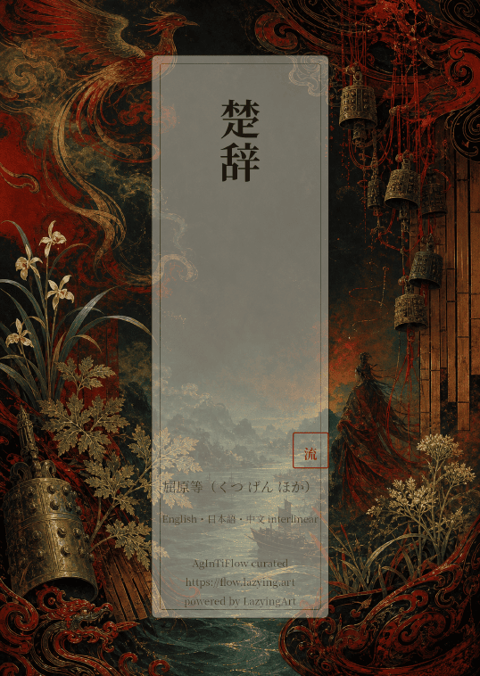 | `chuci` | 文言文 main · English · 日本語 · 中文 | [PDF](https://github.com/lachlanchen/LinguaLeaf/blob/main/docs/pocketpolyglot/books/wenyan-en-jp-zh/chuci/wenyan-main-quadrilingual/color/%E6%A5%9A%E8%BE%AD%EF%BC%88%E8%8B%B1%E6%96%87%E3%83%BB%E7%8F%BE%E4%BB%A3%E6%97%A5%E6%9C%AC%E8%AA%9E%E3%83%BB%E7%8F%BE%E4%BB%A3%E4%B8%AD%E6%96%87%E6%B3%A8%EF%BC%89%E3%83%BB%E6%9C%80%E5%A4%A7%E8%AA%9E%E7%A8%AE%E3%83%BB%E5%A4%A7%E5%AD%97%E7%89%88.pdf) | [PDF](https://github.com/lachlanchen/LinguaLeaf/blob/main/docs/pocketpolyglot/books/wenyan-en-jp-zh/chuci/wenyan-main-quadrilingual/blackwhite/%E6%A5%9A%E8%BE%AD%EF%BC%88%E8%8B%B1%E6%96%87%E3%83%BB%E7%8F%BE%E4%BB%A3%E6%97%A5%E6%9C%AC%E8%AA%9E%E3%83%BB%E7%8F%BE%E4%BB%A3%E4%B8%AD%E6%96%87%E6%B3%A8%E3%83%BB%E9%BB%91%E7%99%BD%EF%BC%89%E3%83%BB%E6%9C%80%E5%A4%A7%E8%AA%9E%E7%A8%AE%E3%83%BB%E5%A4%A7%E5%AD%97%E7%89%88.pdf) |
| 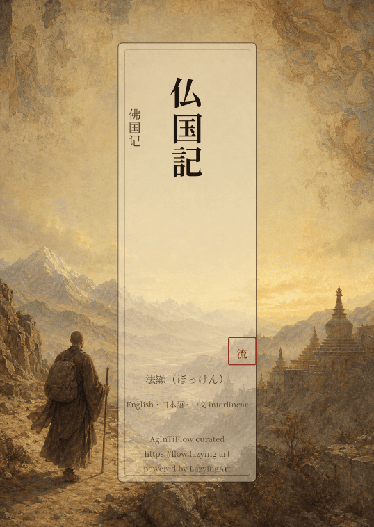 | `foguoji` | 文言文 main · English · 日本語 · 中文 | [PDF](https://github.com/lachlanchen/LinguaLeaf/blob/main/docs/pocketpolyglot/books/wenyan-en-jp-zh/foguoji/wenyan-main-quadrilingual/color/%E4%BD%9B%E5%9C%8B%E8%A8%98%EF%BC%88%E8%8B%B1%E6%96%87%E3%83%BB%E7%8F%BE%E4%BB%A3%E6%97%A5%E6%9C%AC%E8%AA%9E%E3%83%BB%E7%8F%BE%E4%BB%A3%E4%B8%AD%E6%96%87%E6%B3%A8%EF%BC%89%E3%83%BB%E6%9C%80%E5%A4%A7%E8%AA%9E%E7%A8%AE%E3%83%BB%E5%A4%A7%E5%AD%97%E7%89%88.pdf) | [PDF](https://github.com/lachlanchen/LinguaLeaf/blob/main/docs/pocketpolyglot/books/wenyan-en-jp-zh/foguoji/wenyan-main-quadrilingual/blackwhite/%E4%BD%9B%E5%9C%8B%E8%A8%98%EF%BC%88%E8%8B%B1%E6%96%87%E3%83%BB%E7%8F%BE%E4%BB%A3%E6%97%A5%E6%9C%AC%E8%AA%9E%E3%83%BB%E7%8F%BE%E4%BB%A3%E4%B8%AD%E6%96%87%E6%B3%A8%E3%83%BB%E9%BB%91%E7%99%BD%EF%BC%89%E3%83%BB%E6%9C%80%E5%A4%A7%E8%AA%9E%E7%A8%AE%E3%83%BB%E5%A4%A7%E5%AD%97%E7%89%88.pdf) |
| 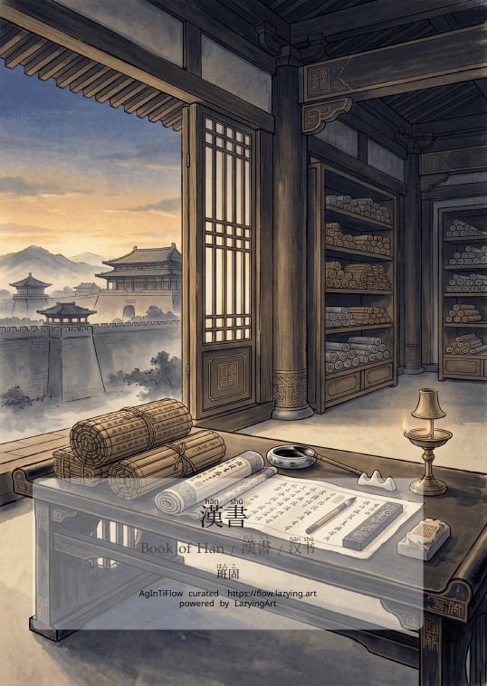 | `han-shu` | 文言文 main · English · 日本語 · 中文 | [PDF](https://github.com/lachlanchen/LinguaLeaf/blob/main/docs/pocketpolyglot/books/wenyan-en-jp-zh/han-shu/wenyan-main-quadrilingual/color/%E6%BC%A2%E6%9B%B8%EF%BC%88%E8%8B%B1%E6%96%87%E3%83%BB%E7%8F%BE%E4%BB%A3%E6%97%A5%E6%9C%AC%E8%AA%9E%E3%83%BB%E7%8F%BE%E4%BB%A3%E4%B8%AD%E6%96%87%E6%B3%A8%EF%BC%89%E3%83%BB%E6%9C%80%E5%A4%A7%E8%AA%9E%E7%A8%AE%E3%83%BB%E5%A4%A7%E5%AD%97%E7%89%88.pdf) | [PDF](https://github.com/lachlanchen/LinguaLeaf/blob/main/docs/pocketpolyglot/books/wenyan-en-jp-zh/han-shu/wenyan-main-quadrilingual/blackwhite/%E6%BC%A2%E6%9B%B8%EF%BC%88%E8%8B%B1%E6%96%87%E3%83%BB%E7%8F%BE%E4%BB%A3%E6%97%A5%E6%9C%AC%E8%AA%9E%E3%83%BB%E7%8F%BE%E4%BB%A3%E4%B8%AD%E6%96%87%E6%B3%A8%E3%83%BB%E9%BB%91%E7%99%BD%EF%BC%89%E3%83%BB%E6%9C%80%E5%A4%A7%E8%AA%9E%E7%A8%AE%E3%83%BB%E5%A4%A7%E5%AD%97%E7%89%88.pdf) |
| 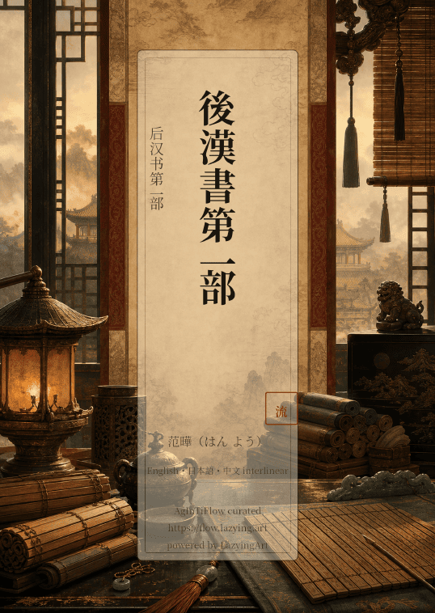 | `hou-han-shu-part-01` | 文言文 main · English · 日本語 · 中文 | [PDF](https://github.com/lachlanchen/LinguaLeaf/blob/main/docs/pocketpolyglot/books/wenyan-en-jp-zh/hou-han-shu-part-01/wenyan-main-quadrilingual/color/%E5%BE%8C%E6%BC%A2%E6%9B%B8%E7%AC%AC%E4%B8%80%E9%83%A8%EF%BC%88%E8%8B%B1%E6%96%87%E3%83%BB%E7%8F%BE%E4%BB%A3%E6%97%A5%E6%9C%AC%E8%AA%9E%E3%83%BB%E7%8F%BE%E4%BB%A3%E4%B8%AD%E6%96%87%E6%B3%A8%EF%BC%89%E3%83%BB%E6%9C%80%E5%A4%A7%E8%AA%9E%E7%A8%AE%E3%83%BB%E5%A4%A7%E5%AD%97%E7%89%88.pdf) | [PDF](https://github.com/lachlanchen/LinguaLeaf/blob/main/docs/pocketpolyglot/books/wenyan-en-jp-zh/hou-han-shu-part-01/wenyan-main-quadrilingual/blackwhite/%E5%BE%8C%E6%BC%A2%E6%9B%B8%E7%AC%AC%E4%B8%80%E9%83%A8%EF%BC%88%E8%8B%B1%E6%96%87%E3%83%BB%E7%8F%BE%E4%BB%A3%E6%97%A5%E6%9C%AC%E8%AA%9E%E3%83%BB%E7%8F%BE%E4%BB%A3%E4%B8%AD%E6%96%87%E6%B3%A8%E3%83%BB%E9%BB%91%E7%99%BD%EF%BC%89%E3%83%BB%E6%9C%80%E5%A4%A7%E8%AA%9E%E7%A8%AE%E3%83%BB%E5%A4%A7%E5%AD%97%E7%89%88.pdf) |
|  | `hou-han-shu-part-02` | 文言文 main · English · 日本語 · 中文 | [PDF](https://github.com/lachlanchen/LinguaLeaf/blob/main/docs/pocketpolyglot/books/wenyan-en-jp-zh/hou-han-shu-part-02/wenyan-main-quadrilingual/color/%E5%BE%8C%E6%BC%A2%E6%9B%B8%E7%AC%AC%E4%BA%8C%E9%83%A8%EF%BC%88%E8%8B%B1%E6%96%87%E3%83%BB%E7%8F%BE%E4%BB%A3%E6%97%A5%E6%9C%AC%E8%AA%9E%E3%83%BB%E7%8F%BE%E4%BB%A3%E4%B8%AD%E6%96%87%E6%B3%A8%EF%BC%89%E3%83%BB%E6%9C%80%E5%A4%A7%E8%AA%9E%E7%A8%AE%E3%83%BB%E5%A4%A7%E5%AD%97%E7%89%88.pdf) | [PDF](https://github.com/lachlanchen/LinguaLeaf/blob/main/docs/pocketpolyglot/books/wenyan-en-jp-zh/hou-han-shu-part-02/wenyan-main-quadrilingual/blackwhite/%E5%BE%8C%E6%BC%A2%E6%9B%B8%E7%AC%AC%E4%BA%8C%E9%83%A8%EF%BC%88%E8%8B%B1%E6%96%87%E3%83%BB%E7%8F%BE%E4%BB%A3%E6%97%A5%E6%9C%AC%E8%AA%9E%E3%83%BB%E7%8F%BE%E4%BB%A3%E4%B8%AD%E6%96%87%E6%B3%A8%E3%83%BB%E9%BB%91%E7%99%BD%EF%BC%89%E3%83%BB%E6%9C%80%E5%A4%A7%E8%AA%9E%E7%A8%AE%E3%83%BB%E5%A4%A7%E5%AD%97%E7%89%88.pdf) |
|  | `hou-han-shu-part-03` | 文言文 main · English · 日本語 · 中文 | [PDF](https://github.com/lachlanchen/LinguaLeaf/blob/main/docs/pocketpolyglot/books/wenyan-en-jp-zh/hou-han-shu-part-03/wenyan-main-quadrilingual/color/%E5%BE%8C%E6%BC%A2%E6%9B%B8%E7%AC%AC%E4%B8%89%E9%83%A8%EF%BC%88%E8%8B%B1%E6%96%87%E3%83%BB%E7%8F%BE%E4%BB%A3%E6%97%A5%E6%9C%AC%E8%AA%9E%E3%83%BB%E7%8F%BE%E4%BB%A3%E4%B8%AD%E6%96%87%E6%B3%A8%EF%BC%89%E3%83%BB%E6%9C%80%E5%A4%A7%E8%AA%9E%E7%A8%AE%E3%83%BB%E5%A4%A7%E5%AD%97%E7%89%88.pdf) | [PDF](https://github.com/lachlanchen/LinguaLeaf/blob/main/docs/pocketpolyglot/books/wenyan-en-jp-zh/hou-han-shu-part-03/wenyan-main-quadrilingual/blackwhite/%E5%BE%8C%E6%BC%A2%E6%9B%B8%E7%AC%AC%E4%B8%89%E9%83%A8%EF%BC%88%E8%8B%B1%E6%96%87%E3%83%BB%E7%8F%BE%E4%BB%A3%E6%97%A5%E6%9C%AC%E8%AA%9E%E3%83%BB%E7%8F%BE%E4%BB%A3%E4%B8%AD%E6%96%87%E6%B3%A8%E3%83%BB%E9%BB%91%E7%99%BD%EF%BC%89%E3%83%BB%E6%9C%80%E5%A4%A7%E8%AA%9E%E7%A8%AE%E3%83%BB%E5%A4%A7%E5%AD%97%E7%89%88.pdf) |
| 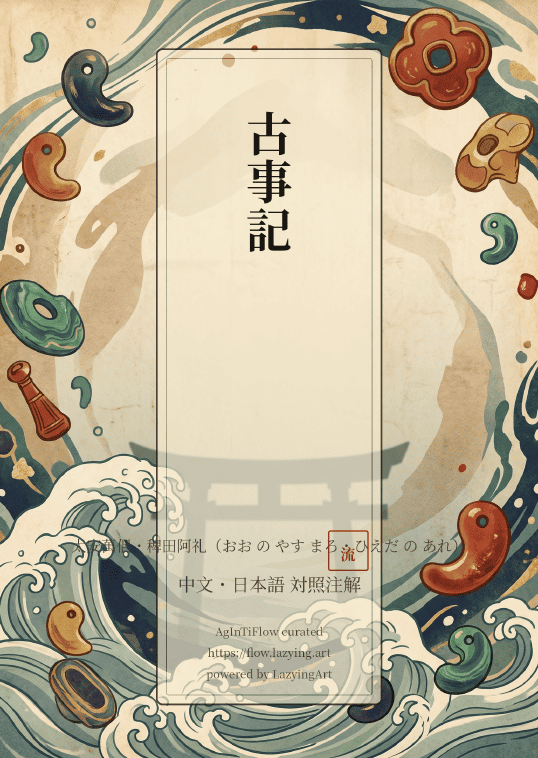 | `kojiki-wenyan` | 文言文 main · English · 日本語 · 中文 | [PDF](https://github.com/lachlanchen/LinguaLeaf/blob/main/docs/pocketpolyglot/books/wenyan-en-jp-zh/kojiki-wenyan/wenyan-main-quadrilingual/color/%E5%8F%A4%E4%BA%8B%E8%A8%98%EF%BC%88%E7%8F%BE%E4%BB%A3%E6%97%A5%E6%9C%AC%E8%AA%9E%E3%83%BB%E7%8F%BE%E4%BB%A3%E4%B8%AD%E6%96%87%E3%83%BB%E8%8B%B1%E6%96%87%E6%B3%A8%EF%BC%89%E3%83%BB%E6%9C%80%E5%A4%A7%E8%AA%9E%E7%A8%AE%E3%83%BB%E5%A4%A7%E5%AD%97%E7%89%88.pdf) | [PDF](https://github.com/lachlanchen/LinguaLeaf/blob/main/docs/pocketpolyglot/books/wenyan-en-jp-zh/kojiki-wenyan/wenyan-main-quadrilingual/blackwhite/%E5%8F%A4%E4%BA%8B%E8%A8%98%EF%BC%88%E7%8F%BE%E4%BB%A3%E6%97%A5%E6%9C%AC%E8%AA%9E%E3%83%BB%E7%8F%BE%E4%BB%A3%E4%B8%AD%E6%96%87%E3%83%BB%E8%8B%B1%E6%96%87%E6%B3%A8%E3%83%BB%E9%BB%91%E7%99%BD%EF%BC%89%E3%83%BB%E6%9C%80%E5%A4%A7%E8%AA%9E%E7%A8%AE%E3%83%BB%E5%A4%A7%E5%AD%97%E7%89%88.pdf) |
| 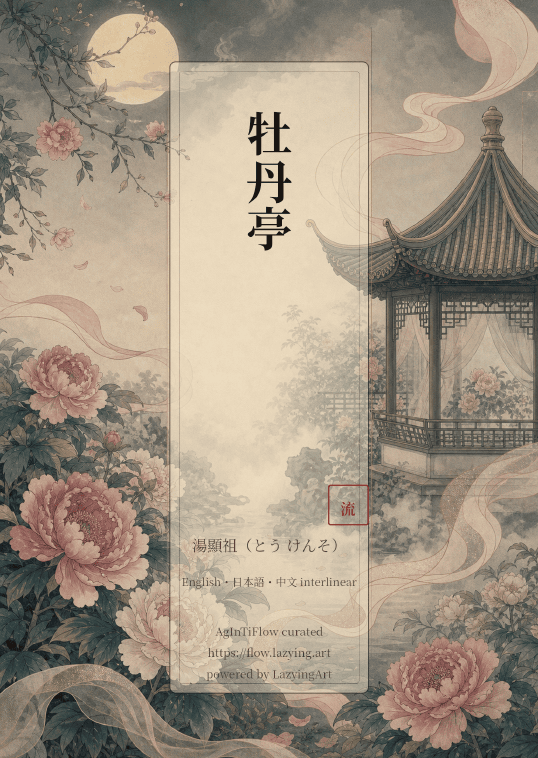 | `mudanting` | 文言文 main · English · 日本語 · 中文 | [PDF](https://github.com/lachlanchen/LinguaLeaf/blob/main/docs/pocketpolyglot/books/wenyan-en-jp-zh/mudanting/wenyan-main-quadrilingual/color/%E7%89%A1%E4%B8%B9%E4%BA%AD%EF%BC%88%E8%8B%B1%E6%96%87%E3%83%BB%E7%8F%BE%E4%BB%A3%E6%97%A5%E6%9C%AC%E8%AA%9E%E3%83%BB%E7%8F%BE%E4%BB%A3%E4%B8%AD%E6%96%87%E6%B3%A8%EF%BC%89%E3%83%BB%E6%9C%80%E5%A4%A7%E8%AA%9E%E7%A8%AE%E3%83%BB%E5%A4%A7%E5%AD%97%E7%89%88.pdf) | [PDF](https://github.com/lachlanchen/LinguaLeaf/blob/main/docs/pocketpolyglot/books/wenyan-en-jp-zh/mudanting/wenyan-main-quadrilingual/blackwhite/%E7%89%A1%E4%B8%B9%E4%BA%AD%EF%BC%88%E8%8B%B1%E6%96%87%E3%83%BB%E7%8F%BE%E4%BB%A3%E6%97%A5%E6%9C%AC%E8%AA%9E%E3%83%BB%E7%8F%BE%E4%BB%A3%E4%B8%AD%E6%96%87%E6%B3%A8%E3%83%BB%E9%BB%91%E7%99%BD%EF%BC%89%E3%83%BB%E6%9C%80%E5%A4%A7%E8%AA%9E%E7%A8%AE%E3%83%BB%E5%A4%A7%E5%AD%97%E7%89%88.pdf) |
|  | `nihon-shoki` | 文言文 main · English · 日本語 · 中文 | [PDF](https://github.com/lachlanchen/LinguaLeaf/blob/main/docs/pocketpolyglot/books/wenyan-en-jp-zh/nihon-shoki/wenyan-main-quadrilingual/color/%E6%97%A5%E6%9C%AC%E6%9B%B8%E7%B4%80%EF%BC%88%E7%8F%BE%E4%BB%A3%E6%97%A5%E6%9C%AC%E8%AA%9E%E3%83%BB%E7%8F%BE%E4%BB%A3%E4%B8%AD%E6%96%87%E3%83%BB%E8%8B%B1%E6%96%87%E6%B3%A8%EF%BC%89%E3%83%BB%E6%9C%80%E5%A4%A7%E8%AA%9E%E7%A8%AE%E3%83%BB%E5%A4%A7%E5%AD%97%E7%89%88.pdf) | [PDF](https://github.com/lachlanchen/LinguaLeaf/blob/main/docs/pocketpolyglot/books/wenyan-en-jp-zh/nihon-shoki/wenyan-main-quadrilingual/blackwhite/%E6%97%A5%E6%9C%AC%E6%9B%B8%E7%B4%80%EF%BC%88%E7%8F%BE%E4%BB%A3%E6%97%A5%E6%9C%AC%E8%AA%9E%E3%83%BB%E7%8F%BE%E4%BB%A3%E4%B8%AD%E6%96%87%E3%83%BB%E8%8B%B1%E6%96%87%E6%B3%A8%E3%83%BB%E9%BB%91%E7%99%BD%EF%BC%89%E3%83%BB%E6%9C%80%E5%A4%A7%E8%AA%9E%E7%A8%AE%E3%83%BB%E5%A4%A7%E5%AD%97%E7%89%88.pdf) |
|  | `platform-sutra` | 文言文 main · English · 日本語 · 中文 | [PDF](https://github.com/lachlanchen/LinguaLeaf/blob/main/docs/pocketpolyglot/books/wenyan-en-jp-zh/platform-sutra/wenyan-main-quadrilingual/color/%E5%85%AD%E7%A5%96%E5%A4%A7%E5%B8%AB%E6%B3%95%E5%AF%B6%E5%A3%87%E7%B6%93%EF%BC%88%E8%8B%B1%E6%96%87%E3%83%BB%E7%8F%BE%E4%BB%A3%E6%97%A5%E6%9C%AC%E8%AA%9E%E3%83%BB%E7%8F%BE%E4%BB%A3%E4%B8%AD%E6%96%87%E6%B3%A8%EF%BC%89%E3%83%BB%E6%9C%80%E5%A4%A7%E8%AA%9E%E7%A8%AE%E3%83%BB%E5%A4%A7%E5%AD%97%E7%89%88.pdf) | [PDF](https://github.com/lachlanchen/LinguaLeaf/blob/main/docs/pocketpolyglot/books/wenyan-en-jp-zh/platform-sutra/wenyan-main-quadrilingual/blackwhite/%E5%85%AD%E7%A5%96%E5%A4%A7%E5%B8%AB%E6%B3%95%E5%AF%B6%E5%A3%87%E7%B6%93%EF%BC%88%E8%8B%B1%E6%96%87%E3%83%BB%E7%8F%BE%E4%BB%A3%E6%97%A5%E6%9C%AC%E8%AA%9E%E3%83%BB%E7%8F%BE%E4%BB%A3%E4%B8%AD%E6%96%87%E6%B3%A8%E3%83%BB%E9%BB%91%E7%99%BD%EF%BC%89%E3%83%BB%E6%9C%80%E5%A4%A7%E8%AA%9E%E7%A8%AE%E3%83%BB%E5%A4%A7%E5%AD%97%E7%89%88.pdf) |
| 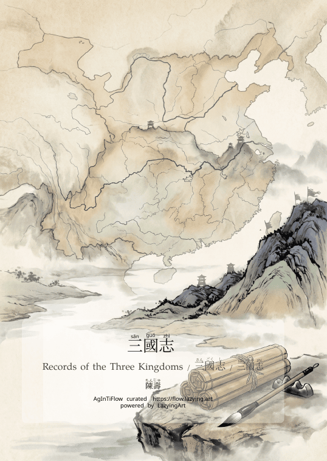 | `sanguozhi` | 文言文 main · English · 日本語 · 中文 | [PDF](https://github.com/lachlanchen/LinguaLeaf/blob/main/docs/pocketpolyglot/books/wenyan-en-jp-zh/sanguozhi/wenyan-main-quadrilingual/color/%E4%B8%89%E5%9C%8B%E5%BF%97%EF%BC%88%E8%8B%B1%E6%96%87%E3%83%BB%E7%8F%BE%E4%BB%A3%E6%97%A5%E6%9C%AC%E8%AA%9E%E3%83%BB%E7%8F%BE%E4%BB%A3%E4%B8%AD%E6%96%87%E6%B3%A8%EF%BC%89%E3%83%BB%E6%9C%80%E5%A4%A7%E8%AA%9E%E7%A8%AE%E3%83%BB%E5%A4%A7%E5%AD%97%E7%89%88.pdf) | [PDF](https://github.com/lachlanchen/LinguaLeaf/blob/main/docs/pocketpolyglot/books/wenyan-en-jp-zh/sanguozhi/wenyan-main-quadrilingual/blackwhite/%E4%B8%89%E5%9C%8B%E5%BF%97%EF%BC%88%E8%8B%B1%E6%96%87%E3%83%BB%E7%8F%BE%E4%BB%A3%E6%97%A5%E6%9C%AC%E8%AA%9E%E3%83%BB%E7%8F%BE%E4%BB%A3%E4%B8%AD%E6%96%87%E6%B3%A8%E3%83%BB%E9%BB%91%E7%99%BD%EF%BC%89%E3%83%BB%E6%9C%80%E5%A4%A7%E8%AA%9E%E7%A8%AE%E3%83%BB%E5%A4%A7%E5%AD%97%E7%89%88.pdf) |
|  | `sanguozhi-pei-zhu` | 文言文 main · English · 日本語 · 中文 | [PDF](https://github.com/lachlanchen/LinguaLeaf/blob/main/docs/pocketpolyglot/books/wenyan-en-jp-zh/sanguozhi-pei-zhu/wenyan-main-quadrilingual/color/%E4%B8%89%E5%9C%8B%E5%BF%97%E8%A3%B4%E6%9D%BE%E4%B9%8B%E6%B3%A8%EF%BC%88%E8%8B%B1%E6%96%87%E3%83%BB%E7%8F%BE%E4%BB%A3%E6%97%A5%E6%9C%AC%E8%AA%9E%E3%83%BB%E7%8F%BE%E4%BB%A3%E4%B8%AD%E6%96%87%E6%B3%A8%EF%BC%89%E3%83%BB%E6%9C%80%E5%A4%A7%E8%AA%9E%E7%A8%AE%E3%83%BB%E5%A4%A7%E5%AD%97%E7%89%88.pdf) | [PDF](https://github.com/lachlanchen/LinguaLeaf/blob/main/docs/pocketpolyglot/books/wenyan-en-jp-zh/sanguozhi-pei-zhu/wenyan-main-quadrilingual/blackwhite/%E4%B8%89%E5%9C%8B%E5%BF%97%E8%A3%B4%E6%9D%BE%E4%B9%8B%E6%B3%A8%EF%BC%88%E8%8B%B1%E6%96%87%E3%83%BB%E7%8F%BE%E4%BB%A3%E6%97%A5%E6%9C%AC%E8%AA%9E%E3%83%BB%E7%8F%BE%E4%BB%A3%E4%B8%AD%E6%96%87%E6%B3%A8%E3%83%BB%E9%BB%91%E7%99%BD%EF%BC%89%E3%83%BB%E6%9C%80%E5%A4%A7%E8%AA%9E%E7%A8%AE%E3%83%BB%E5%A4%A7%E5%AD%97%E7%89%88.pdf) |
| 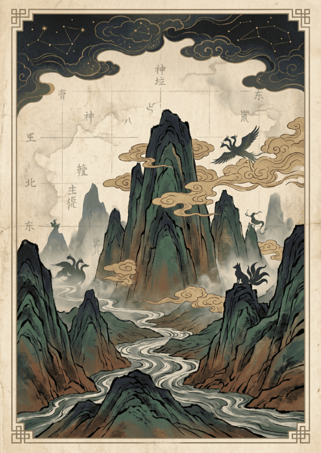 | `shanhaijing` | 文言文 main · English · 日本語 · 中文 | [PDF](https://github.com/lachlanchen/LinguaLeaf/blob/main/docs/pocketpolyglot/books/wenyan-en-jp-zh/shanhaijing/wenyan-main-quadrilingual/color/%E5%B1%B1%E6%B5%B7%E7%B6%93%EF%BC%88%E8%8B%B1%E6%96%87%E3%83%BB%E7%8F%BE%E4%BB%A3%E6%97%A5%E6%9C%AC%E8%AA%9E%E3%83%BB%E7%8F%BE%E4%BB%A3%E4%B8%AD%E6%96%87%E6%B3%A8%EF%BC%89%E3%83%BB%E6%9C%80%E5%A4%A7%E8%AA%9E%E7%A8%AE%E3%83%BB%E5%A4%A7%E5%AD%97%E7%89%88.pdf) | [PDF](https://github.com/lachlanchen/LinguaLeaf/blob/main/docs/pocketpolyglot/books/wenyan-en-jp-zh/shanhaijing/wenyan-main-quadrilingual/blackwhite/%E5%B1%B1%E6%B5%B7%E7%B6%93%EF%BC%88%E8%8B%B1%E6%96%87%E3%83%BB%E7%8F%BE%E4%BB%A3%E6%97%A5%E6%9C%AC%E8%AA%9E%E3%83%BB%E7%8F%BE%E4%BB%A3%E4%B8%AD%E6%96%87%E6%B3%A8%E3%83%BB%E9%BB%91%E7%99%BD%EF%BC%89%E3%83%BB%E6%9C%80%E5%A4%A7%E8%AA%9E%E7%A8%AE%E3%83%BB%E5%A4%A7%E5%AD%97%E7%89%88.pdf) |
|  | `shijing` | 文言文 main · English · 日本語 · 中文 | [PDF](https://github.com/lachlanchen/LinguaLeaf/blob/main/docs/pocketpolyglot/books/wenyan-en-jp-zh/shijing/wenyan-main-quadrilingual/color/%E8%A9%A9%E7%B6%93%EF%BC%88%E8%8B%B1%E6%96%87%E3%83%BB%E7%8F%BE%E4%BB%A3%E6%97%A5%E6%9C%AC%E8%AA%9E%E3%83%BB%E7%8F%BE%E4%BB%A3%E4%B8%AD%E6%96%87%E6%B3%A8%EF%BC%89%E3%83%BB%E6%9C%80%E5%A4%A7%E8%AA%9E%E7%A8%AE%E3%83%BB%E5%A4%A7%E5%AD%97%E7%89%88.pdf) | [PDF](https://github.com/lachlanchen/LinguaLeaf/blob/main/docs/pocketpolyglot/books/wenyan-en-jp-zh/shijing/wenyan-main-quadrilingual/blackwhite/%E8%A9%A9%E7%B6%93%EF%BC%88%E8%8B%B1%E6%96%87%E3%83%BB%E7%8F%BE%E4%BB%A3%E6%97%A5%E6%9C%AC%E8%AA%9E%E3%83%BB%E7%8F%BE%E4%BB%A3%E4%B8%AD%E6%96%87%E6%B3%A8%E3%83%BB%E9%BB%91%E7%99%BD%EF%BC%89%E3%83%BB%E6%9C%80%E5%A4%A7%E8%AA%9E%E7%A8%AE%E3%83%BB%E5%A4%A7%E5%AD%97%E7%89%88.pdf) |
| 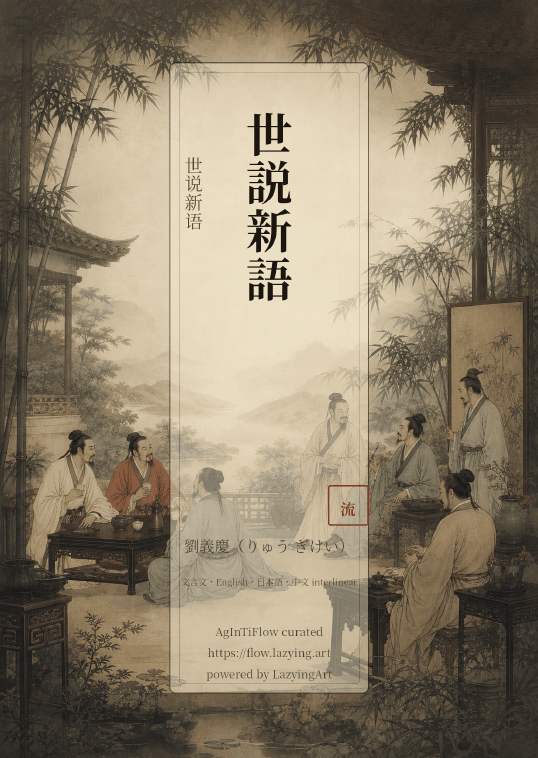 | `shishuo-xinyu` | 文言文 main · English · 日本語 · 中文 | [PDF](https://github.com/lachlanchen/LinguaLeaf/blob/main/docs/pocketpolyglot/books/wenyan-en-jp-zh/shishuo-xinyu/wenyan-main-quadrilingual/color/%E4%B8%96%E8%AA%AA%E6%96%B0%E8%AA%9E%EF%BC%88%E8%8B%B1%E6%96%87%E3%83%BB%E7%8F%BE%E4%BB%A3%E6%97%A5%E6%9C%AC%E8%AA%9E%E3%83%BB%E7%8F%BE%E4%BB%A3%E4%B8%AD%E6%96%87%E6%B3%A8%EF%BC%89%E3%83%BB%E6%9C%80%E5%A4%A7%E8%AA%9E%E7%A8%AE%E3%83%BB%E5%A4%A7%E5%AD%97%E7%89%88.pdf) | [PDF](https://github.com/lachlanchen/LinguaLeaf/blob/main/docs/pocketpolyglot/books/wenyan-en-jp-zh/shishuo-xinyu/wenyan-main-quadrilingual/blackwhite/%E4%B8%96%E8%AA%AA%E6%96%B0%E8%AA%9E%EF%BC%88%E8%8B%B1%E6%96%87%E3%83%BB%E7%8F%BE%E4%BB%A3%E6%97%A5%E6%9C%AC%E8%AA%9E%E3%83%BB%E7%8F%BE%E4%BB%A3%E4%B8%AD%E6%96%87%E6%B3%A8%E3%83%BB%E9%BB%91%E7%99%BD%EF%BC%89%E3%83%BB%E6%9C%80%E5%A4%A7%E8%AA%9E%E7%A8%AE%E3%83%BB%E5%A4%A7%E5%AD%97%E7%89%88.pdf) |
| 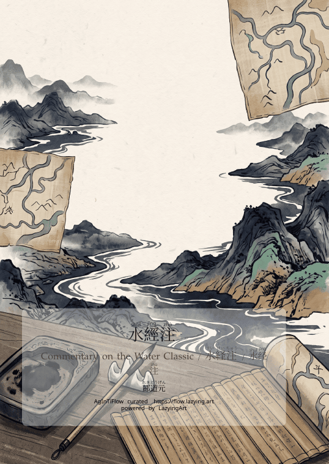 | `shui-jing-zhu` | 文言文 main · English · 日本語 · 中文 | [PDF](https://github.com/lachlanchen/LinguaLeaf/blob/main/docs/pocketpolyglot/books/wenyan-en-jp-zh/shui-jing-zhu/wenyan-main-quadrilingual/color/%E6%B0%B4%E7%B6%93%E6%B3%A8%EF%BC%88%E8%8B%B1%E6%96%87%E3%83%BB%E7%8F%BE%E4%BB%A3%E6%97%A5%E6%9C%AC%E8%AA%9E%E3%83%BB%E7%8F%BE%E4%BB%A3%E4%B8%AD%E6%96%87%E6%B3%A8%EF%BC%89%E3%83%BB%E6%9C%80%E5%A4%A7%E8%AA%9E%E7%A8%AE%E3%83%BB%E5%A4%A7%E5%AD%97%E7%89%88.pdf) | [PDF](https://github.com/lachlanchen/LinguaLeaf/blob/main/docs/pocketpolyglot/books/wenyan-en-jp-zh/shui-jing-zhu/wenyan-main-quadrilingual/blackwhite/%E6%B0%B4%E7%B6%93%E6%B3%A8%EF%BC%88%E8%8B%B1%E6%96%87%E3%83%BB%E7%8F%BE%E4%BB%A3%E6%97%A5%E6%9C%AC%E8%AA%9E%E3%83%BB%E7%8F%BE%E4%BB%A3%E4%B8%AD%E6%96%87%E6%B3%A8%E3%83%BB%E9%BB%91%E7%99%BD%EF%BC%89%E3%83%BB%E6%9C%80%E5%A4%A7%E8%AA%9E%E7%A8%AE%E3%83%BB%E5%A4%A7%E5%AD%97%E7%89%88.pdf) |
|  | `tangshi-sanbai` | 文言文 main · English · 日本語 · 中文 | [PDF](https://github.com/lachlanchen/LinguaLeaf/blob/main/docs/pocketpolyglot/books/wenyan-en-jp-zh/tangshi-sanbai/wenyan-main-quadrilingual/color/%E5%94%90%E8%A9%A9%E4%B8%89%E7%99%BE%E9%A6%96%EF%BC%88%E8%8B%B1%E6%96%87%E3%83%BB%E7%8F%BE%E4%BB%A3%E6%97%A5%E6%9C%AC%E8%AA%9E%E3%83%BB%E7%8F%BE%E4%BB%A3%E4%B8%AD%E6%96%87%E6%B3%A8%EF%BC%89%E3%83%BB%E6%9C%80%E5%A4%A7%E8%AA%9E%E7%A8%AE%E3%83%BB%E5%A4%A7%E5%AD%97%E7%89%88.pdf) | [PDF](https://github.com/lachlanchen/LinguaLeaf/blob/main/docs/pocketpolyglot/books/wenyan-en-jp-zh/tangshi-sanbai/wenyan-main-quadrilingual/blackwhite/%E5%94%90%E8%A9%A9%E4%B8%89%E7%99%BE%E9%A6%96%EF%BC%88%E8%8B%B1%E6%96%87%E3%83%BB%E7%8F%BE%E4%BB%A3%E6%97%A5%E6%9C%AC%E8%AA%9E%E3%83%BB%E7%8F%BE%E4%BB%A3%E4%B8%AD%E6%96%87%E6%B3%A8%E3%83%BB%E9%BB%91%E7%99%BD%EF%BC%89%E3%83%BB%E6%9C%80%E5%A4%A7%E8%AA%9E%E7%A8%AE%E3%83%BB%E5%A4%A7%E5%AD%97%E7%89%88.pdf) |
|  | `vimalakirti-sutra` | 文言文 main · English · 日本語 · 中文 | [PDF](https://github.com/lachlanchen/LinguaLeaf/blob/main/docs/pocketpolyglot/books/wenyan-en-jp-zh/vimalakirti-sutra/wenyan-main-quadrilingual/color/%E7%B6%AD%E6%91%A9%E8%A9%B0%E6%89%80%E8%AA%AA%E7%B6%93%EF%BC%88%E8%8B%B1%E6%96%87%E3%83%BB%E7%8F%BE%E4%BB%A3%E6%97%A5%E6%9C%AC%E8%AA%9E%E3%83%BB%E7%8F%BE%E4%BB%A3%E4%B8%AD%E6%96%87%E6%B3%A8%EF%BC%89%E3%83%BB%E6%9C%80%E5%A4%A7%E8%AA%9E%E7%A8%AE%E3%83%BB%E5%A4%A7%E5%AD%97%E7%89%88.pdf) | [PDF](https://github.com/lachlanchen/LinguaLeaf/blob/main/docs/pocketpolyglot/books/wenyan-en-jp-zh/vimalakirti-sutra/wenyan-main-quadrilingual/blackwhite/%E7%B6%AD%E6%91%A9%E8%A9%B0%E6%89%80%E8%AA%AA%E7%B6%93%EF%BC%88%E8%8B%B1%E6%96%87%E3%83%BB%E7%8F%BE%E4%BB%A3%E6%97%A5%E6%9C%AC%E8%AA%9E%E3%83%BB%E7%8F%BE%E4%BB%A3%E4%B8%AD%E6%96%87%E6%B3%A8%E3%83%BB%E9%BB%91%E7%99%BD%EF%BC%89%E3%83%BB%E6%9C%80%E5%A4%A7%E8%AA%9E%E7%A8%AE%E3%83%BB%E5%A4%A7%E5%AD%97%E7%89%88.pdf) |
|  | `xixiangji` | 文言文 main · English · 日本語 · 中文 | [PDF](https://github.com/lachlanchen/LinguaLeaf/blob/main/docs/pocketpolyglot/books/wenyan-en-jp-zh/xixiangji/wenyan-main-quadrilingual/color/%E8%A5%BF%E5%BB%82%E8%A8%98%EF%BC%88%E8%8B%B1%E6%96%87%E3%83%BB%E7%8F%BE%E4%BB%A3%E6%97%A5%E6%9C%AC%E8%AA%9E%E3%83%BB%E7%8F%BE%E4%BB%A3%E4%B8%AD%E6%96%87%E6%B3%A8%EF%BC%89%E3%83%BB%E6%9C%80%E5%A4%A7%E8%AA%9E%E7%A8%AE%E3%83%BB%E5%A4%A7%E5%AD%97%E7%89%88.pdf) | [PDF](https://github.com/lachlanchen/LinguaLeaf/blob/main/docs/pocketpolyglot/books/wenyan-en-jp-zh/xixiangji/wenyan-main-quadrilingual/blackwhite/%E8%A5%BF%E5%BB%82%E8%A8%98%EF%BC%88%E8%8B%B1%E6%96%87%E3%83%BB%E7%8F%BE%E4%BB%A3%E6%97%A5%E6%9C%AC%E8%AA%9E%E3%83%BB%E7%8F%BE%E4%BB%A3%E4%B8%AD%E6%96%87%E6%B3%A8%E3%83%BB%E9%BB%91%E7%99%BD%EF%BC%89%E3%83%BB%E6%9C%80%E5%A4%A7%E8%AA%9E%E7%A8%AE%E3%83%BB%E5%A4%A7%E5%AD%97%E7%89%88.pdf) |
|  | `xu-xiake-youji` | 文言文 main · English · 日本語 · 中文 | [PDF](https://github.com/lachlanchen/LinguaLeaf/blob/main/docs/pocketpolyglot/books/wenyan-en-jp-zh/xu-xiake-youji/wenyan-main-quadrilingual/color/%E5%BE%90%E9%9C%9E%E5%AE%A2%E9%81%8A%E8%A8%98%EF%BC%88%E8%8B%B1%E6%96%87%E3%83%BB%E7%8F%BE%E4%BB%A3%E6%97%A5%E6%9C%AC%E8%AA%9E%E3%83%BB%E7%8F%BE%E4%BB%A3%E4%B8%AD%E6%96%87%E6%B3%A8%EF%BC%89%E3%83%BB%E6%9C%80%E5%A4%A7%E8%AA%9E%E7%A8%AE%E3%83%BB%E5%A4%A7%E5%AD%97%E7%89%88.pdf) | [PDF](https://github.com/lachlanchen/LinguaLeaf/blob/main/docs/pocketpolyglot/books/wenyan-en-jp-zh/xu-xiake-youji/wenyan-main-quadrilingual/blackwhite/%E5%BE%90%E9%9C%9E%E5%AE%A2%E9%81%8A%E8%A8%98%EF%BC%88%E8%8B%B1%E6%96%87%E3%83%BB%E7%8F%BE%E4%BB%A3%E6%97%A5%E6%9C%AC%E8%AA%9E%E3%83%BB%E7%8F%BE%E4%BB%A3%E4%B8%AD%E6%96%87%E6%B3%A8%E3%83%BB%E9%BB%91%E7%99%BD%EF%BC%89%E3%83%BB%E6%9C%80%E5%A4%A7%E8%AA%9E%E7%A8%AE%E3%83%BB%E5%A4%A7%E5%AD%97%E7%89%88.pdf) |
|  | `yijing` | 文言文 main · English · 日本語 · 中文 | [PDF](https://github.com/lachlanchen/LinguaLeaf/blob/main/docs/pocketpolyglot/books/wenyan-en-jp-zh/yijing/wenyan-main-quadrilingual/color/%E5%91%A8%E6%98%93%EF%BC%88%E8%8B%B1%E6%96%87%E3%83%BB%E7%8F%BE%E4%BB%A3%E6%97%A5%E6%9C%AC%E8%AA%9E%E3%83%BB%E7%8F%BE%E4%BB%A3%E4%B8%AD%E6%96%87%E6%B3%A8%EF%BC%89%E3%83%BB%E6%9C%80%E5%A4%A7%E8%AA%9E%E7%A8%AE%E3%83%BB%E5%A4%A7%E5%AD%97%E7%89%88.pdf) | [PDF](https://github.com/lachlanchen/LinguaLeaf/blob/main/docs/pocketpolyglot/books/wenyan-en-jp-zh/yijing/wenyan-main-quadrilingual/blackwhite/%E5%91%A8%E6%98%93%EF%BC%88%E8%8B%B1%E6%96%87%E3%83%BB%E7%8F%BE%E4%BB%A3%E6%97%A5%E6%9C%AC%E8%AA%9E%E3%83%BB%E7%8F%BE%E4%BB%A3%E4%B8%AD%E6%96%87%E6%B3%A8%E3%83%BB%E9%BB%91%E7%99%BD%EF%BC%89%E3%83%BB%E6%9C%80%E5%A4%A7%E8%AA%9E%E7%A8%AE%E3%83%BB%E5%A4%A7%E5%AD%97%E7%89%88.pdf) |
| 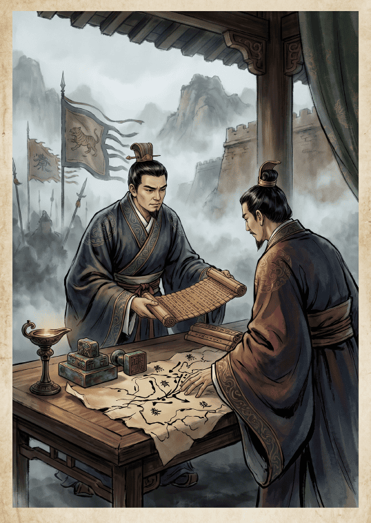 | `zhanguoce` | 文言文 main · English · 日本語 · 中文 | [PDF](https://github.com/lachlanchen/LinguaLeaf/blob/main/docs/pocketpolyglot/books/wenyan-en-jp-zh/zhanguoce/wenyan-main-quadrilingual/color/%E6%88%B0%E5%9C%8B%E7%AD%96%EF%BC%88%E8%8B%B1%E6%96%87%E3%83%BB%E7%8F%BE%E4%BB%A3%E6%97%A5%E6%9C%AC%E8%AA%9E%E3%83%BB%E7%8F%BE%E4%BB%A3%E4%B8%AD%E6%96%87%E6%B3%A8%EF%BC%89%E3%83%BB%E6%9C%80%E5%A4%A7%E8%AA%9E%E7%A8%AE%E3%83%BB%E5%A4%A7%E5%AD%97%E7%89%88.pdf) | [PDF](https://github.com/lachlanchen/LinguaLeaf/blob/main/docs/pocketpolyglot/books/wenyan-en-jp-zh/zhanguoce/wenyan-main-quadrilingual/blackwhite/%E6%88%B0%E5%9C%8B%E7%AD%96%EF%BC%88%E8%8B%B1%E6%96%87%E3%83%BB%E7%8F%BE%E4%BB%A3%E6%97%A5%E6%9C%AC%E8%AA%9E%E3%83%BB%E7%8F%BE%E4%BB%A3%E4%B8%AD%E6%96%87%E6%B3%A8%E3%83%BB%E9%BB%91%E7%99%BD%EF%BC%89%E3%83%BB%E6%9C%80%E5%A4%A7%E8%AA%9E%E7%A8%AE%E3%83%BB%E5%A4%A7%E5%AD%97%E7%89%88.pdf) |
|  | `zhuangzi` | 文言文 main · English · 日本語 · 中文 | [PDF](https://github.com/lachlanchen/LinguaLeaf/blob/main/docs/pocketpolyglot/books/wenyan-en-jp-zh/zhuangzi/wenyan-main-quadrilingual/color/%E8%8E%8A%E5%AD%90%EF%BC%88%E8%8B%B1%E6%96%87%E3%83%BB%E7%8F%BE%E4%BB%A3%E6%97%A5%E6%9C%AC%E8%AA%9E%E3%83%BB%E7%8F%BE%E4%BB%A3%E4%B8%AD%E6%96%87%E6%B3%A8%EF%BC%89%E3%83%BB%E6%9C%80%E5%A4%A7%E8%AA%9E%E7%A8%AE%E3%83%BB%E5%A4%A7%E5%AD%97%E7%89%88.pdf) | [PDF](https://github.com/lachlanchen/LinguaLeaf/blob/main/docs/pocketpolyglot/books/wenyan-en-jp-zh/zhuangzi/wenyan-main-quadrilingual/blackwhite/%E8%8E%8A%E5%AD%90%EF%BC%88%E8%8B%B1%E6%96%87%E3%83%BB%E7%8F%BE%E4%BB%A3%E6%97%A5%E6%9C%AC%E8%AA%9E%E3%83%BB%E7%8F%BE%E4%BB%A3%E4%B8%AD%E6%96%87%E6%B3%A8%E3%83%BB%E9%BB%91%E7%99%BD%EF%BC%89%E3%83%BB%E6%9C%80%E5%A4%A7%E8%AA%9E%E7%A8%AE%E3%83%BB%E5%A4%A7%E5%AD%97%E7%89%88.pdf) |
|  | `zizhi-tongjian-part-01` | 文言文 main · English · 日本語 · 中文 | - | [PDF](https://github.com/lachlanchen/LinguaLeaf/blob/main/docs/pocketpolyglot/books/wenyan-en-jp-zh/zizhi-tongjian-part-01/wenyan-main-quadrilingual/blackwhite/%E8%B3%87%E6%B2%BB%E9%80%9A%E9%91%91%E7%AC%AC%E4%B8%80%E9%83%A8%EF%BC%88%E8%8B%B1%E6%96%87%E3%83%BB%E7%8F%BE%E4%BB%A3%E6%97%A5%E6%9C%AC%E8%AA%9E%E3%83%BB%E7%8F%BE%E4%BB%A3%E4%B8%AD%E6%96%87%E6%B3%A8%E3%83%BB%E9%BB%91%E7%99%BD%EF%BC%89%E3%83%BB%E6%9C%80%E5%A4%A7%E8%AA%9E%E7%A8%AE%E3%83%BB%E5%A4%A7%E5%AD%97%E7%89%88.pdf) |
|  | `zizhi-tongjian-part-02` | 文言文 main · English · 日本語 · 中文 | - | [PDF](https://github.com/lachlanchen/LinguaLeaf/blob/main/docs/pocketpolyglot/books/wenyan-en-jp-zh/zizhi-tongjian-part-02/wenyan-main-quadrilingual/blackwhite/%E8%B3%87%E6%B2%BB%E9%80%9A%E9%91%91%E7%AC%AC%E4%BA%8C%E9%83%A8%EF%BC%88%E8%8B%B1%E6%96%87%E3%83%BB%E7%8F%BE%E4%BB%A3%E6%97%A5%E6%9C%AC%E8%AA%9E%E3%83%BB%E7%8F%BE%E4%BB%A3%E4%B8%AD%E6%96%87%E6%B3%A8%E3%83%BB%E9%BB%91%E7%99%BD%EF%BC%89%E3%83%BB%E6%9C%80%E5%A4%A7%E8%AA%9E%E7%A8%AE%E3%83%BB%E5%A4%A7%E5%AD%97%E7%89%88.pdf) |
|  | `zizhi-tongjian-part-03` | 文言文 main · English · 日本語 · 中文 | - | [PDF](https://github.com/lachlanchen/LinguaLeaf/blob/main/docs/pocketpolyglot/books/wenyan-en-jp-zh/zizhi-tongjian-part-03/wenyan-main-quadrilingual/blackwhite/%E8%B3%87%E6%B2%BB%E9%80%9A%E9%91%91%E7%AC%AC%E4%B8%89%E9%83%A8%EF%BC%88%E8%8B%B1%E6%96%87%E3%83%BB%E7%8F%BE%E4%BB%A3%E6%97%A5%E6%9C%AC%E8%AA%9E%E3%83%BB%E7%8F%BE%E4%BB%A3%E4%B8%AD%E6%96%87%E6%B3%A8%E3%83%BB%E9%BB%91%E7%99%BD%EF%BC%89%E3%83%BB%E6%9C%80%E5%A4%A7%E8%AA%9E%E7%A8%AE%E3%83%BB%E5%A4%A7%E5%AD%97%E7%89%88.pdf) |
|  | `zizhi-tongjian-part-04` | 文言文 main · English · 日本語 · 中文 | - | [PDF](https://github.com/lachlanchen/LinguaLeaf/blob/main/docs/pocketpolyglot/books/wenyan-en-jp-zh/zizhi-tongjian-part-04/wenyan-main-quadrilingual/blackwhite/%E8%B3%87%E6%B2%BB%E9%80%9A%E9%91%91%E7%AC%AC%E5%9B%9B%E9%83%A8%EF%BC%88%E8%8B%B1%E6%96%87%E3%83%BB%E7%8F%BE%E4%BB%A3%E6%97%A5%E6%9C%AC%E8%AA%9E%E3%83%BB%E7%8F%BE%E4%BB%A3%E4%B8%AD%E6%96%87%E6%B3%A8%E3%83%BB%E9%BB%91%E7%99%BD%EF%BC%89%E3%83%BB%E6%9C%80%E5%A4%A7%E8%AA%9E%E7%A8%AE%E3%83%BB%E5%A4%A7%E5%AD%97%E7%89%88.pdf) |
|  | `zizhi-tongjian-part-05` | 文言文 main · English · 日本語 · 中文 | - | [PDF](https://github.com/lachlanchen/LinguaLeaf/blob/main/docs/pocketpolyglot/books/wenyan-en-jp-zh/zizhi-tongjian-part-05/wenyan-main-quadrilingual/blackwhite/%E8%B3%87%E6%B2%BB%E9%80%9A%E9%91%91%E7%AC%AC%E4%BA%94%E9%83%A8%EF%BC%88%E8%8B%B1%E6%96%87%E3%83%BB%E7%8F%BE%E4%BB%A3%E6%97%A5%E6%9C%AC%E8%AA%9E%E3%83%BB%E7%8F%BE%E4%BB%A3%E4%B8%AD%E6%96%87%E6%B3%A8%E3%83%BB%E9%BB%91%E7%99%BD%EF%BC%89%E3%83%BB%E6%9C%80%E5%A4%A7%E8%AA%9E%E7%A8%AE%E3%83%BB%E5%A4%A7%E5%AD%97%E7%89%88.pdf) |
| 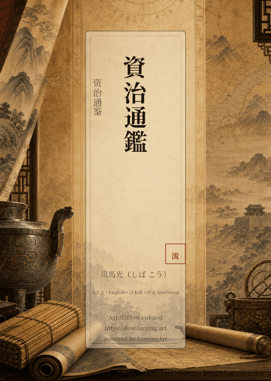 | `zizhi-tongjian-part-06` | 文言文 main · English · 日本語 · 中文 | - | [PDF](https://github.com/lachlanchen/LinguaLeaf/blob/main/docs/pocketpolyglot/books/wenyan-en-jp-zh/zizhi-tongjian-part-06/wenyan-main-quadrilingual/blackwhite/%E8%B3%87%E6%B2%BB%E9%80%9A%E9%91%91%E7%AC%AC%E5%85%AD%E9%83%A8%EF%BC%88%E8%8B%B1%E6%96%87%E3%83%BB%E7%8F%BE%E4%BB%A3%E6%97%A5%E6%9C%AC%E8%AA%9E%E3%83%BB%E7%8F%BE%E4%BB%A3%E4%B8%AD%E6%96%87%E6%B3%A8%E3%83%BB%E9%BB%91%E7%99%BD%EF%BC%89%E3%83%BB%E6%9C%80%E5%A4%A7%E8%AA%9E%E7%A8%AE%E3%83%BB%E5%A4%A7%E5%AD%97%E7%89%88.pdf) |
|  | `zuozhuan` | 文言文 main · English · 日本語 · 中文 | [PDF](https://github.com/lachlanchen/LinguaLeaf/blob/main/docs/pocketpolyglot/books/wenyan-en-jp-zh/zuozhuan/wenyan-main-quadrilingual/color/%E6%98%A5%E7%A7%8B%E5%B7%A6%E6%B0%8F%E5%82%B3%EF%BC%88%E8%8B%B1%E6%96%87%E3%83%BB%E7%8F%BE%E4%BB%A3%E6%97%A5%E6%9C%AC%E8%AA%9E%E3%83%BB%E7%8F%BE%E4%BB%A3%E4%B8%AD%E6%96%87%E6%B3%A8%EF%BC%89%E3%83%BB%E6%9C%80%E5%A4%A7%E8%AA%9E%E7%A8%AE%E3%83%BB%E5%A4%A7%E5%AD%97%E7%89%88.pdf) | [PDF](https://github.com/lachlanchen/LinguaLeaf/blob/main/docs/pocketpolyglot/books/wenyan-en-jp-zh/zuozhuan/wenyan-main-quadrilingual/blackwhite/%E6%98%A5%E7%A7%8B%E5%B7%A6%E6%B0%8F%E5%82%B3%EF%BC%88%E8%8B%B1%E6%96%87%E3%83%BB%E7%8F%BE%E4%BB%A3%E6%97%A5%E6%9C%AC%E8%AA%9E%E3%83%BB%E7%8F%BE%E4%BB%A3%E4%B8%AD%E6%96%87%E6%B3%A8%E3%83%BB%E9%BB%91%E7%99%BD%EF%BC%89%E3%83%BB%E6%9C%80%E5%A4%A7%E8%AA%9E%E7%A8%AE%E3%83%BB%E5%A4%A7%E5%AD%97%E7%89%88.pdf) |
|  | `shiji-aginti` | 文言文 main · 日本語 · 中文 | [PDF](https://github.com/lachlanchen/LinguaLeaf/blob/main/docs/pocketpolyglot/books/wenyan-jp-zh/shiji-aginti/wenyan-main-jp-zh/color/%E5%8F%B2%E8%A8%98%EF%BC%88%E7%8F%BE%E4%BB%A3%E6%97%A5%E6%9C%AC%E8%AA%9E%E3%83%BB%E7%8F%BE%E4%BB%A3%E4%B8%AD%E6%96%87%E6%B3%A8%EF%BC%89%E3%83%BB%E6%9C%80%E5%A4%A7%E8%AA%9E%E7%A8%AE%E3%83%BB%E5%A4%A7%E5%AD%97%E7%89%88.pdf) | [PDF](https://github.com/lachlanchen/LinguaLeaf/blob/main/docs/pocketpolyglot/books/wenyan-jp-zh/shiji-aginti/wenyan-main-jp-zh/blackwhite/%E5%8F%B2%E8%A8%98%EF%BC%88%E7%8F%BE%E4%BB%A3%E6%97%A5%E6%9C%AC%E8%AA%9E%E3%83%BB%E7%8F%BE%E4%BB%A3%E4%B8%AD%E6%96%87%E6%B3%A8%E3%83%BB%E9%BB%91%E7%99%BD%EF%BC%89%E3%83%BB%E6%9C%80%E5%A4%A7%E8%AA%9E%E7%A8%AE%E3%83%BB%E5%A4%A7%E5%AD%97%E7%89%88.pdf) |

Website reader: [learn.lazying.art](https://learn.lazying.art).
<!-- POCKETPOLYGLOT_MAX_LANGUAGE:END -->

## One Sentence In Full Width

JP-main sample from Kokoro: Japanese main text with furigana, Chinese comment with pinyin, and grammar color on the aligned words.

<p align="center">
  <a href="assets/edition-comparisons/kokoro-jp-main-sentence-page-20.png">
    
  </a>
</p>

## Four Editions At A Glance

The same Kokoro interior page rendered as all four standard editions:

<p align="center">
  <a href="assets/edition-comparisons/kokoro-four-editions-page-20.png">
    
  </a>
</p>

Click the image to open the full-resolution version for readable ruby, furigana, and pinyin.

Chinese/Japanese is the current showcase pair, but the pipeline is not limited to it. Any language pair with prepared aligned text and readings can use the same book model: EN-JP, ZH-EN, classical-modern, learner gloss editions, or teacher-curated parallel readers.

## What It Builds

Every complete paired book can be exported in four reader choices:

| Direction | Color | Black and White |
| --- | --- | --- |
| Chinese main text with Japanese notes | grammar-colored ruby/pinyin edition | monochrome edition for e-ink |
| Japanese main text with Chinese notes | grammar-colored furigana/pinyin edition | monochrome edition for e-ink |

The page format is pocket-size, with line-based interlinear blocks, full furigana over Japanese kanji, pinyin over Chinese text, optional grammar roles, tables of contents, generated covers, and chapter page breaks.

## Gallery

These previews are first pages rendered from generated PDFs, not standalone cover images. The full local export currently contains 224 PDFs across color/black-white variants and reading directions.

| Preview | Book | Edition |
| --- | --- | --- |
|  | **A City on Mars** | EN-JP · en-main · color |
| 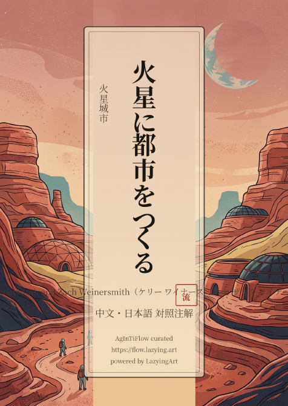 | **火星城市** | ZH-EN · zh-main · color |
|  | **火星城市** | ZH-JP · zh-main · color |
| 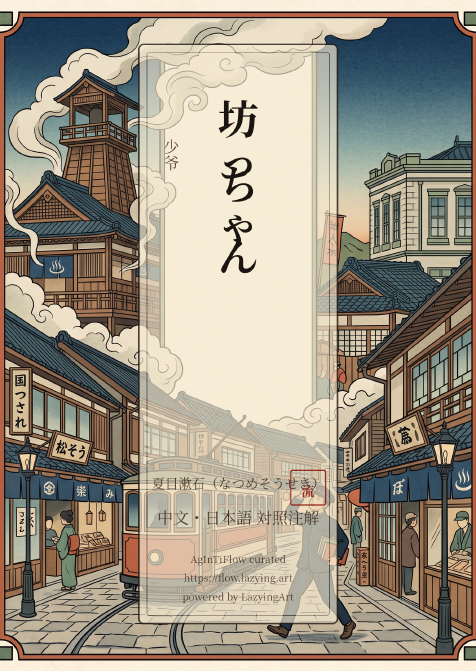 | **Botchan** | EN-JP · en-main · color |
|  | **少爷** | ZH-EN · zh-main · color |
|  | **少爷** | ZH-JP · zh-main · color |
| 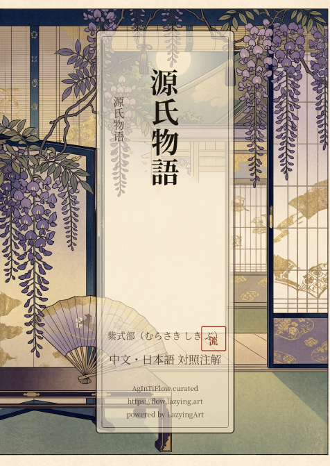 | **源氏物语** | ZH-JP · zh-main · color |
| 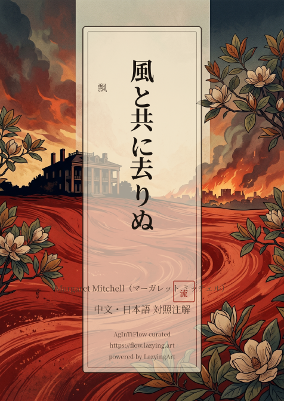 | **Gone With the Wind** | EN-JP · en-main · color |
|  | **飘** | ZH-EN · zh-main · color |
|  | **飘** | ZH-JP · zh-main · color |
|  | **I Am a Cat** | EN-JP · en-main · color |
| 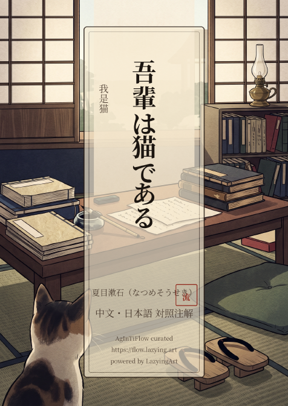 | **我是猫** | ZH-EN · zh-main · color |
|  | **我是猫** | ZH-JP · zh-main · color |
| 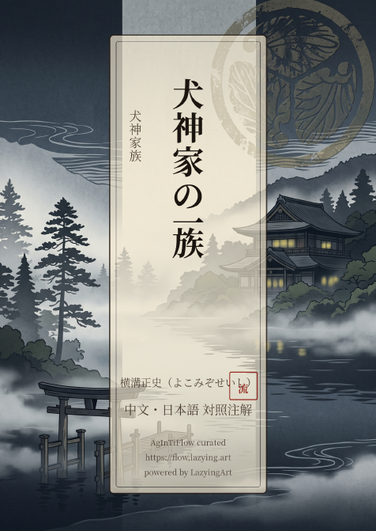 | **The Inugami Curse** | EN-JP · en-main · color |
|  | **犬神家族** | ZH-EN · zh-main · color |
|  | **犬神家族** | ZH-JP · zh-main · color |
| 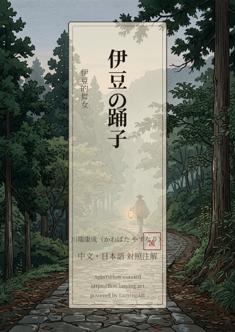 | **伊豆的舞女** | ZH-JP · zh-main · color |
| 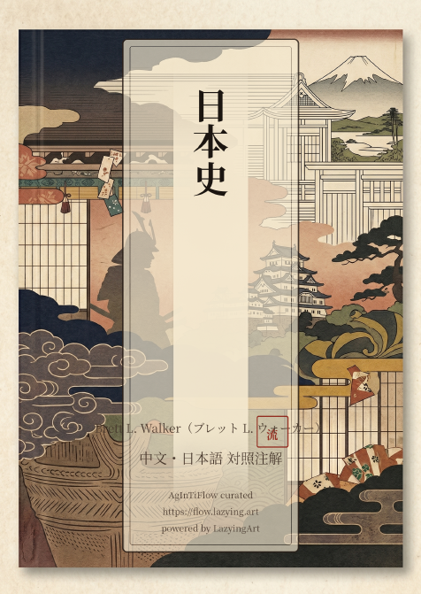 | **A Concise History of Japan** | EN-JP · en-main · color |
|  | **日本史** | ZH-EN · zh-main · color |
|  | **日本史** | ZH-JP · zh-main · color |
| 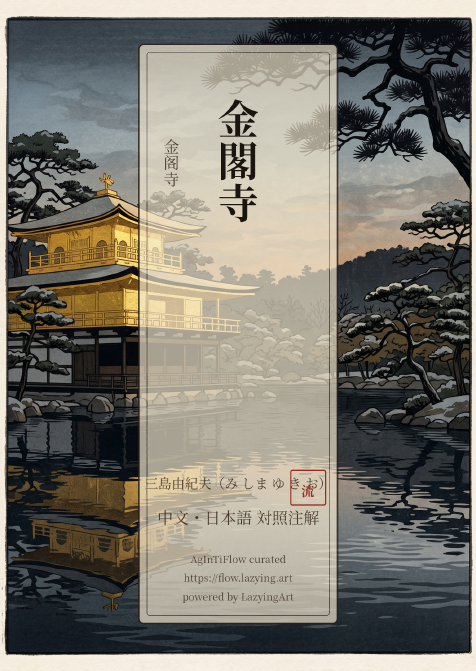 | **金阁寺** | ZH-JP · zh-main · color |
| 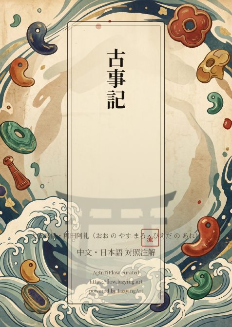 | **古事記** | ZH-JP · zh-main · color |
| 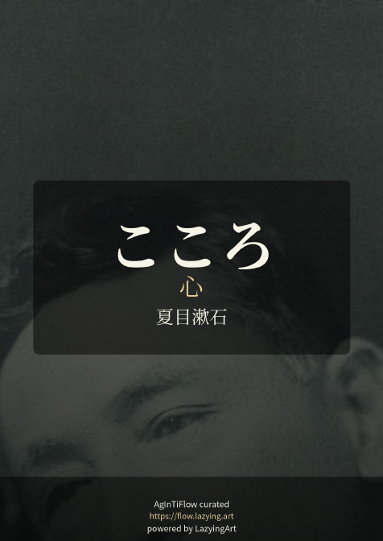 | **心** | ZH-JP · zh-main · color |
|  | **The Martian Chronicles** | EN-JP · en-main · color |
| 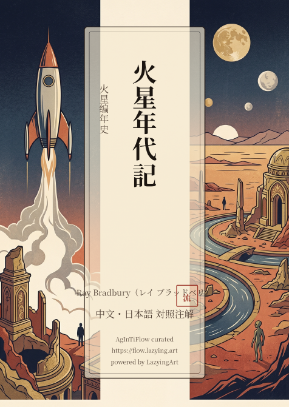 | **火星编年史** | ZH-EN · zh-main · color |
|  | **火星编年史** | ZH-JP · zh-main · color |
|  | **人間失格** | ZH-JP · zh-main · color |
| 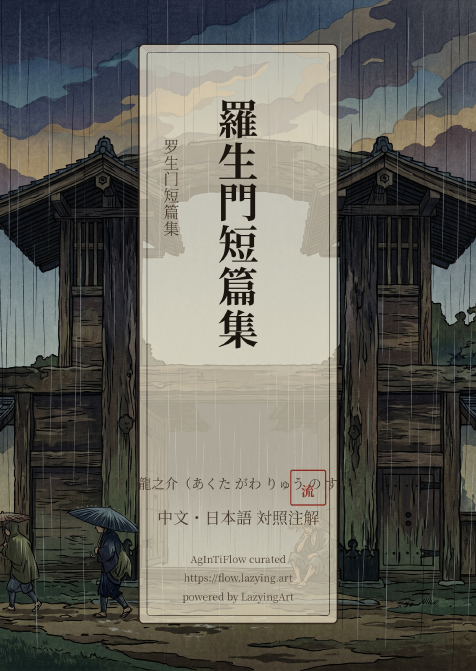 | **罗生门短篇集** | ZH-JP · zh-main · color |
|  | **Red Mars** | EN-JP · en-main · color |
|  | **红火星** | ZH-EN · zh-main · color |
| 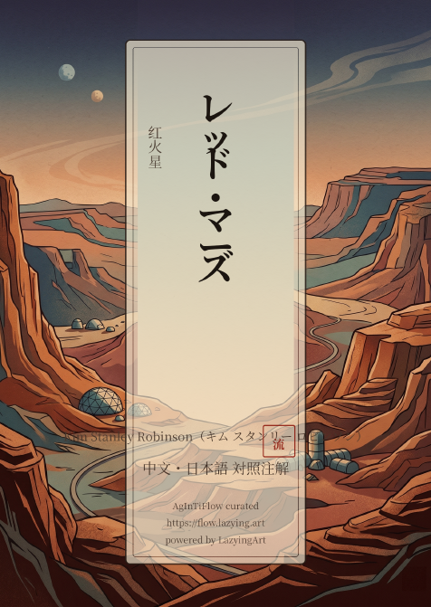 | **红火星** | ZH-JP · zh-main · color |
|  | **Red Rising** | EN-JP · en-main · color |
| 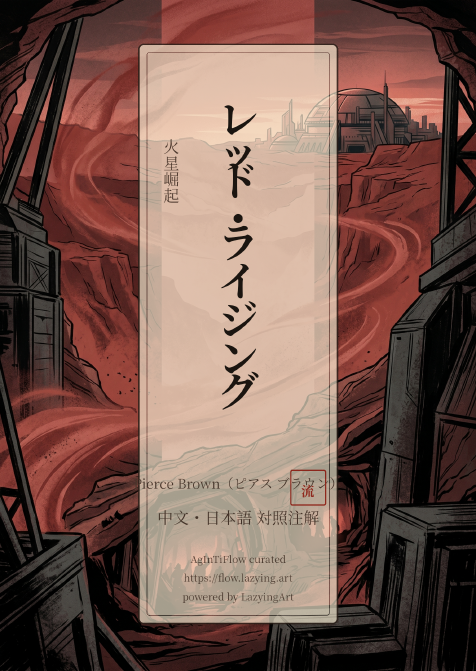 | **火星崛起** | ZH-EN · zh-main · color |
|  | **火星崛起** | ZH-JP · zh-main · color |
|  | **Golden Son** | EN-JP · en-main · color |
| 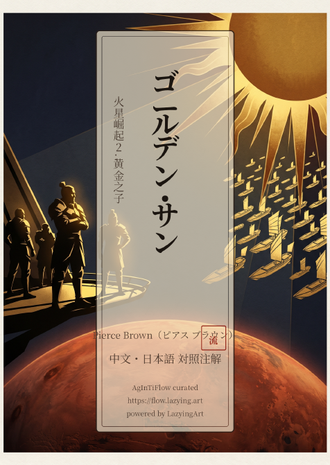 | **火星崛起2：黄金之子** | ZH-EN · zh-main · color |
|  | **火星崛起2：黄金之子** | ZH-JP · zh-main · color |
|  | **Morning Star** | EN-JP · en-main · color |
| 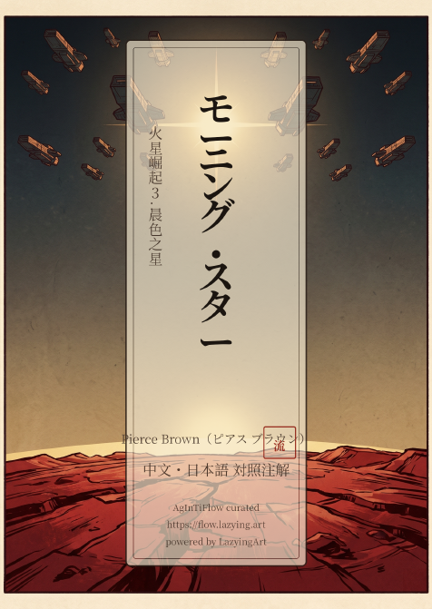 | **火星崛起3：晨色之星** | ZH-EN · zh-main · color |
|  | **火星崛起3：晨色之星** | ZH-JP · zh-main · color |
| 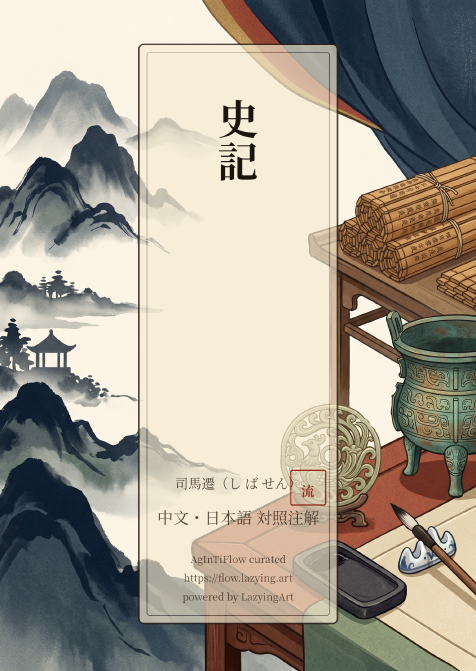 | **史記** | ZH-JP · zh-main · color |
| 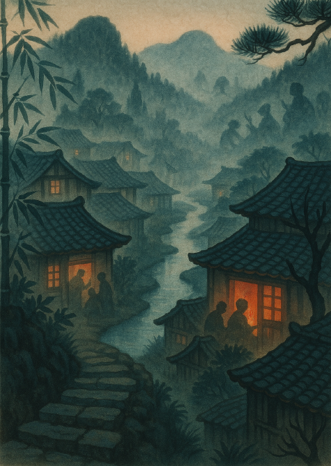 | **中国民间故事集成四川卷上** | ZH-JP · zh-main · color |
| 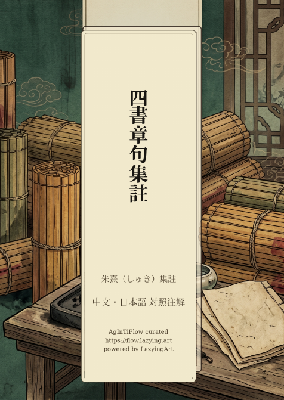 | **四書章句集註** | ZH-JP · zh-main · color |
| 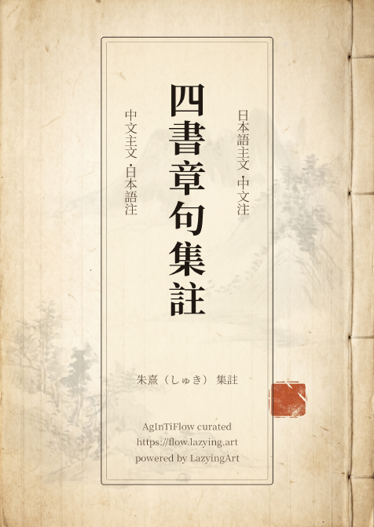 | **四書章句集註** | ZH-JP · zh-main · color |
|  | **雪国** | ZH-JP · zh-main · color |
|  | **Spring Snow** | EN-JP · en-main · color |
| 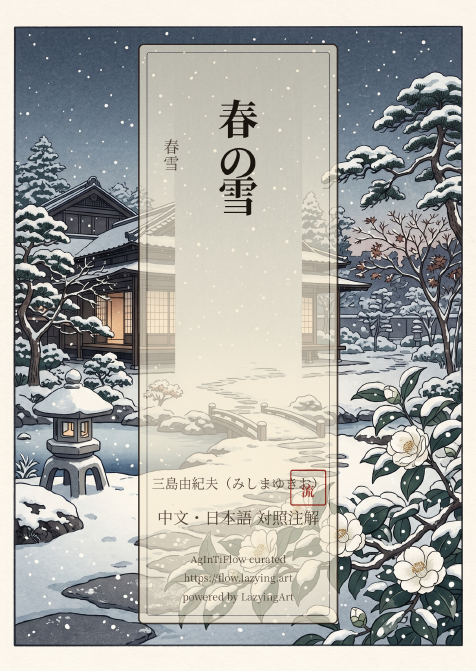 | **春雪** | ZH-EN · zh-main · color |
|  | **春雪** | ZH-JP · zh-main · color |
|  | **The Martian** | EN-JP · en-main · color |
|  | **火星救援** | ZH-EN · zh-main · color |
| 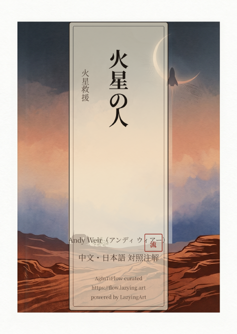 | **火星救援** | ZH-JP · zh-main · color |
| 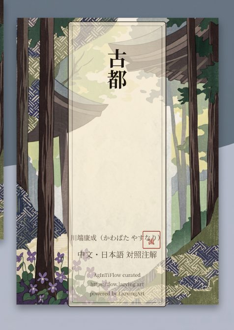 | **古都** | ZH-JP · zh-main · color |
|  | **The Sirens of Mars** | EN-JP · en-main · color |
|  | **火星的塞壬** | ZH-EN · zh-main · color |
| 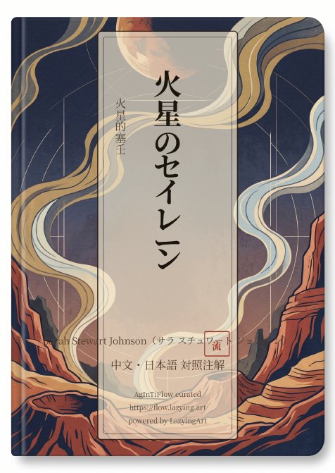 | **火星的塞壬** | ZH-JP · zh-main · color |
| 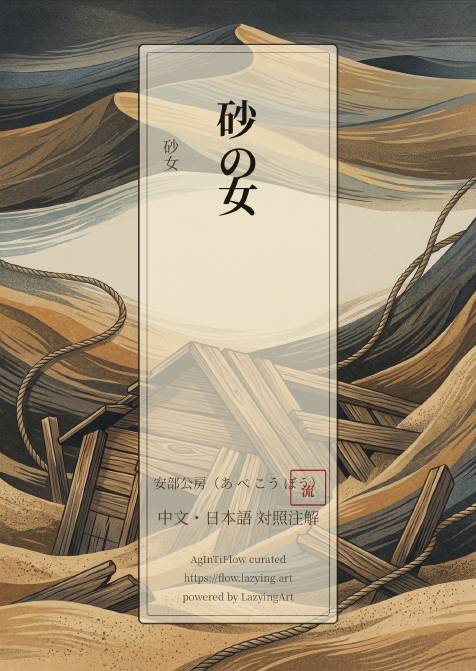 | **砂女** | ZH-JP · zh-main · color |

## Quick Start

Build the simple paired demo:

```sh
make sample
```

Build the Chinese-main interlinear sample:

```sh
make interlinear
```

Build the Japanese-main interlinear sample from the same JSON:

```sh
make interlinear-jp-main
```

Export completed local PDFs into a flat browsing folder and regenerate README previews:

```sh
make export-books
make readme-assets
```

## Data Model

The core format is a paragraph/chapter JSON model. Text is split into aligned reading units, and each token can carry a reading and an optional grammar role.

```json
{
  "zh": [{"t": "天", "r": "tiān", "g": "subject"}, {"t": "地", "r": "dì", "g": "subject"}],
  "ja": [[{"t": "天", "r": "てん", "g": "subject"}, {"t": "地", "r": "ち", "g": "subject"}]]
}
```

Stable token fields:

| Field | Meaning |
| --- | --- |
| `t` | surface text |
| `r` | ruby, furigana, pinyin, or other reading |
| `g` | optional grammar role such as `subject`, `predicate`, `object`, `attributive`, `adverbial`, `complement`, `topic`, or `function` |

## Project Layout

| Path | Purpose |
| --- | --- |
| `tex/` | XeLaTeX templates for paired, block interlinear, run-in, and JP-main layouts |
| `scripts/books/` | EPUB/PDF/Markdown preparation, cover composition, preview export |
| `scripts/interlinear/` | JSON chunking, validation, rendering, compiling, long-run workers |
| `data/interlinear/sample.json` | small public sample of the structured format |
| `assets/readme-previews/` | first-page preview images generated from PDFs |
| `assets/edition-comparisons/` | single-sentence and four-edition comparison images generated from interior PDF pages |
| `references/` | design notes, naming notes, and pipeline references |
| `sources/` | local source books, ignored by Git |
| `build/` | generated PDFs and TeX intermediates, ignored by Git |

## Public Use

PocketPolyglot is designed for language learners, teachers, and book builders who want maintainable bilingual editions rather than manually aligned TeX. Keep source rights clear: publish templates, samples, and previews freely; publish full book PDFs only when the source text and translation can be redistributed.

Project site: [learn.lazying.art](https://learn.lazying.art)
