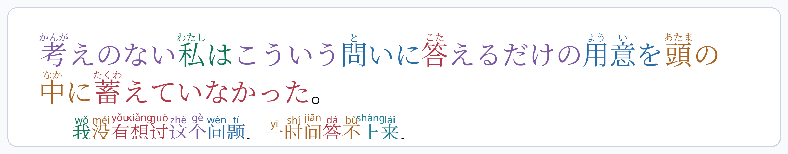
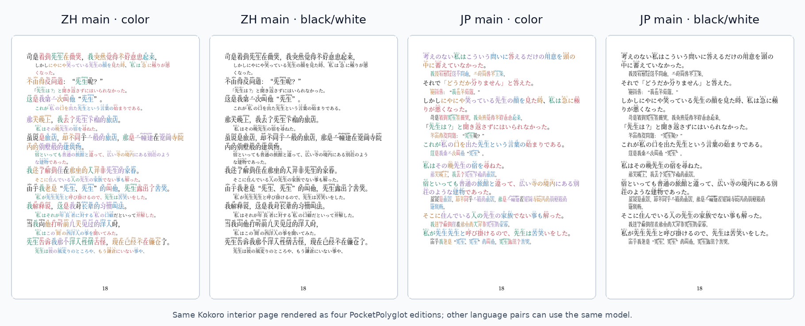

[English](../README.md) · [العربية](README.ar.md) · [Español](README.es.md) · [Français](README.fr.md) · [日本語](README.ja.md) · [한국어](README.ko.md) · [Tiếng Việt](README.vi.md) · [中文 (简体)](README.zh-Hans.md) · [中文（繁體）](README.zh-Hant.md) · [Deutsch](README.de.md) · [Русский](README.ru.md)

[](https://github.com/lachlanchen/lachlanchen/blob/main/figs/banner.png)

# PocketPolyglot

Générez de beaux livres interlinéaires de poche pour l'apprentissage des langues.

PocketPolyglot transforme des textes bilingues en petits PDF avec ruby, furigana, pinyin, couleurs grammaticales et alignement ligne par ligne. Le flux actuel met en avant le chinois et le japonais, mais le modèle peut servir à EN-JP, ZH-EN, classique-moderne et à d'autres lectures parallèles.

Ce dépôt est une boîte à outils : modèles TeX, scripts Python, JSON d'exemple, images de prévisualisation et notes de pipeline. Ne publiez des livres complets que lorsque les textes et traductions peuvent être redistribués légalement.

## Une Phrase En Pleine Largeur

Exemple JP-main de Kokoro : texte japonais avec furigana, commentaire chinois avec pinyin et couleurs grammaticales sur les mots alignés.

<p align="center">
  <a href="../assets/edition-comparisons/kokoro-jp-main-sentence-page-20.png">
    
  </a>
</p>

## Quatre Éditions

La même page intérieure de Kokoro rendue dans les quatre éditions standard :

<p align="center">
  <a href="../assets/edition-comparisons/kokoro-four-editions-page-20.png">
    
  </a>
</p>

## Sorties

| Texte principal | Couleur | Noir et blanc |
| --- | --- | --- |
| Chinois avec notes japonaises | Couleurs grammaticales, pinyin, furigana | Pour liseuses à encre électronique |
| Japonais avec notes chinoises | Couleurs grammaticales, furigana, pinyin | Pour liseuses à encre électronique |

## Commandes

```sh
make sample
make interlinear
make interlinear-jp-main
make export-books
make readme-assets
```

Site : [learn.lazying.art](https://learn.lazying.art)
