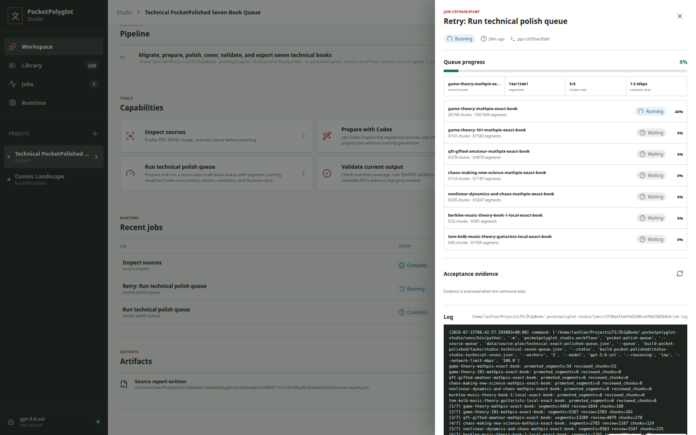
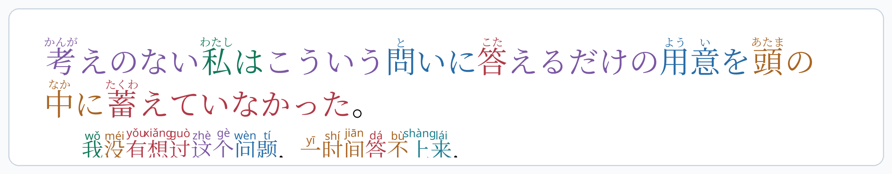
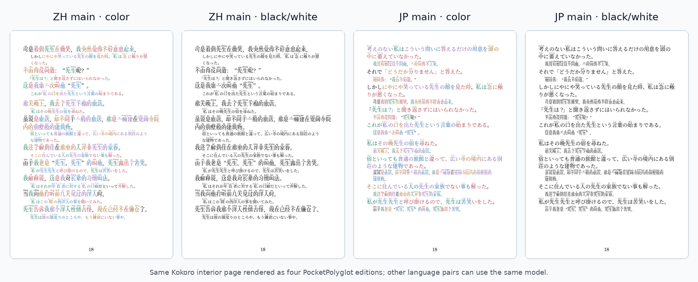

[English](../README.md) · [العربية](README.ar.md) · [Español](README.es.md) · [Français](README.fr.md) · [日本語](README.ja.md) · [한국어](README.ko.md) · [Tiếng Việt](README.vi.md) · [中文 (简体)](README.zh-Hans.md) · [中文（繁體）](README.zh-Hant.md) · [Deutsch](README.de.md) · [Русский](README.ru.md)

[](https://github.com/lachlanchen/lachlanchen/blob/main/figs/banner.png)

# PocketPolyglot

Tạo sách song ngữ liên dòng cỡ bỏ túi, đẹp và hữu ích cho việc học ngôn ngữ.

PocketPolyglot biến văn bản song ngữ thành PDF nhỏ có ruby, furigana, pinyin, màu vai trò ngữ pháp và căn hàng theo từng dòng. Quy trình hiện tại tập trung vào Trung-Nhật, nhưng mô hình có thể dùng cho EN-JP, ZH-EN, cổ điển-hiện đại và nhiều cặp ngôn ngữ khác.

Kho này là bộ công cụ, không phải nơi phân phối văn bản gốc. Nó gồm mẫu TeX, script Python, JSON mẫu, ảnh xem trước và ghi chú pipeline. Chỉ xuất bản sách đầy đủ khi văn bản và bản dịch có quyền phân phối rõ ràng.

## Ủng hộ PocketPolyglot

| Donate | PayPal | Stripe |
| --- | --- | --- |
| [](https://chat.lazying.art/donate) | [](https://paypal.me/RongzhouChen) | [](https://buy.stripe.com/aFadR8gIaflgfQV6T4fw400) |

## PocketPolyglot Studio

Studio hợp nhất LinguaLeaf, OCR, chuyển PDF sang TeX, kiểm định và xuất bản trong ứng dụng web và CLI cục bộ. Các tác vụ tmux có thể tiếp tục chỉ hoàn tất sau khi vượt qua kiểm tra bằng chứng.

[](../studio/docs/images/pocketpolyglot-studio-queue.png)

## Một Câu Toàn Chiều Rộng

Ví dụ JP-main từ Kokoro: văn bản Nhật có furigana, chú thích tiếng Trung có pinyin và màu ngữ pháp trên các từ đã căn hàng.

<p align="center">
  <a href="../assets/edition-comparisons/kokoro-jp-main-sentence-page-20.png">
    
  </a>
</p>

## Bốn Phiên Bản

Cùng một trang nội dung của Kokoro được kết xuất thành bốn phiên bản chuẩn:

<p align="center">
  <a href="../assets/edition-comparisons/kokoro-four-editions-page-20.png">
    
  </a>
</p>

## Đầu Ra

| Văn bản chính | Màu | Đen trắng |
| --- | --- | --- |
| Tiếng Trung chính, ghi chú tiếng Nhật | Màu ngữ pháp, pinyin, furigana | Phù hợp màn hình e-ink |
| Tiếng Nhật chính, ghi chú tiếng Trung | Màu ngữ pháp, furigana, pinyin | Phù hợp màn hình e-ink |

## Lệnh

```sh
make sample
make interlinear
make interlinear-jp-main
make export-books
make readme-assets
```

Trang web: [learn.lazying.art](https://learn.lazying.art)

## Trích dẫn

Nếu dùng PocketPolyglot trong nghiên cứu hoặc giảng dạy, hãy trích dẫn kho này. GitHub đọc [CITATION.cff](../CITATION.cff) và hiển thị **Cite this repository**.

```bibtex
@software{chen_pocketpolyglot_2026,
  author = {Chen, Lachlan},
  title = {PocketPolyglot: Multilingual Interlinear Pocket-Book Studio},
  year = {2026},
  url = {https://github.com/lachlanchen/PocketPolyglot}
}
```
